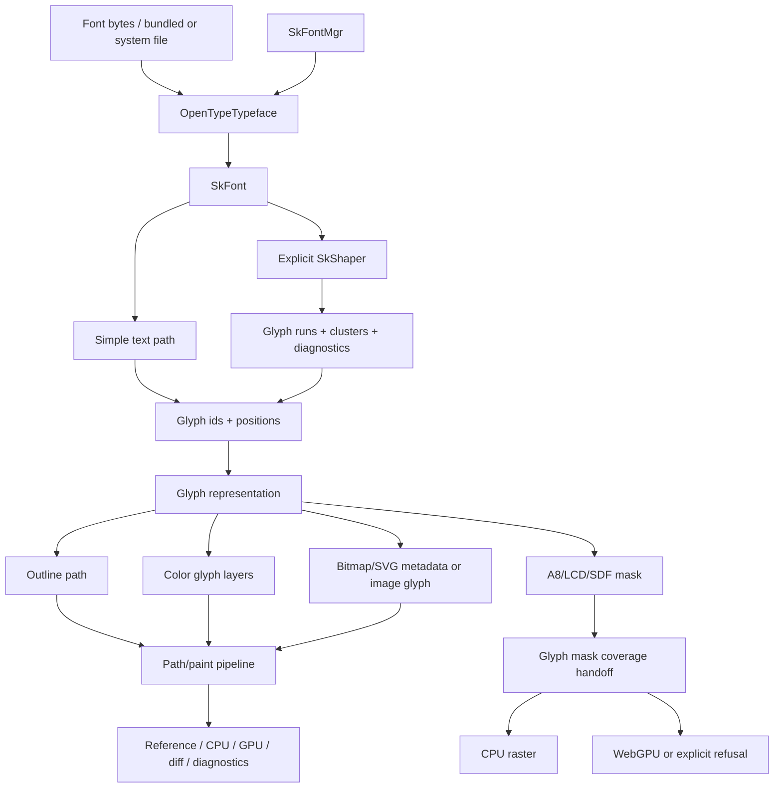

# Font And Text Specs

Status: Draft
Target: `.upstream/target/skia-like-realtime-renderer-target.md`
Parent target: `.upstream/target/high-performance-wgsl-pipeline-target.md`
Historical MEP target: removed from the working tree; recover from Git history
only if needed.

This spec pack owns the Kanvas font, text, glyph, and font-rendering target.
It covers portable font loading, typeface selection, shaping boundaries, glyph
outline and mask production, color-font policy, emoji gating, SDF text, glyph
coverage handoff, and font-specific validation.

It deliberately does not own the generic paint pipeline, general geometry
coverage rules, PM dashboard UX, codec breadth, or SVG rendering outside glyph
formats. Those remain in their own spec packs or target documents.

The font layer produces text and glyph evidence. It does not define generic
rendering truth by itself.

## Source Of Truth

- Active rendering target:
  `.upstream/target/skia-like-realtime-renderer-target.md`
- Historical MEP conformance target:
  removed from the working tree; recover from Git history only if needed.
- WGSL pipeline target:
  `.upstream/target/high-performance-wgsl-pipeline-target.md`
- Current portable OpenType scope:
  `.upstream/specs/pure-kotlin-text/README.md`
- Font GM post-AWT classification:
  `reports/upstream-rebaseline/`
- Current upstream rebaseline:
  `reports/upstream-rebaseline/2026-05-25-post-1087.md`
- Current upstream rebaseline TSV:
  `reports/upstream-rebaseline/2026-05-25-post-1087.tsv`
- Geometry glyph-mask handoff:
  `.upstream/specs/geometry-coverage/02-lowering-rules.md`
- Geometry glyph-mask contracts:
  `.upstream/specs/geometry-coverage/01-contracts-geometry-coverage.md`
- Glyph-mask diagnostics:
  `.upstream/specs/geometry-coverage/05-fallback-diagnostics.md`
- Backend-neutral glyph-mask contract code:
  `render-pipeline/src/main/kotlin/org/skia/pipeline/GeometryCoverageContracts.kt`
- Glyph-mask contract tests:
  `render-pipeline/src/test/kotlin/org/skia/pipeline/GeometryCoverageContractsTest.kt`
- Portable font entry points:
  `font/src/main/kotlin/org/graphiks/kanvas/font/` and `kanvas/src/main/kotlin/org/skia/foundation/`
- Portable OpenType backend:
  `font/sfnt/src/main/kotlin/org/graphiks/kanvas/font/sfnt/`
- WebGPU text smoke evidence:
  `gpu-renderer/src/test/kotlin/` and `integration-tests/skia/src/test/kotlin/`
- WebGPU text mask-filter evidence:
  `gpu-renderer/src/test/kotlin/` and `integration-tests/skia/src/test/kotlin/`

## Hard Boundaries

- Do not add external font libraries for this scope. HarfBuzz, FreeType,
  Fontations, platform shapers, native SVG renderers, and JNI bridges are not
  active implementation dependencies here.
- Prefer internal pure Kotlin implementations, generated fixtures, and explicit
  fallback diagnostics.
- Do not port Ganesh or Graphite text systems, atlas managers, glyph ops, or
  subrun machinery.
- Do not mark text, font, glyph mask, emoji, or SDF support complete without
  reference, CPU/GPU or explicit refusal evidence, diff/stat artifacts where
  applicable, route diagnostics, and stable fallback policy.
- Do not clear font-gated rows with short-lived substitutes, fake fixtures, or
  broad tolerances.
- Keep `SkCanvas.drawString` simple and deterministic. Complex shaping must be
  explicit through `SkShaper` or a future text-layout API, not silently enabled
  by ordinary string draws.
- Keep glyph-mask atlas ownership in text/glyph infrastructure. Geometry and
  coverage consume opaque glyph mask references and stable diagnostics only.

## Naming Convention

- `font.glyph.*` identifies glyph representation and rendering routes.
- `font.*` identifies proposed font fallback or refusal reason codes.
- `coverage.*` identifies implemented geometry/coverage diagnostics.

The proposed `font.*` reason codes in this pack do not imply runtime support
until tests or reports prove they are emitted.

## Spec Index

| Spec | Purpose |
|---|---|
| `00-current-state-inventory.md` | Current font APIs, OpenType backend, shaping, glyph rendering, evidence, and gated rows. |
| `01-boundaries-and-architecture.md` | Ownership boundaries, target architecture, data flow, and module responsibilities. |
| `02-opentype-backend-contract.md` | Internal OpenType/SFNT parser, typeface, scaler, variation, system fallback, and table contracts. |
| `03-shaping-and-layout-boundary.md` | `SkShaper`, simple text, complex shaping, fallback runs, clusters, diagnostics, and non-goals. |
| `04-glyph-rendering-and-coverage.md` | Glyph outlines, text paths, masks, SDF, atlas policy, CPU/WebGPU handoff, and route diagnostics. |
| `05-color-fonts-emoji-and-fixtures.md` | COLR/CPAL, bitmap and SVG color fonts, emoji table dispatch, generated fixtures, and refusal policy. |
| `06-validation-and-conformance.md` | Test matrix, GM classification, generated evidence, dashboard requirements, and acceptance gates. |

## Target Shape



The target font layer must make each claim inspectable:

- which font source was used;
- how text became glyphs and clusters;
- whether shaping was simple, portable, or explicitly unsupported;
- which glyph representation rendered;
- whether CPU and WebGPU rendered, refused, or used a scoped fallback;
- which artifact proves the result.

## Status Policy

Specs start as `Draft`. A font spec can move to `Accepted` only when the
corresponding implementation evidence is merged, the refusal or support route is
asserted in tests, and the GM/dashboard classification no longer relies on an
obsolete stub label.

Existing working code can be documented in this pack while the spec remains
`Draft`; documenting shipped behavior does not by itself broaden support.

## Font Milestone Slices

| Slice | Outcome | Primary spec |
|---|---|---|
| FNT0 | Font specs are separated from rendering and dashboard specs. | `README.md` |
| FNT1 | Current pure Kotlin OpenType baseline is documented. | `00-current-state-inventory.md`, `02-opentype-backend-contract.md` |
| FNT2 | Simple text vs explicit shaping boundary is stable. | `03-shaping-and-layout-boundary.md` |
| FNT3 | Glyph outline rendering and glyph-mask handoff are specified. | `04-glyph-rendering-and-coverage.md` |
| FNT4 | Color font and emoji rows have stable internal implementation/refusal policy. | `05-color-fonts-emoji-and-fixtures.md` |
| FNT5 | Font GM and dashboard evidence can distinguish support, fixture-gated rows, and dependency-gated refusals. | `06-validation-and-conformance.md` |
| FNT6 | SDF/LCD/bitmap glyph paths have internal contracts before support claims. | `04-glyph-rendering-and-coverage.md`, `05-color-fonts-emoji-and-fixtures.md` |
| FNT7 | Font support claims can enter the generated conformance dashboard with CPU/GPU evidence or explicit refusal rows. | `06-validation-and-conformance.md` |

## Validation

Font spec-only changes must run:

```bash
rtk git diff --check
```

Font implementation changes must run the owning focused tests, starting with:

```bash
rtk ./gradlew --no-daemon :font:test :kanvas:test
```

Text/GPU changes must also run the owning WebGPU tests when an adapter lane is
available:

```bash
rtk ./gradlew --no-daemon :gpu-renderer:test :integration-tests:skia:test
```

Any promoted font scene must also satisfy the generated evidence rules in
`.upstream/target/skia-like-realtime-renderer-target.md`.
