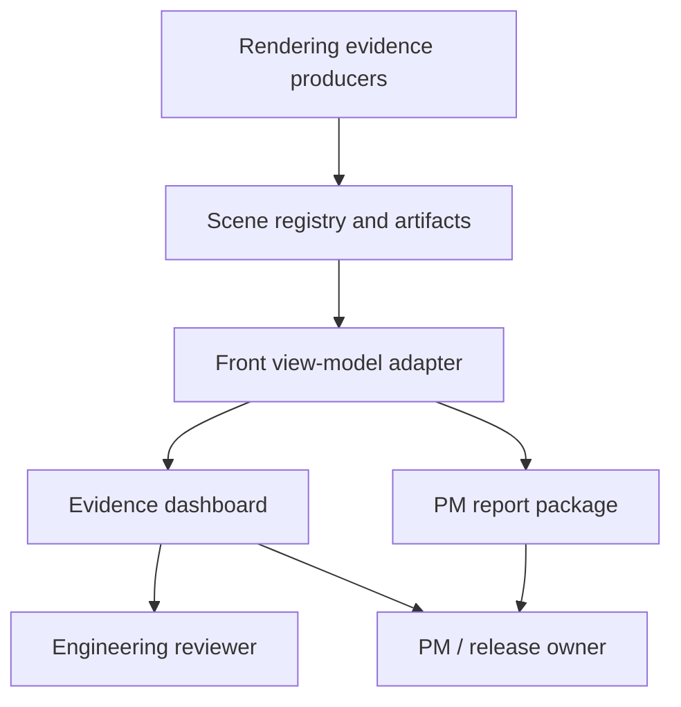

# Front Experience Specs

Status: Draft
Target: `.upstream/target/skia-like-realtime-renderer-target.md`
Parent target: `.upstream/target/high-performance-wgsl-pipeline-target.md`
Historical MEP target: removed from the working tree; recover from Git history
only if needed.

This spec pack owns the human-facing front experience for Kanvas conformance
and PM evidence. It covers dashboards, evidence browsing, filters, visual
states, accessibility, and demo/reporting workflow.

It deliberately does not own rendering support, shader behavior, pixel
thresholds, route selection, fallback taxonomy, or benchmark math. Those remain
in the rendering spec packs:

- `.upstream/specs/wgsl-pipeline/`
- `.upstream/specs/geometry-coverage/`
- `.upstream/target/skia-like-realtime-renderer-target.md`

The front consumes rendering evidence. It does not define rendering truth.

## Source Of Truth

- Active target and readiness:
  `.upstream/target/skia-like-realtime-renderer-target.md`
- Historical MEP target:
  removed from the working tree; recover from Git history only if needed.
- Dashboard source committed in the repository:
  `reports/wgsl-pipeline/scenes/index.html`
- Current scene registry:
  `reports/wgsl-pipeline/scenes/data/scenes.json`
- Dashboard export task:
  `rtk ./gradlew --no-daemon pipelineSceneDashboard`
- Generated scene exporter:
  `rtk ./gradlew --no-daemon pipelineGeneratedSceneExport`
- Release gate task:
  `rtk ./gradlew --no-daemon pipelineSceneDashboardGate`
- Portable PM bundle task:
  `rtk ./gradlew --no-daemon pipelinePmBundle`
- M49 closeout evidence:
  `reports/wgsl-pipeline/2026-05-31-m49-sprint-review.md`
- M49 portable PM bundle report:
  `reports/wgsl-pipeline/2026-05-31-m49-portable-pm-bundle.md`
- M49 dashboard gate invariants:
  `reports/wgsl-pipeline/2026-05-31-m49-dashboard-gate-invariants.md`
- PM methodology:
  `.upstream/target/linear-agent-methodology.md`

## Hard Boundaries

- Do not move rendering contracts into front specs.
- Do not hide expected-unsupported rows in the default experience.
- Do not infer support from route strings, screenshots, or tag aggregates.
- Do not add marketing pages; the first front surface is the usable evidence
  surface.
- Do not make frontend status labels more optimistic than the source data.
- Do not require a network service for the static evidence dashboard.
- Do not add external front libraries for this scope. Filters, state, routing,
  card rendering, accessibility helpers, and report generation should stay
  internal unless an existing repository dependency already owns that surface.

## Spec Index

| Spec | Purpose |
|---|---|
| `00-current-state-inventory.md` | Current front surfaces, shipped behavior, evidence counters, and gaps. |
| `01-boundaries-and-information-architecture.md` | Ownership boundary, audiences, navigation model, and target views. |
| `02-scene-dashboard-ui.md` | Dashboard UI contract: summary, filters, cards, image panels, diagnostics, and states. |
| `03-demo-reporting-workflow.md` | PM demo and release reporting flow from generated artifacts to reviewable evidence. |
| `04-quality-accessibility-gates.md` | Accessibility, responsive behavior, artifact QA, and validation gates. |

## Target Shape



The front layer must make the state of evidence obvious:

- what passed;
- what intentionally refused;
- what remains a tracked gap;
- what artifact proves the claim;
- what raw file a reviewer can inspect next.

## Status Policy

Specs start as `Draft`. A front spec can move to `Accepted` when the front
surface exists, the validation command is documented, artifact links are
reviewable, and the PM workflow has been used in a milestone closeout.

M49 makes the current inventory, gate, and PM bundle implementation-backed, but
this new pack remains `Draft` until the front spec split itself is accepted.
Editorial updates do not change status.

## Front Milestone Slices

| Slice | Outcome | Primary spec |
|---|---|---|
| F0 | Front specs are separated from rendering specs. | `README.md` |
| F1 | Static dashboard shell is documented as current baseline. | `00-current-state-inventory.md` |
| F2 | Dashboard IA and filtering behavior are explicit. | `01-boundaries-and-information-architecture.md`, `02-scene-dashboard-ui.md` |
| F3 | PM demo/report workflow is repeatable through `pipelinePmBundle`. | `03-demo-reporting-workflow.md` |
| F4 | Current release gate is documented around `pipelineSceneDashboardGate`; browser/a11y checks remain manual/future. | `04-quality-accessibility-gates.md` |
| F5 | Deployable/static review package is generated by `pipelinePmBundle`. | `03-demo-reporting-workflow.md` |

## Validation

Front changes must at minimum run:

```bash
rtk git diff --check
rtk ./gradlew --no-daemon pipelineSceneDashboard
```

Changes that alter release gate behavior or PM packaging should also run:

```bash
rtk ./gradlew --no-daemon pipelineSceneDashboardGate
rtk ./gradlew --no-daemon pipelinePmBundle
```

Changes that alter the dashboard UI should manually distinguish and open the
generated export, not only the committed source:

```text
build/reports/wgsl-pipeline-scenes/index.html
```

If a future browser automation lane is added, screenshots and accessibility
checks should become part of `04-quality-accessibility-gates.md`.
