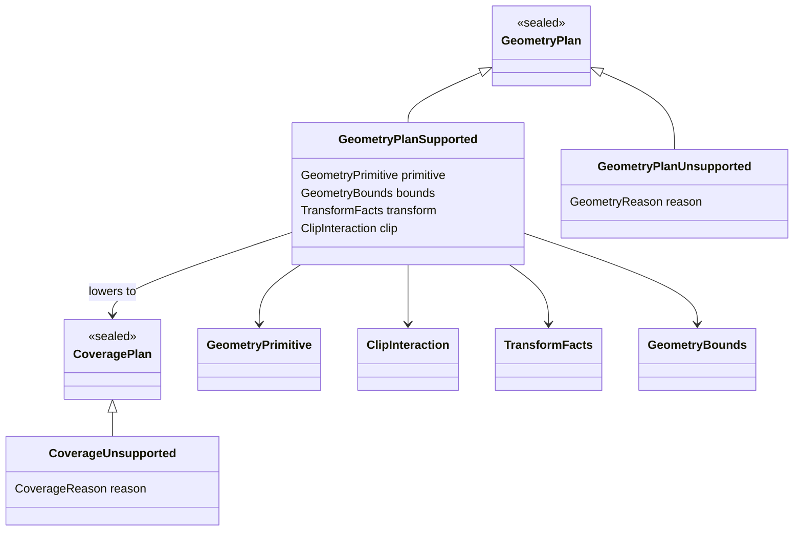

# Spec 01: Geometry And Coverage Contracts

Status: Accepted
Target: `.upstream/target/high-performance-wgsl-pipeline-target.md`

## M24 Acceptance Evidence

Accepted on 2026-05-27 for the geometry/coverage scope covered by the M24
conformance gate.

Evidence links:

- PR #1142 / `12684fb7259644bb2932e930026c7134177e1964`: `pipelineConformance`.
- PR #1143 / `637e42344a335504bfe8d95b63351dfc40ebd872`: PM convergence report.
- PR #1144 / `2035b455535e35452097154d9b5d0f05eea8a866`: report regeneration fix.

Acceptance is limited to descriptor, selector, oracle, fallback, and migration
fixtures covered by `GeometryCoverageContractsTest`,
`GeometryCoverageMigrationHarnessTest`, and `WebGpuCoveragePlanSelectorTest`.
Additional primitive families need their own rollout evidence before default
routing.


## Problem

Geometry decisions currently live inside backend draw methods. Paint lowering
needs a stable input describing coverage without inheriting CPU or WebGPU
implementation details.

## Scope

Define backend-neutral contracts:

- `GeometryPlan`
- `GeometryPrimitive`
- `GeometryBounds`
- `TransformFacts`
- `ClipInteraction`
- `CoveragePlan`
- `CoverageCachePolicy`
- typed diagnostic reason records

Per `adr/0004-contract-owner-package.md`, these contracts live in
the Kanvas geometry/coverage layer and use dependency-free value records.
`:kanvas` adapters translate public Skia-like types at the boundary.

## Relationship With `KanvasPipelineIR`

`CoveragePlan` is not a rename of the existing
`render-pipeline/src/main/kotlin/org/skia/pipeline/KanvasPipelineIR.kt`
`CoverageModel`.

The boundary is:

```text
GeometryPlan + ClipInteraction
  -> CoveragePlan
  -> CoveragePlan lowering adapter
  -> PipelineOp.ApplyCoverage(CoverageModel) or explicit backend strategy
```

Current `CoverageModel` remains the paint-IR handoff used by
`PipelineOp.ApplyCoverage`. It is the supported coverage subset that paint
specialization can consume today: `Full`, `Span`, `AlphaMask`, and
`AnalyticRect`.

`CoveragePlan` is the geometry-side semantic descriptor. It may be lowered to
`CoverageModel` when the coverage is already materialized or directly
representable. It may also select a backend execution strategy, such as WebGPU
stencil-cover for path coverage, before paint receives the final coverage
model.

Initial mapping:

| CoveragePlan | `CoverageModel` / strategy |
|---|---|
| `Full` | `CoverageModel.Full` |
| `AnalyticRect` | `CoverageModel.AnalyticRect` |
| `AnalyticRRect` | materialize to `AlphaMask`/`Span`, or add a future `CoverageModel` variant in an explicit IR ticket |
| `SpanRuns` | `CoverageModel.Span` |
| `AlphaMask` | `CoverageModel.AlphaMask` |
| `PathCoverage` | CPU spans or WebGPU path strategy, then a consumable coverage model |
| `CoverageAtlas` | `CoverageModel.AlphaMask` backed by a cache entry |
| `Unsupported` | `FallbackPlan.RefuseDiagnostic` or declared compatibility fallback |

Until the current `FallbackPlan.reason: String` is migrated, adapters must
store the typed reason's stable `.code` string and keep tests on that code.

## Non-Goals

- No Graphite `DrawList`, `DrawPass`, `Renderer`, `RenderStep`, or scheduler.
- No SkSL, SkSL IR, or Graphite paint keys.
- No universal low-level coverage buffer format.
- No compute tessellation until profiling justifies it.
- No dependency on legacy `:kanvas`.

## Contract Overview



## GeometryPlan

`GeometryPlan` is the normalized geometry contract for one draw. It stores
transform and clip facts explicitly so downstream code does not read ambient
canvas state.

Representative shape:

```kotlin
sealed interface GeometryPlan {
    data class Supported(
        val primitive: GeometryPrimitive,
        val bounds: GeometryBounds,
        val transform: TransformFacts,
        val clip: ClipInteraction,
    ) : GeometryPlan

    data class Unsupported(val reason: GeometryReason) : GeometryPlan
}
```

Required invariants:

- `Supported.bounds` is conservative enough for safe clipping and allocation.
- Tight bounds may be optional, but when present they must be auditable.
- `transform` records only facts needed by geometry/coverage selection.
- `clip` references already-lowered clip-stack state.
- `Unsupported.reason.code` must be stable and testable.

## GeometryPrimitive

Representative shape:

```kotlin
sealed interface GeometryPrimitive {
    data class Rect(val source: FloatRect, val device: FloatRect) : GeometryPrimitive
    data class RRect(val shape: RRectSpec) : GeometryPrimitive
    data class Oval(val bounds: FloatRect) : GeometryPrimitive
    data class Path(
        val fillType: PathFillType,
        val stroke: StrokePlan?,
        val verbs: PathVerbSlice,
    ) : GeometryPrimitive
    data class GlyphMask(val run: GlyphRunRef) : GeometryPrimitive
    data class ImageRect(
        val source: FloatRect,
        val destination: FloatRect,
        val sampling: SamplingGeometry,
    ) : GeometryPrimitive
}
```

`GeometryPrimitive.Path.stroke` is present only when stroke semantics are still
needed downstream. If stroking has already produced an outline path, the plan
should record that as a filled path plus diagnostic metadata identifying the
stroke lowering source.

Glyph atlas ownership stays outside geometry. `GlyphMask` carries the glyph run
or positioned mask request; coverage selection resolves that request to
`CoveragePlan.AlphaMask` through text/glyph infrastructure when an atlas entry
exists.

## TransformFacts

Representative shape:

```kotlin
data class TransformFacts(
    val matrix: MatrixSpec,
    val isAxisAligned: Boolean,
    val hasPerspective: Boolean,
    val maxScale: Float,
    val isInvertible: Boolean,
)
```

Rules:

- `matrix` is the source-to-device matrix used for geometry lowering.
- Backend code must not re-read `SkCanvas` CTM during execution.
- Non-invertible transforms must choose a stable unsupported or no-op policy
  per primitive.
- Perspective support must be declared per primitive and backend.

## ClipInteraction

Clip-stack lowering happens before `GeometryPlan`.

Representative shape:

```kotlin
sealed interface ClipInteraction {
    data object None : ClipInteraction
    data class DeviceRect(val bounds: IntRect) : ClipInteraction
    data class AnalyticShape(val shape: ClipShapeSpec) : ClipInteraction
    data class AaClip(val ref: AaClipRef, val bounds: IntRect) : ClipInteraction
    data class ShaderClip(val reason: CoverageReason) : ClipInteraction
    data class Unsupported(val reason: GeometryReason) : ClipInteraction
}
```

Rules:

- Intersect/difference composition belongs in clip lowering, not paint.
- Paint receives coverage/clip modulation, not raw clip-stack operations.
- WebGPU may accept analytic simple-shape clips and reject arbitrary `AaClip`
  unless a mask/atlas path is selected.
- CPU may keep `SkAAClip` native RLE behind `AaClipRef`.

`AaClipRef` is an opaque coverage-resource reference. It exists so
`ClipInteraction.AaClip` does not collapse alpha RLE into bounds-only metadata.
The CPU adapter may wrap `SkAAClip`; a future GPU adapter may wrap an uploaded
mask or coverage-atlas entry.

## CoveragePlan

Representative shape:

```kotlin
sealed interface CoveragePlan {
    data object Full : CoveragePlan
    data class AnalyticRect(val bounds: FloatRect, val aa: Boolean) : CoveragePlan
    data class AnalyticRRect(val shape: RRectSpec, val aa: Boolean) : CoveragePlan
    data class SpanRuns(val bounds: IntRect) : CoveragePlan
    data class AlphaMask(val ref: AlphaMaskRef, val bounds: IntRect, val format: MaskFormat) : CoveragePlan
    data class PathCoverage(val fillType: PathFillType, val aa: Boolean, val inverse: Boolean) : CoveragePlan
    data class CoverageAtlas(
        val ref: CoverageAtlasRef,
        val bounds: IntRect,
        val cachePolicy: CoverageCachePolicy,
    ) : CoveragePlan
    data class Unsupported(val reason: CoverageReason) : CoveragePlan
}
```

Rules:

- `CoveragePlan` describes coverage semantics, not physical storage.
- CPU and WebGPU may map the same `CoveragePlan` to different storage.
- Stencil-cover is a WebGPU strategy for `PathCoverage`, not a backend-neutral
  `CoveragePlan` variant.
- `PathCoverage.aa` affects backend strategy selection and may affect pipeline
  state after lowering.
- `CoverageAtlas` is profile-driven only.
- `CoveragePlan` is the long-lived handoff to paint. Direct `CoverageModel`
  construction is transitional M0-M11 paint-pipeline scaffolding and should
  remain isolated to tests or explicit compatibility shims once
  Geometry/Coverage covers rect, path, glyph, image, and clip coverage.

## Diagnostic Reasons

Representative shape:

```kotlin
sealed interface DiagnosticReason {
    val code: String
}

sealed interface GeometryReason : DiagnosticReason
sealed interface CoverageReason : DiagnosticReason

enum class StandardGeometryReason(override val code: String) : GeometryReason {
    NonFiniteInput("geometry.nonfinite-input"),
    UnsupportedPerspective("geometry.unsupported-perspective"),
    StrokeDegenerate("geometry.stroke-degenerate"),
    PathEffectUnsupported("geometry.path-effect-unsupported"),
    ClipStackUnsupported("geometry.clip-stack-unsupported"),
    ComputeTessellationNotEnabled("geometry.compute-tessellation-not-enabled"),
}

enum class StandardCoverageReason(override val code: String) : CoverageReason {
    SpanRunsUnsupported("coverage.span-runs-unsupported"),
    AlphaMaskUnsupported("coverage.alpha-mask-unsupported"),
    StencilCoverUnavailable("coverage.stencil-cover-unavailable"),
    EdgeCountExceeded("coverage.edge-count-exceeded"),
    AtlasPolicyUnavailable("coverage.atlas-policy-unavailable"),
    ArbitraryAaClipUnsupported("coverage.arbitrary-aa-clip-unsupported"),
}
```

Rules:

- Unsupported plans carry typed reasons, not arbitrary strings.
- Existing string-based `FallbackPlan` and dumps carry `reason.code` until the
  code model is migrated.
- Backend identity belongs on the diagnostic record, not in the reason code.

## CoverageCachePolicy

Representative shape:

```kotlin
sealed interface CoverageCachePolicy {
    data object FrameLocal : CoverageCachePolicy
    data object PersistentByShapeKey : CoverageCachePolicy
    data object NoCache : CoverageCachePolicy
}
```

Rules:

- Coverage cache lifetime is not inherited from image or glyph atlases.
- Persistent shape keys must include transform facts that affect coverage.
- Frame-local entries must be released with frame/backend owner scope.
- `NoCache` is the default until profiling justifies persistence.

## Unsupported Semantics

`GeometryPlan.Unsupported` means the draw cannot produce a safe geometry
contract. It must either choose a declared `:kanvas` compatibility CPU route or
emit a stable diagnostic.

`CoveragePlan.Unsupported` means geometry was understood but the selected
backend cannot execute the requested coverage strategy. It must not silently
drop coverage or switch backend without a declared fallback.

If geometry is unsupported, coverage should normally be unsupported with the
same reason unless an explicit `FallbackPlan` says otherwise.

## Acceptance Criteria

- Contracts are implemented in a backend-neutral module or package.
- Existing draw paths can log or dump a provisional `GeometryPlan` and
  `CoveragePlan` without changing pixels.
- Unsupported reasons are typed codes with tests.
- CPU and WebGPU mappings can consume the same descriptor in later specs.
