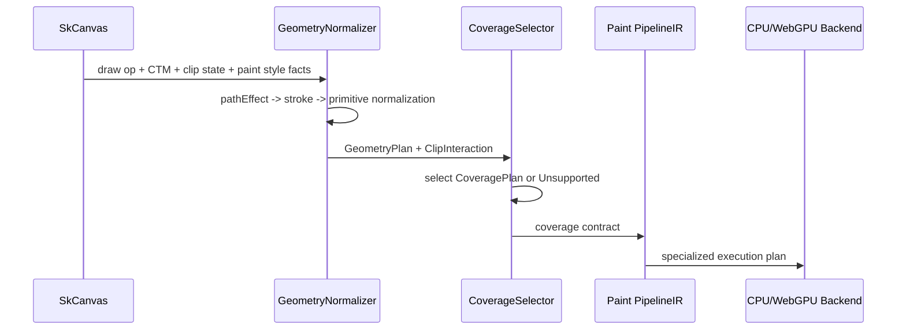

# Spec 02: Geometry Lowering Rules

Status: Draft
Target: `.upstream/target/high-performance-wgsl-pipeline-target.md`

## Purpose

Define how public drawing operations become `GeometryPlan` and
`CoveragePlan`. This spec is about semantic order, not final code layout.

## Global Order

The geometry side of a draw follows this order:

```text
draw input
  -> capture current CTM and clip state
  -> apply path effect when present
  -> lower stroke when required
  -> normalize primitive and bounds
  -> lower clip stack to ClipInteraction
  -> choose GeometryPlan
  -> choose CoveragePlan
  -> pass coverage contract to Paint PipelineIR
```

Paint lowering starts after coverage selection. It may consume the coverage
contract but must not reinterpret raw path, stroke, or clip-stack state.



## `drawRect`

Inputs:

- source `SkRect`;
- paint style;
- CTM;
- clip state;
- paint path effect, mask filter, shader presence as routing facts.

Lowering:

- Axis-aligned fill with no path effect can produce `GeometryPrimitive.Rect`.
- Stroke rect may produce an analytic annular rect coverage when supported.
- Stroke rect may lower through `GeometryPrimitive.Path` when path effect,
  shader path, or complex stroke semantics require shared path handling.
- Non-axis-aligned rects lower to `GeometryPrimitive.Path`.
- Empty rects are no-op unless paint/blend semantics require touching
  zero-alpha covered pixels; that exception belongs to paint/blend, not
  geometry.

Coverage:

- fill, axis-aligned: `AnalyticRect`;
- stroke, axis-aligned: `AnalyticRect` or `AnalyticRRect` only if semantics are
  exact enough for the selected backend;
- rotated/skewed: path coverage, usually fan or stencil-cover on GPU and spans
  on CPU.

## `drawPath`

Inputs:

- source `SkPath`;
- fill type;
- paint style;
- path effect;
- mask filter;
- CTM;
- clip state.

Lowering:

- Apply supported path effects before stroke.
- Stroke style lowers using shared stroking invariants.
- Stroke-and-fill lowers into two geometry operations: fill, then stroke
  outline.
- Curves are flattened only by a named lowering stage with explicit tolerance.
- Inverse fill keeps the clip bounds as the conservative draw area.
- Path verbs and contour starts must be preserved until a backend strategy is
  selected.

Coverage:

- CPU: scanline spans or mask/RLE.
- WebGPU convex single-contour: CPU-prepared fan when accepted.
- WebGPU concave, inverse, multi-contour: stencil-cover.
- WebGPU AA: edge-segment coverage when edge count is within declared limits;
  otherwise fallback to a supported mask/atlas or unsupported diagnostic.

## Stroke Lowering

Rules:

- Stroke width, cap, join, and miter limit are geometry facts.
- Hairline means one device pixel when the backend supports that mode; source
  space stroking must compensate with transform scale when needed.
- Stroker flattening tolerance is tied to device-space error, not arbitrary
  source-space segment count.
- Open-contour caps and closed-contour joins must be tested separately.
- Degenerate zero-length contours require explicit cap behavior.

The first implementation may reuse `SkStroker`, but the spec target is shared
stroking invariants, not backend-local copies.

## Clip Lowering

Rules:

- `clipRect`, `clipPath`, `clipRRect`, `clipRegion`, and `clipShader` lower
  before `GeometryPlan` consumption.
- Difference clips are represented in `ClipInteraction`, not in paint.
- Rect clips may tighten device bounds.
- Simple shape clips may become analytic clips.
- Arbitrary AA clips may become native CPU `SkAAClip`, alpha mask, coverage
  atlas entry, or unsupported WebGPU diagnostic.
- Multiple curved clip shapes are unsupported on WebGPU until a list/atlas path
  is specified.

## Glyph Masks

Rules:

- Text shaping and glyph discovery remain outside this geometry layer.
- Geometry sees a glyph run or positioned glyph mask reference.
- Glyph coverage normally lowers to `CoveragePlan.AlphaMask`.
- Glyph atlas ownership remains with text/glyph infrastructure.
- Geometry must not invent glyph rasterization substitutes.

## Image Rect

Rules:

- Image rect geometry describes source rect, destination rect, transform facts,
  and sampling geometry.
- Pixel sampling and colorspace belong to paint/image shader logic.
- Geometry may choose analytic rect coverage for axis-aligned image rects.
- Rotated/skewed image rects lower through path-like coverage while preserving
  image sampling payload for paint.

## Mask Filters

Rules:

- Shape mask creation is geometry/coverage.
- Filter kernel execution is effect/backend behavior.
- The handoff between the two must be explicit: shape coverage is rendered or
  materialized first, then filtered, then paint is applied or sampled.

## Acceptance Criteria

- Each draw family has a documented lowering order.
- Existing CPU and WebGPU behavior can be mapped to these rules.
- Every fallback path names a reason code from `05-fallback-diagnostics.md`.
- No rule requires porting Graphite, Ganesh, or SkSL.
