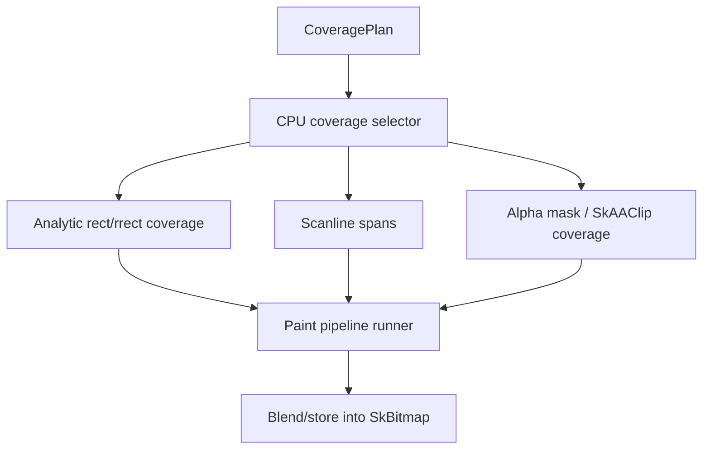

# Spec 03: CPU Coverage Backend

Status: Accepted
Target: `.upstream/target/high-performance-wgsl-pipeline-target.md`

## M24 Acceptance Evidence

Accepted on 2026-05-27 for the geometry/coverage scope covered by the M24
conformance gate.

Evidence links:

- PR #1142 / `12684fb7259644bb2932e930026c7134177e1964`: `pipelineConformance`.
- PR #1143 / `637e42344a335504bfe8d95b63351dfc40ebd872`: PM convergence report.
- PR #1144 / `2035b455535e35452097154d9b5d0f05eea8a866`: report regeneration fix.

Acceptance is limited to descriptor, selector, oracle, fallback, and migration
fixtures covered by `GeometryCoverageContractsTest`,
`GeometryCoverageMigrationHarnessTest`, and `WebGpuCoveragePlanSelectorTest`.
Additional primitive families need their own rollout evidence before default
routing.

## Purpose

Define the CPU/reference coverage path as the reference oracle for geometry
behavior. The oracle is current `:kanvas` behavior plus
`:integration-tests:skia` reference evidence, not retired `kanvas-skia` or
`cpu-raster` code.

## Ownership

Current owner modules:

- `kanvas/src/main/kotlin/org/graphiks/kanvas/`
- `kanvas/src/main/kotlin/org/skia/foundation/`
- `integration-tests/skia/src/test/kotlin/org/graphiks/kanvas/skia/`

Future target owner:

- backend-neutral contracts in a geometry/coverage package;
- CPU execution code that consumes `CoveragePlan`.

Retired CPU-raster code is not the owner of `CoveragePlan`. The first owner is
the Kanvas geometry/coverage contract; `:kanvas` adapts current CPU/reference
drawing state into those contracts.

## Supported CoveragePlan Mapping

| CoveragePlan | CPU mapping |
|---|---|
| `Full` | Iterate clipped device bounds at full coverage. |
| `AnalyticRect` | Existing rect overlap rules for AA or snapped non-AA pixels. |
| `AnalyticRRect` | Analytic path if exact enough; otherwise path spans. |
| `SpanRuns` | Native scanline spans. |
| `AlphaMask` | A8 mask sampled as coverage. |
| `PathCoverage` | Path scanline semantics using fill type, inverse fill, and AA facts. |
| `CoverageAtlas` | Optional cache of A8/RLE coverage, profile-driven only. |
| `Unsupported` | Stable diagnostic or declared compatibility route. |

## CPU Reference Rules

- CPU coverage is the behavioral oracle for WebGPU comparisons.
- CPU execution may use scalar loops first.
- Java 25 Vector API paths are optimization plans, not correctness
  dependencies.
- Native `SkAAClip` RLE remains valid storage for clip coverage.
- Path fill rules must match `SkPathFillType`: winding, even-odd, inverse
  winding, inverse even-odd.
- Rect edge rounding must be named and tested.
- Coverage multiplication order with clip and clip shader must be stable.

## Java 25 Vector Policy

SIMD work should use what is available in Java 25 rather than introducing a
native dependency or a custom intrinsic layer.

Rules:

- Keep every vectorized path paired with a scalar reference loop.
- Gate vector kernels behind capability checks and deterministic fallbacks.
- Prefer row-local kernels where input/output arrays are contiguous: coverage
  multiplication, premultiplied color application, blend preparation, and mask
  sampling.
- Do not vectorize path topology, contour classification, or winding decisions
  until profiling proves the scalar algorithm is the bottleneck.
- Tests compare scalar and vector output byte-for-byte or with an explicitly
  documented float tolerance.
- Benchmarks must report scalar time, vector time, selected vector species,
  touched pixels, and fallback count.

## Span Execution Model

Required runner inputs:

- device row;
- x range;
- coverage byte or float;
- clip coverage;
- optional mask coverage;
- paint pipeline descriptor;
- destination storage descriptor.

## SkAAClip Usage

`SkAAClip` remains the reference representation for non-rect CPU clips.

Rules:

- Rect clips should stay fast-path where possible.
- Arbitrary path clips may become `SkAAClip`.
- Clip operations use explicit alpha combinators.
- Per-pixel access is acceptable for correctness tests; optimized row-run
  iteration should be added only when profiling requires it.

## Mask Coverage

Rules:

- A8 masks are coverage, not color.
- Glyph masks and path masks must identify their bounds and coordinate space.
- Mask filters may widen bounds; widened bounds must be represented before
  paint consumes the coverage.

## Diagnostics

The CPU backend should emit diagnostics only when a geometry contract cannot be
represented safely. It should not hide correctness gaps behind permissive
fallbacks.

Suggested CPU diagnostics use the shared reason code plus `backend=CPU`.
Reason codes do not carry a backend prefix:

- `geometry.unsupported-perspective`
- `geometry.nonfinite-input`
- `coverage.alpha-mask-unsupported`
- `coverage.arbitrary-aa-clip-unsupported`

## Validation

Required tests:

- unit tests for descriptor selection;
- existing `SkBitmapDevice` rect/path/stroke/clip tests;
- integration GM golden tests;
- CPU old-path vs descriptor-driven path equivalence tests during migration;
- tests for stable unsupported reasons.

Migration harness details are specified in `07-migration-shim.md`.

## Performance Counters

Track:

- span count;
- touched pixels;
- mask bytes allocated;
- `SkAAClip` run count;
- path edge count after flattening;
- temporary buffer bytes;
- scalar vs vector execution time once vector pilots start.

## Acceptance Criteria

- `:kanvas` compatibility facade is named as the oracle in tests and docs.
- At least one descriptor dump can show CPU coverage selection for rect and
  path.
- Existing CPU visual behavior does not regress.
- Unsupported CPU cases produce stable diagnostics.
