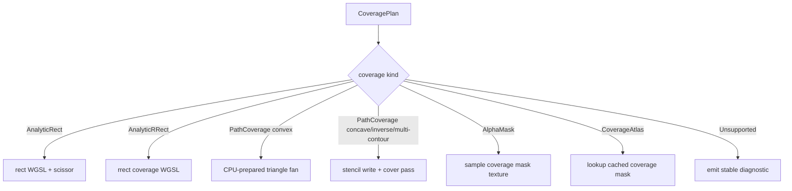

# Spec 04: WebGPU Coverage Backend

Status: Accepted
Target: `.upstream/target/high-performance-wgsl-pipeline-target.md`

## M24 Acceptance Evidence

Accepted on 2026-05-27 for the geometry/coverage scope covered by the M24
conformance gate.

Evidence links:

- PR #1142 / `12684fb7259644bb2932e930026c7134177e1964`: `pipelineConformance`.
- PR #1143 / `637e42344a335504bfe8d95b63351dfc40ebd872`: PM convergence report.
- PR #1144 / `2035b455535e35452097154d9b5d0f05eea8a866`: report regeneration fix.

Acceptance is limited to descriptor, selector, oracle, fallback, and migration
fixtures covered by `GeometryCoverageContractsTest`,
`GeometryCoverageMigrationHarnessTest`, and `WebGpuCoveragePlanSelectorTest`.
Additional primitive families need their own rollout evidence before default
routing.

## Purpose

Define how WebGPU consumes `GeometryPlan` and `CoveragePlan` without porting
Graphite or Ganesh. WebGPU may use GPU-native strategies, but the semantic
coverage contract remains shared with CPU.

## Ownership

Current owner module:

- `gpu-renderer/src/main/kotlin/org/skia/gpu/webgpu/SkWebGpuDevice.kt`

Related resources:

- `gpu-renderer/src/main/resources/shaders/*.wgsl`
- WGSL parser/generator integration from `webgpu-ktypes`

## Supported CoveragePlan Mapping

| CoveragePlan | WebGPU mapping |
|---|---|
| `Full` | Full scissor/viewport draw. |
| `AnalyticRect` | Fragment analytic coverage and scissor. |
| `AnalyticRRect` | Fragment analytic rrect coverage. |
| `SpanRuns` | Unsupported initially unless encoded through an upload/mask path. |
| `AlphaMask` | Texture mask sampled as coverage. |
| `PathCoverage` | Convex fan, stencil-cover, or mask/atlas strategy selected by path facts. |
| `CoverageAtlas` | Profile-driven mask atlas, not default. |
| `Unsupported` | Stable diagnostic; no silent scissor-only approximation. |

## Strategy Selection

Rules:

- Convex fan is CPU-prepared: WebGPU receives a triangle list.
- Stencil-cover is WebGPU execution strategy, but vertices are still prepared
  by host-side lowering unless a future profiling decision introduces compute.
- AA coverage can use edge-segment data in WGSL when bounded by explicit
  limits.
- Arbitrary clip masks require an explicit mask/atlas strategy.
- Analytical simple-shape clip data may be packed as uniforms when it does not
  alter layout or pipeline state.

## PipelineKey Interaction

There is no standalone public `PipelineKey` type yet. The current anchor is
`SkWebGpuDevice.PipelineKeyClassification`,
`SkWebGpuDevice.buildPipelineKeyForDiagnostics`, and
`PipelineKeyTelemetryTest`.

Geometry/coverage axes may enter that diagnostic key, or a future shared key
type, only when they affect layout, WGSL code, or WebGPU pipeline state.

Likely pipeline-state axes:

- primitive topology;
- depth/stencil enabled;
- fill rule stencil read mask/compare mode;
- blend state;
- attachment/intermediate format;
- multisampling when introduced.

Likely code/layout axes:

- analytic rect vs rrect helper;
- mask texture/sampler presence;
- edge segment array presence and max count policy;
- gradient/bitmap/runtime paint payload presence.

Uniform-only axes:

- rect bounds;
- rrect bounds and radii when helper already exists;
- clip shape bounds and radii;
- fill color;
- transform values;
- cache lookup coordinates.

The key identity, hash, collision, and dump policy follows
`.upstream/specs/wgsl-pipeline/04-gpu-generated-wgsl-backend.md#pipelinekey-identity`
when coverage axes become production key axes.

## WGSL Rules

- Generated WGSL must come from deterministic builders and pass parser
  validation.
- Shared paint helpers should be reused across rect, polygon, stencil-cover,
  and mask paths where layout permits.
- Coverage helpers must be separate from paint color helpers.
- Mask and atlas sampling must define coordinate space and edge behavior.

## Stencil-Cover

Stencil-cover is a WebGPU execution strategy for `CoveragePlan.PathCoverage`.
It is required for concave, inverse, or multi-contour paths unless a mask/atlas
strategy is explicitly selected.

Rules:

- Stencil write pass updates winding/even-odd state.
- Cover pass applies paint and coverage.
- AA cover path may render inside/outside variants around edges.
- Fill type controls stencil read mask and compare operation.
- The cover geometry is bbox or viewport for inverse fill.

## Coverage Atlas

Atlas is not part of the first implementation by default.

A `CoverageAtlas` strategy may be accepted when profiling shows repeated
coverage generation cost or repeated mask uploads dominate a real scene.

Required before enabling persistent atlas:

- shape key definition;
- transform key definition;
- invalidation policy;
- memory budget;
- eviction policy;
- CPU/GPU synchronization policy;
- visual tests proving no stale masks.

## Concurrency

Initial WebGPU coverage work follows the same single owner-thread model as the
generated WGSL backend:

- `SkWebGpuDevice`, WebGPU handles, coverage caches, and telemetry mutation are
  owned by the render/device thread;
- host-side geometry lowering may prepare immutable descriptors off-thread;
- WebGPU handle creation, cache mutation, and telemetry updates happen on the
  owner thread;
- shared mutable caches, atomics, or locks require a follow-up ADR and stress
  tests.

## Diagnostics

Suggested WebGPU diagnostics use the shared reason code plus `backend=GPU`.
Reason codes do not carry a backend prefix:

- `coverage.span-runs-unsupported`
- `coverage.arbitrary-aa-clip-unsupported`
- `coverage.edge-count-exceeded`
- `coverage.atlas-policy-unavailable`
- `geometry.unsupported-perspective`
- `geometry.compute-tessellation-not-enabled`

## Validation

Required:

- cross-backend visual tests for each strategy;
- WGSL parser validation for generated/handwritten modules touched;
- pipeline key dump for strategy selection;
- warm-frame pipeline-cache check;
- fallback reason tests for unsupported coverage.

Initial measurable gates:

- at least 60 warmup frames before steady-state measurement unless the scene
  provides a documented 3-sigma stabilization rule;
- zero pipeline creations over 120 consecutive steady-state frames for a PM
  demo scene, or an explicit accepted exception;
- at most 16 resident generated/coverage WGSL modules for a PM demo scene
  unless a reviewed scene-specific bound is documented.

## Acceptance Criteria

- WebGPU strategy selection is driven by `CoveragePlan`, not ad hoc path code.
- Every unsupported strategy has a stable diagnostic.
- CPU reference comparison exists for each enabled strategy.
- No compute tessellation is introduced without a profiling ADR.
