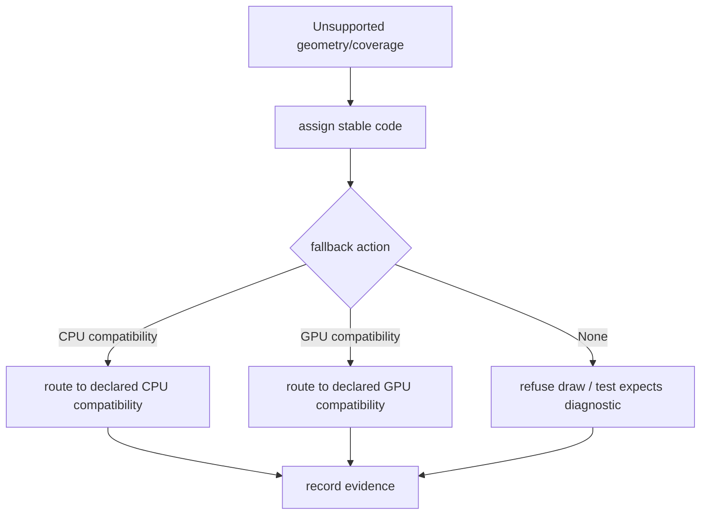

# Spec 05: Fallback Diagnostics

Status: Accepted
Target: `.upstream/target/high-performance-wgsl-pipeline-target.md`

## M24 Acceptance Evidence

Accepted on 2026-05-27 for the geometry/coverage scope covered by the M24
conformance gate.

Evidence links:

- PR #1142 / `12684fb7259644bb2932e930026c7134177e1964`: `pipelineConformance`.
- PR #1143 / `637e42344a335504bfe8d95b63351dfc40ebd872`: PM convergence report.
- PR #1144 / `2035b455535e35452097154d9b5d0f05eea8a866`: report regeneration fix.

Acceptance is limited to descriptor, selector, oracle, fallback, and migration
fixtures covered by `GeometryCoverageContractsTest`,
`GeometryCoverageMigrationHarnessTest`, and `WebGpuCoveragePlanSelectorTest`.
Additional primitive families need their own rollout evidence before default
routing.


## Purpose

Make geometry and coverage refusal explicit. Unsupported behavior must be
diagnosed, not hidden behind wrong pixels or accidental backend switches.

## Diagnostic Model

Representative shape:

```kotlin
data class CoverageDiagnostic(
    val reason: DiagnosticReason,
    val severity: Severity,
    val backend: BackendKind,
    val drawKind: String,
    val message: String,
    val fallback: FallbackAction,
)

enum class Severity { Warning, Error }

sealed interface FallbackAction {
    data object None : FallbackAction
    data class CpuCompatibility(val reason: DiagnosticReason) : FallbackAction
    data class ExistingGpuCompatibility(val reason: DiagnosticReason) : FallbackAction
    data class Refuse(val reason: DiagnosticReason) : FallbackAction
}
```

`CoverageDiagnostic.reason.code` is the stable string stored in current
string-based dumps or `FallbackPlan.reason` fields until those APIs migrate.
`Info` is intentionally not a severity for unsupported coverage. Any fallback,
refusal, or compatibility route is at least `Warning`; incorrect or unsafe
execution is `Error`.

## Reason Code Rules

- Codes are stable test fixtures.
- Codes are lower-case dotted identifiers.
- Codes identify the failed contract, not the incidental implementation line.
- Messages may change; codes should not.
- Fallback action must be explicit.

## Geometry Codes

Suggested initial codes:

| Code | Meaning |
|---|---|
| `geometry.nonfinite-input` | Path or bounds contain non-finite values. |
| `geometry.unsupported-perspective` | Perspective transform is not supported for the primitive/backend. |
| `geometry.stroke-degenerate` | Stroke cannot produce safe outline coverage. |
| `geometry.path-effect-unsupported` | Path effect cannot lower to geometry. |
| `geometry.clip-stack-unsupported` | Clip stack cannot lower to `ClipInteraction`. |
| `geometry.compute-tessellation-not-enabled` | Compute tessellation would be required but is out of scope. |

## Coverage Codes

Suggested initial codes:

| Code | Meaning |
|---|---|
| `coverage.span-runs-unsupported` | Backend cannot execute span-run coverage. |
| `coverage.alpha-mask-unsupported` | Backend cannot sample/materialize alpha mask coverage. |
| `coverage.stencil-cover-unavailable` | Backend cannot execute required stencil-cover path. |
| `coverage.edge-count-exceeded` | AA edge coverage exceeds configured GPU limit. |
| `coverage.atlas-policy-unavailable` | Requested atlas policy is not implemented/enabled. |
| `coverage.arbitrary-aa-clip-unsupported` | Arbitrary AA clip cannot execute on selected backend. |

## Backend Action Policy

CPU:

- Prefer correct execution where possible.
- Emit diagnostics for non-finite, unbounded, or unsafe geometry.
- May use a `:kanvas` compatibility route only when declared.

WebGPU:

- May use existing GPU compatibility paths when they preserve semantics.
- Must refuse unsafe approximation.
- Must not silently replace arbitrary clip with integer scissor.
- Must not switch to CPU readback without explicit fallback action.

## Review Flow



## Dumps

Developer-facing dumps should include:

- draw kind;
- `GeometryPlan`;
- `CoveragePlan`;
- backend selected;
- fallback code;
- fallback action;
- bounds;
- transform facts;
- clip interaction;
- pipeline key when GPU is selected.

## Tests

Required tests:

- direct unit tests for reason-code stability;
- one unsupported CPU case;
- one unsupported WebGPU case;
- one declared compatibility fallback case;
- one PM-facing report fixture that includes code and action.

## Acceptance Criteria

- Every `Unsupported` plan has a code and action.
- Unsupported coverage never produces silently wrong pixels.
- Reviewers can map diagnostics back to Linear acceptance criteria.
