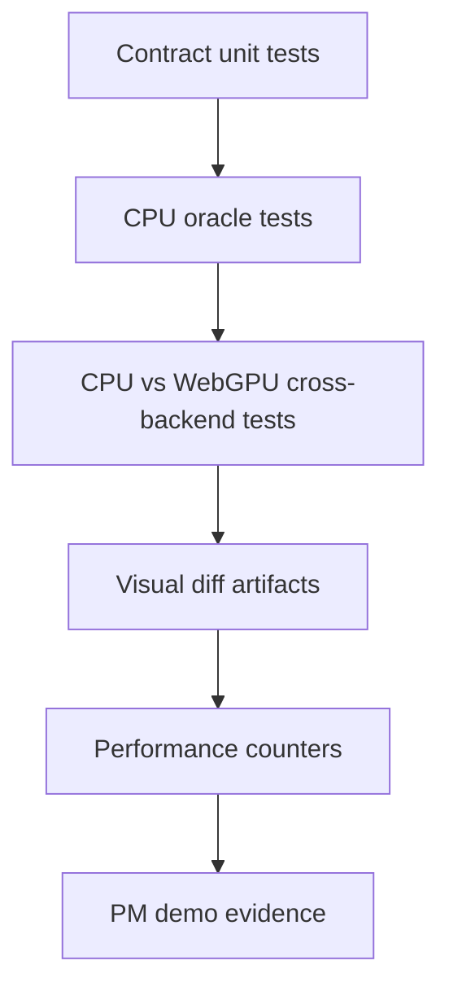

# Spec 06: Validation And Performance

Status: Accepted
Target: `.upstream/target/high-performance-wgsl-pipeline-target.md`

## M24 Acceptance Evidence

Accepted on 2026-05-27 for the geometry/coverage scope covered by the M24
conformance gate.

Evidence links:

- PR #1142 / `12684fb7259644bb2932e930026c7134177e1964`: `pipelineConformance`.
- PR #1143 / `637e42344a335504bfe8d95b63351dfc40ebd872`: PM convergence report.
- PR #1144 / `2035b455535e35452097154d9b5d0f05eea8a866`: report regeneration fix.

Acceptance is limited to descriptor, selector, oracle, fallback, and migration
fixtures covered by `GeometryCoverageContractsTest`,
`GeometryCoverageMigrationHarnessTest`, and `WebGpuCoveragePlanSelectorTest`.
Additional primitive families need their own rollout evidence before default
routing.


## Purpose

Define how Geometry/Coverage work proves correctness, performance, and PM
progress.

## Validation Layers



## CI Gates

The intended CI gates are:

| Gate | Purpose |
|---|---|
| `geometry-contracts` | Validate `GeometryPlan`, `CoveragePlan`, transform, clip, and reason-code contracts. |
| `cpu-coverage-oracle` | Compare descriptor-driven coverage against current `:kanvas` CPU/reference behavior. |
| `webgpu-coverage-cross-backend` | Compare enabled WebGPU strategies against CPU reference. |
| `wgsl-coverage-validate` | Parse touched/generated coverage WGSL and verify reflected packers. |
| `geometry-cache-warmup` | Assert warmup/stable pipeline creation and module-count gates. |

Until these are separate workflows, milestone PRs must run the equivalent
focused Gradle tasks and paste the command/evidence into Linear or the PR.

## Contract Tests

Required:

- `GeometryPlan` selection for rect, path, stroke, glyph mask, image rect.
- `CoveragePlan` selection for full, analytic rect/rrect, span runs, alpha
  mask, stencil-cover, unsupported.
- `ClipInteraction` lowering for rect/path/rrect intersect and difference.
- `TransformFacts` classification for identity, scale/translate,
  rotate/skew, perspective, singular.
- Stable reason-code tests.
- Migration shadow/compare fixtures from `07-migration-shim.md`.

## CPU Oracle Tests

CPU oracle is current `:kanvas` CPU/reference behavior plus
`:integration-tests:skia` reference evidence.

Required:

- descriptor-driven output equals current CPU output during migration;
- shadow mode does not change current CPU pixels;
- gated mode is enabled only for primitive families with compare evidence;
- rect AA/non-AA edge rules;
- path winding/even-odd/inverse;
- stroke caps/joins/miter;
- `SkAAClip` coverage interaction;
- glyph mask coverage;
- image rect geometry coverage.

## WebGPU Cross-Backend Tests

Each enabled WebGPU strategy needs a cross-backend test:

- analytic rect;
- analytic rrect/simple clip shape;
- CPU-prepared convex fan;
- stencil-cover concave;
- stencil-cover multi-contour;
- stencil-cover inverse fill;
- alpha mask or mask filter path when enabled;
- coverage atlas when enabled.

Each test records:

- geometry strategy;
- coverage strategy;
- paint strategy;
- fallback code if any;
- similarity/threshold result;
- artifact paths when the result is near or below floor.

Initial falsifiable thresholds:

| Metric | Initial value |
|---|---|
| CPU descriptor vs `:kanvas` compatibility facade integer fixtures | exact pixel match unless the primitive family names a tolerance. |
| CPU/WebGPU sRGB byte fixtures | max channel delta <= 1 for at least 99.5 percent of pixels, with no pixel above 3 unless the family-specific policy says otherwise. |
| DeltaE family policy | Required before using DeltaE as the review metric; until then, use channel delta/PSNR/SSIM policies named by the test. |
| Warmup before stable GPU measurement | >= 60 frames or documented 3-sigma stabilization. |
| Steady-state pipeline creations | 0 over 120 consecutive frames for the selected PM scene. |
| Java 25 Vector default promotion | >= 1.5x scalar on the named reference machine. |

## WGSL Validation

When a coverage strategy touches WGSL:

- generated/handwritten module parses through the WGSL parser;
- reflected layout matches Kotlin packer;
- golden generated source is deterministic when generation is involved;
- shader module count and pipeline key are dumped.

## Performance Counters

Required counters:

- geometry lowering time;
- path verb count;
- flattened segment count;
- contour count;
- edge count for AA GPU coverage;
- vertex buffer bytes;
- stencil pass count;
- mask/atlas bytes;
- coverage cache hit/miss;
- temporary allocations;
- CPU span count;
- WebGPU pipeline cache hit/miss;
- uniform upload bytes.

## Golden Corpus

Golden artifacts live under the owning module:

```text
<module>/src/test/resources/golden/<family>/<stable-id>.<ext>
```

Recommended extensions:

- `.json` for descriptors, reflection reports, coverage dumps, and pipeline
  keys;
- `.png` for visual outputs or diff images;
- `.wgsl` for generated coverage WGSL.

Rebaseline requires an explicit review note explaining why the golden changed.
CI must fail on unexpected golden drift. Bulk updates should use a named Gradle
task or documented `UPDATE_GOLDENS=1` path, not manual copy/paste.

## Benchmark Scenes

Initial scenes:

- many integer rects;
- fractional AA rects;
- rrect/oval/circle grid;
- convex paths;
- concave paths;
- multi-contour paths;
- stroke caps/joins/miter;
- clip path/rrect difference;
- glyph mask run;
- image rect with rotated destination;
- path-heavy GM subset.

## PM Evidence

Each milestone should produce one PM-readable artifact:

- descriptor dump;
- before/after visual diff;
- short benchmark table;
- fallback report;
- screenshot of geometry-heavy scene;
- link to PR/commit/test run.

Example:

```text
Milestone: M15 - WebGPU analytic rect/rrect convergence
Capability: WebGPU selects analytic rect/rrect coverage from CoveragePlan.
Evidence:
  - selector dump: WebGpuCoveragePlanSelectorTest
  - cross-backend: WebGpuCoveragePlanSelectorTest, p99.5 channel delta <= 1
Commands:
  - rtk ./gradlew :gpu-renderer:test --tests org.skia.gpu.webgpu.WebGpuCoveragePlanSelectorTest
Artifacts:
  - coverage selection dump
Known limitations: production draw-route wiring remains a follow-up if not in scope.
Next dependency: M16 CPU PathCoverage oracle.
Commit or PR: <link>
```

## Definition Of Done

A Geometry/Coverage implementation slice is done when:

- it satisfies the accepted spec section;
- CPU oracle evidence exists;
- WebGPU evidence exists or a stable unsupported diagnostic is asserted;
- no hidden dependency on legacy `:kanvas` is introduced;
- fallback behavior is explicit;
- PM evidence is attached to the relevant Linear ticket.
