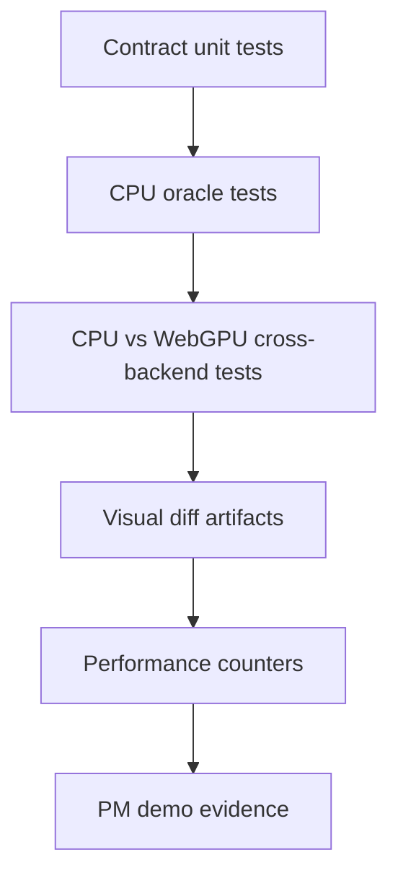

# Spec 06: Validation And Performance

Status: Draft
Target: `.upstream/target/high-performance-wgsl-pipeline-target.md`

## Purpose

Define how Geometry/Coverage work proves correctness, performance, and PM
progress.

## Validation Layers

## Contract Tests

Required:

- `GeometryPlan` selection for rect, path, stroke, glyph mask, image rect.
- `CoveragePlan` selection for full, analytic rect/rrect, span runs, alpha
  mask, stencil-cover, unsupported.
- `ClipInteraction` lowering for rect/path/rrect intersect and difference.
- `TransformFacts` classification for identity, scale/translate,
  rotate/skew, perspective, singular.
- Stable reason-code tests.
- Migration shadow/compare fixtures from `07-migration-shim.md`.

## CPU Oracle Tests

CPU oracle is `:kanvas-skia`.

Required:

- descriptor-driven output equals current CPU output during migration;
- shadow mode does not change current CPU pixels;
- gated mode is enabled only for primitive families with compare evidence;
- rect AA/non-AA edge rules;
- path winding/even-odd/inverse;
- stroke caps/joins/miter;
- `SkAAClip` coverage interaction;
- glyph mask coverage;
- image rect geometry coverage.

## WebGPU Cross-Backend Tests

Each enabled WebGPU strategy needs a cross-backend test:

- analytic rect;
- analytic rrect/simple clip shape;
- CPU-prepared convex fan;
- stencil-cover concave;
- stencil-cover multi-contour;
- stencil-cover inverse fill;
- alpha mask or mask filter path when enabled;
- coverage atlas when enabled.

Each test records:

- geometry strategy;
- coverage strategy;
- paint strategy;
- fallback code if any;
- similarity/threshold result;
- artifact paths when the result is near or below floor.

## WGSL Validation

When a coverage strategy touches WGSL:

- generated/handwritten module parses through the WGSL parser;
- reflected layout matches Kotlin packer;
- golden generated source is deterministic when generation is involved;
- shader module count and pipeline key are dumped.

## Performance Counters

Required counters:

- geometry lowering time;
- path verb count;
- flattened segment count;
- contour count;
- edge count for AA GPU coverage;
- vertex buffer bytes;
- stencil pass count;
- mask/atlas bytes;
- coverage cache hit/miss;
- temporary allocations;
- CPU span count;
- WebGPU pipeline cache hit/miss;
- uniform upload bytes.

## Benchmark Scenes

Initial scenes:

- many integer rects;
- fractional AA rects;
- rrect/oval/circle grid;
- convex paths;
- concave paths;
- multi-contour paths;
- stroke caps/joins/miter;
- clip path/rrect difference;
- glyph mask run;
- image rect with rotated destination;
- path-heavy GM subset.

## PM Evidence

Each milestone should produce one PM-readable artifact:

- descriptor dump;
- before/after visual diff;
- short benchmark table;
- fallback report;
- screenshot of geometry-heavy scene;
- link to PR/commit/test run.

## Definition Of Done

A Geometry/Coverage implementation slice is done when:

- it satisfies the accepted spec section;
- CPU oracle evidence exists;
- WebGPU evidence exists or a stable unsupported diagnostic is asserted;
- no hidden dependency on legacy `:kanvas` is introduced;
- fallback behavior is explicit;
- PM evidence is attached to the relevant Linear ticket.
