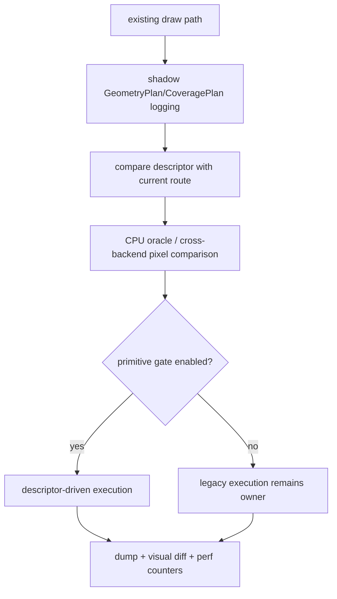

# Spec 07: Migration Shim

Status: Draft
Target: `.upstream/target/high-performance-wgsl-pipeline-target.md`

## Purpose

Introduce `GeometryPlan` and `CoveragePlan` without a big-bang rewrite of
`SkCanvas`, `SkBitmapDevice`, or `SkWebGpuDevice`.

The first implementation should prove descriptor correctness while existing
draw paths still produce pixels.

## Migration Loop

## Modes

| Mode | Behavior |
|---|---|
| Shadow | Build and dump descriptors, but execute current code path. |
| Compare | Execute current path and descriptor path into separate targets, then compare pixels/artifacts. |
| Gated | Route selected primitive families through descriptor path behind an explicit flag. |
| Default | Descriptor path owns the primitive; legacy route remains as declared compatibility fallback only. |

## Primitive Rollout Order

1. Axis-aligned filled rect.
2. Axis-aligned AA rect and stroked rect.
3. RRect/oval/circle analytic or materialized coverage.
4. Simple filled path.
5. Stroke outline path after `SkStroker`.
6. Clip rect/rrect/path interaction.
7. Glyph mask and image rect coverage.
8. Concave, inverse, and multi-contour path coverage.

## Descriptor Dumps

Each shadow or compare run should be able to dump:

- draw kind;
- CTM and `TransformFacts`;
- lowered clip state;
- `GeometryPlan`;
- `CoveragePlan`;
- resulting `CoverageModel` or backend strategy;
- fallback reason code and action;
- legacy route identifier;
- descriptor route identifier;
- pixel diff summary when compare mode is enabled.

## Pixel Comparison

Rules:

- CPU comparison uses `:kanvas-skia` current output as oracle during migration.
- WebGPU comparison uses existing cross-backend harnesses where available.
- Thresholds must be named per primitive family and recorded with artifacts.
- A descriptor path cannot become default unless the comparison artifact is
  attached to the relevant ticket.
- Unsupported descriptor paths must produce stable diagnostics instead of
  silently falling back.

## Rollout Gates

Each primitive family needs:

- one descriptor selection test;
- one shadow dump fixture;
- one old-path vs descriptor-path pixel comparison;
- one fallback reason test;
- one PM-readable artifact: dump, screenshot, visual diff, or small benchmark.

## Acceptance Criteria

- Existing draw paths can run in shadow mode without pixel changes.
- Compare mode can run at least one CPU primitive and one WebGPU primitive.
- Gated mode is explicit per primitive/backend; no implicit auto-switching.
- Default cutover is allowed only after oracle evidence and fallback tests.
