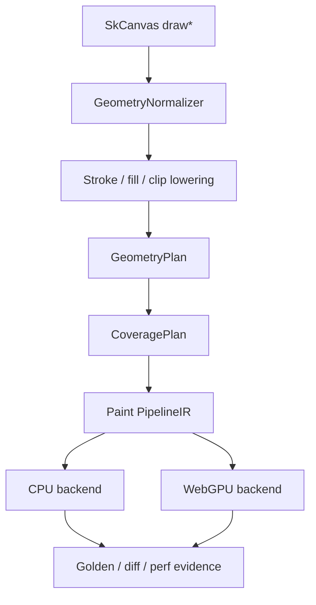
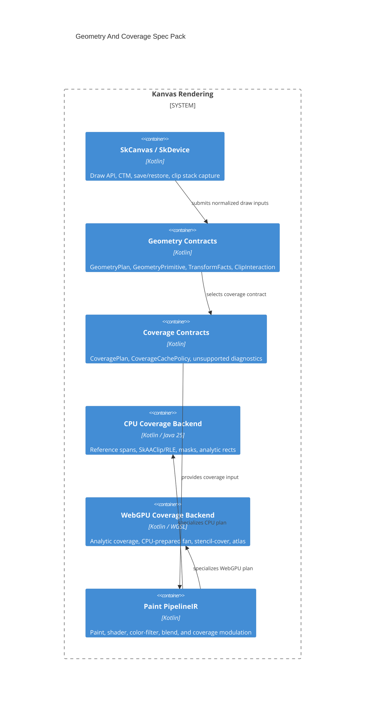

# Geometry And Coverage Specs

Status: Draft
Target: `.upstream/target/high-performance-wgsl-pipeline-target.md`

This spec pack turns the validated Geometry And Coverage target into
implementation-ready technical contracts. It is intentionally separate from
the WGSL paint-pipeline milestones: geometry produces coverage; paint consumes
coverage.

## Source Of Truth

- Target architecture:
  `.upstream/target/high-performance-wgsl-pipeline-target.md`
- Execution method:
  `.upstream/target/linear-agent-methodology.md`
- Upstream/rebaseline evidence:
  `reports/upstream-rebaseline/` and `.upstream/source/map/`

Hard constraints:

- Do not port Ganesh or Graphite.
- Do not introduce SkSL, SkSL IR, or Graphite paint-key machinery.
- Keep WebGPU as the GPU backend.
- Keep `:kanvas-skia` CPU coverage as the behavior oracle.
- Treat legacy `:kanvas` as historical/porting evidence only.

## Status Policy

Specs start as `Draft`. A spec can move to `Accepted` only when the owning
Geometry/Coverage milestone has merged implementation evidence, fallback
behavior is asserted in tests or reports, and the PM evidence comment links the
relevant commit or PR. Editorial fixes do not change status.

## Spec Index

| Spec | Purpose |
|---|---|
| `00-current-state-inventory.md` | Current CPU/GPU geometry and coverage behavior. |
| `01-contracts-geometry-coverage.md` | `GeometryPlan`, `CoveragePlan`, clip, transform, cache, and unsupported contracts. |
| `02-lowering-rules.md` | Draw, stroke, clip, glyph, image, and mask lowering rules. |
| `03-cpu-coverage-backend.md` | CPU reference execution, spans, `SkAAClip`, masks, Java 25 Vector policy, and oracle behavior. |
| `04-webgpu-coverage-backend.md` | WebGPU analytic, fan, stencil-cover, mask atlas, and pipeline-key strategy. |
| `05-fallback-diagnostics.md` | Stable fallback reason taxonomy and reporting rules. |
| `06-validation-and-perf.md` | Tests, visual evidence, benchmarks, counters, and Definition of Done. |
| `07-migration-shim.md` | Shadow logging, equivalence checks, rollout gates, and progressive cutover. |

Decision records live under `adr/`.

## Target Shape

## Spec Acceptance Rules

A Geometry/Coverage spec is accepted only when it names:

- affected modules and ownership boundaries;
- explicit non-goals;
- data contracts and invariants;
- fallback behavior and stable diagnostic reasons;
- CPU reference behavior;
- WebGPU behavior or refusal mode;
- tests, visual artifacts, and benchmark counters;
- unresolved questions that must block implementation tickets.

## Design Decisions

The initial design questions are tracked as ADRs so implementation tickets do
not reopen them ad hoc:

- `adr/0004-contract-owner-package.md`: own backend-neutral contracts in
  `:render-pipeline`.
- `adr/0005-webgpu-aa-edge-budget.md`: start with the current 256-edge WebGPU
  AA budget and stable overflow diagnostic.
- `adr/0006-mask-ownership-boundary.md`: keep glyph atlas ownership in text
  infrastructure and path/filter mask ownership in coverage backends.
- `adr/0007-java25-vector-environment.md`: use the Java 25 Vector API
  incubator module with scalar fallbacks.
