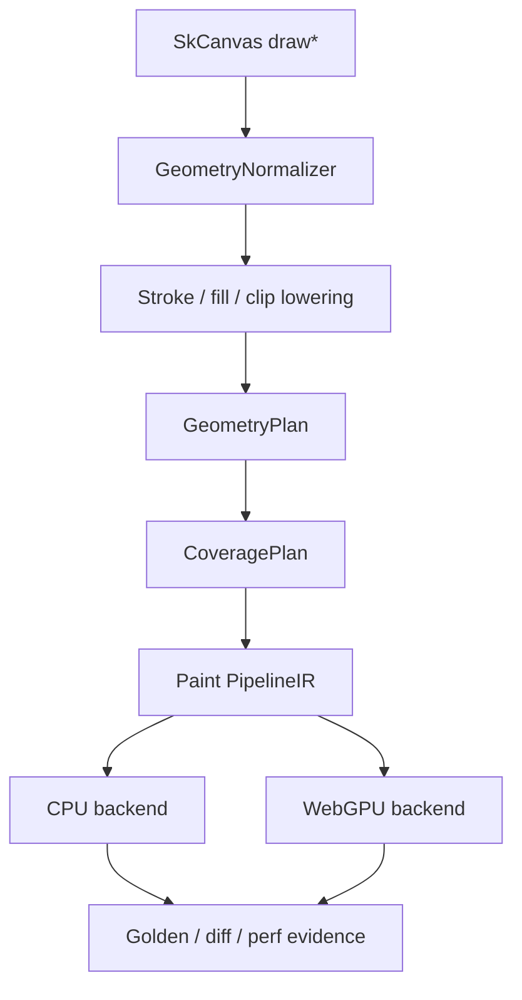
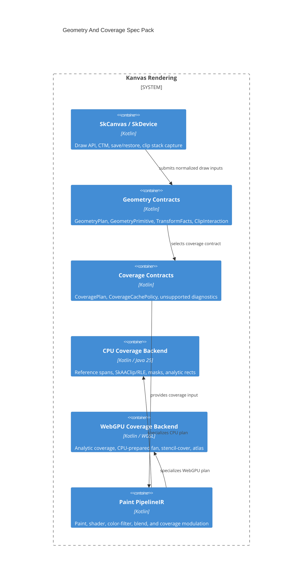

# Geometry And Coverage Specs

Status: Draft
Target: `.upstream/target/high-performance-wgsl-pipeline-target.md`

This spec pack turns the validated Geometry And Coverage target into
implementation-ready technical contracts. It is intentionally separate from
the WGSL paint-pipeline milestones: geometry produces coverage; paint consumes
coverage.

## Source Of Truth

- Target architecture:
  `.upstream/target/high-performance-wgsl-pipeline-target.md`
- Execution method:
  `.upstream/target/linear-agent-methodology.md`
- Upstream/rebaseline evidence:
  `reports/upstream-rebaseline/` and `.upstream/source/map/`

Hard constraints:

- Do not port Ganesh or Graphite.
- Do not introduce SkSL, SkSL IR, or Graphite paint-key machinery.
- Keep WebGPU as the GPU backend.
- Keep `:kanvas` compatibility facade CPU coverage as the behavior oracle.
- Treat legacy `:kanvas` as historical/porting evidence only.

## Status Policy

Specs start as `Draft`. A spec can move to `Accepted` only when the owning
Geometry/Coverage milestone has merged implementation evidence, fallback
behavior is asserted in tests or reports, and the PM evidence comment links the
relevant commit or PR. Editorial fixes do not change status.

## M24 Status Review

Review date: 2026-05-27

Evidence:

- Conformance command:
  `rtk ./gradlew --no-daemon pipelineConformance`
- PM report command:
  `rtk ./gradlew --no-daemon pipelineConformanceReport`
- M24 conformance task: PR #1142 / merge
  `12684fb7259644bb2932e930026c7134177e1964`
- PM report generation: PR #1143 / merge
  `637e42344a335504bfe8d95b63351dfc40ebd872`
- Report regeneration fix: PR #1144 / merge
  `2035b455535e35452097154d9b5d0f05eea8a866`

| Spec | M24 status | Evidence | Remaining gaps |
|---|---|---|---|
| `00-current-state-inventory.md` | Draft | Inventory updated with descriptor and selector evidence. | The inventory remains descriptive and tracks unresolved atlas/glyph/image coverage ownership. |
| `01-contracts-geometry-coverage.md` | Accepted | `GeometryCoverageContractsTest`, `GeometryCoverageMigrationHarnessTest`, `pipelineConformance`. | New primitives must add contract fixtures before default routing. |
| `02-lowering-rules.md` | Draft | Rect, rrect, path, stroke, and clip slices have migration evidence. | Glyph masks, image rect lowering, coverage atlas policy, and full clip-stack breadth remain partial. |
| `03-cpu-coverage-backend.md` | Accepted | CPU descriptor oracle tests in `GeometryCoverageMigrationHarnessTest`. | More primitive families need old-path vs descriptor comparisons before default routing. |
| `04-webgpu-coverage-backend.md` | Accepted | `WebGpuCoveragePlanSelectorTest`, PipelineKey diagnostics, PM report. | GPU adapter CI is skipped under the current gate and remains residual risk. |
| `05-fallback-diagnostics.md` | Accepted | Stable reason-code tests and unsupported descriptor diagnostics in conformance. | New refusal modes must add stable codes before use. |
| `06-validation-and-perf.md` | Accepted | `pipelineConformance`, `pipelineConformanceReport`, Linear evidence comments. | Slow performance gates remain opt-in until CI budget accepts them. |
| `07-migration-shim.md` | Accepted | Shadow, compare, gated, default, rollback, and unsupported diagnostics in migration harness tests. | Additional primitive families still need their own rollout evidence. |

## M30 Residual Scope Decomposition

GRA-65 converts the remaining Draft Geometry/Coverage breadth into explicit
Linear follow-up tickets. These tickets describe future scope and evidence
requirements; they do not claim implementation completion for the listed
families.

| Residual scope | Classification | Follow-up | Evidence boundary |
|---|---|---|---|
| Glyph masks and text coverage ownership | Dependency-gated post-baseline capability | GRA-66 | Text/glyph infrastructure keeps glyph discovery, rasterization, atlas lifetime, and invalidation ownership; geometry only consumes a glyph mask or glyph-run coverage contract. |
| Image rect lowering and image/bitmap coverage interaction | Post-baseline capability | GRA-67 | Geometry owns source/destination rect facts and coverage selection; paint/image shader logic owns sampling, filtering, and colorspace payloads. |
| Coverage atlas policy | Dependency-gated | GRA-68 | Persistent atlas remains disabled until shape keys, transform keys, budgets, eviction, synchronization, and profiling evidence justify it. |
| Full clip-stack breadth | Release-blocking for full lowering-rules acceptance | GRA-69 | Intersect, difference, AA, and multi-shape clips must map to supported `ClipInteraction` strategies or stable refusal diagnostics. |
| WebGPU coverage strategies with adapter-risk-only evidence | Dependency-gated and post-baseline | GRA-70 | GPU-supported claims require adapter-backed or equivalent scheduled evidence; skipped adapter lanes remain explicit blockers or risk states. |

## Spec Index

| Spec | Purpose |
|---|---|
| `00-current-state-inventory.md` | Current CPU/GPU geometry and coverage behavior. |
| `01-contracts-geometry-coverage.md` | `GeometryPlan`, `CoveragePlan`, clip, transform, cache, and unsupported contracts. |
| `02-lowering-rules.md` | Draw, stroke, clip, glyph, image, and mask lowering rules. |
| `03-cpu-coverage-backend.md` | CPU reference execution, spans, `SkAAClip`, masks, Java 25 Vector policy, and oracle behavior. |
| `04-webgpu-coverage-backend.md` | WebGPU analytic, fan, stencil-cover, mask atlas, and pipeline-key strategy. |
| `05-fallback-diagnostics.md` | Stable fallback reason taxonomy and reporting rules. |
| `06-validation-and-perf.md` | Tests, visual evidence, benchmarks, counters, and Definition of Done. |
| `07-migration-shim.md` | Shadow logging, equivalence checks, rollout gates, and progressive cutover. |
| `08-path-aa-mvp-boundary.md` | M33 Path AA MVP boundary for edge-budget refusals, inventory classification, and smoke promotion decisions. |

Decision records live under `adr/`.

## Target Shape

## Spec Acceptance Rules

A Geometry/Coverage spec is accepted only when it names:

- affected modules and ownership boundaries;
- explicit non-goals;
- data contracts and invariants;
- fallback behavior and stable diagnostic reasons;
- CPU reference behavior;
- WebGPU behavior or refusal mode;
- tests, visual artifacts, and benchmark counters;
- unresolved questions that must block implementation tickets.

## Design Decisions

The initial design questions are tracked as ADRs so implementation tickets do
not reopen them ad hoc:

- `adr/0004-contract-owner-package.md`: own backend-neutral contracts in
  `:render-pipeline`.
- `adr/0005-webgpu-aa-edge-budget.md`: start with the current 256-edge WebGPU
  AA budget and stable overflow diagnostic.
- `adr/0006-mask-ownership-boundary.md`: keep glyph atlas ownership in text
  infrastructure and path/filter mask ownership in coverage backends.
- `adr/0007-java25-vector-environment.md`: use the Java 25 Vector API
  incubator module with scalar fallbacks.
