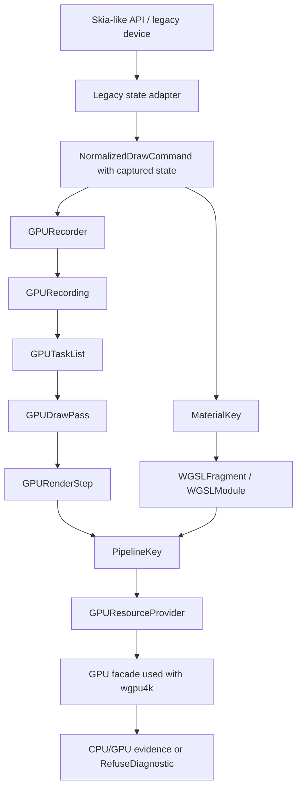

# GPU Renderer Specs

Status: Draft
Date: 2026-06-13
Target: proposed GPU-first successor direction for the active WGSL/WebGPU
renderer work.

This spec pack captures the agreed kernel for a new Kanvas GPU renderer module.
It is intentionally narrower than a full implementation plan. It defines the
module shape, naming policy, command boundary, WGSL material model, pipeline
key split, route policy, legacy cleanup policy, and validation expectations
that future implementation tickets must follow.

The current `.upstream/target/high-performance-wgsl-pipeline-target.md` and
`.upstream/target/skia-like-realtime-renderer-target.md` remain active project
context until a target update is explicitly accepted. This pack records the new
direction being designed: GPU-first, Graphite-inspired, inline on the `GPU`
facade used with `wgpu4k`, and WGSL-only for shader implementation.

## Source Of Truth

- Parent rendering context:
  `.upstream/target/high-performance-wgsl-pipeline-target.md`
- Active realtime context:
  `.upstream/target/skia-like-realtime-renderer-target.md`
- Existing WGSL paint specs:
  `.upstream/specs/wgsl-pipeline/README.md`
- Existing geometry/coverage specs:
  `.upstream/specs/geometry-coverage/README.md`
- Local Skia Graphite source evidence:
  `/Users/chaos/workspace/kanvas-forge/skia-main/src/gpu/graphite/`
- WGSL language validation model:
  `https://gpuweb.github.io/gpuweb/wgsl/`

## Hard Constraints

- Do not port Ganesh or Graphite.
- Do not rebuild Skia's SkSL compiler, IR, or VM.
- Do not introduce a Kanvas-owned multi-API graphics abstraction around the
  `GPU` facade used with `wgpu4k`.
- Keep the shader implementation target as WGSL.
- Treat SkSL only as Skia API compatibility vocabulary where required; Kanvas
  does not dynamically compile arbitrary SkSL.
- Keep supported runtime effects registered through Kanvas descriptors with
  Kotlin/CPU behavior and parser-validated WGSL GPU implementations.
- Keep `ygdrasil-io/wgsl4k` behavior explicit. If parsing, reflection, or
  generation behavior is ambiguous, capture evidence and open a `wgsl4k`
  issue instead of hiding a workaround.
- Do not mark rendering support complete without CPU/GPU evidence or an
  explicit refusal, stable route diagnostics, and promotion gates.

## Accepted Kernel Decisions

- Create a new renderer module for the GPU-first architecture.
- Use public concept names with `GPU`, `CPU`, and `WGSL` in uppercase.
- Interpret `GPU` as the WebGPU-like facade used with `wgpu4k`, not as a browser
  only target and not as a free-form Vulkan/Metal abstraction.
- Keep the core module pure: it must not depend directly on `SkPaint`,
  `SkShader`, `SkPath`, or other Skia-like API types.
- Feed the core with high-level normalized draw commands.
- Capture draw state before it enters the core. The core does not replay a
  Canvas-style save/restore/matrix/clip stack.
- Separate `MaterialKey` from `PipelineKey`.
- Keep WGSL as the shader language. Graphite's SkSL paint machinery maps to
  Kanvas `MaterialKey`, `PipelineKey`, and parser-validated WGSL fragments.
- Prefer `GPUNative` routes. Allow `CPUPreparedGPU` only when CPU work produces
  an explicit artifact consumed by the GPU. Forbid silent full CPU fallback.
- Treat `CPUReferenceOnly` as evidence/oracle behavior, not as a product GPU
  route.
- Treat `RefuseDiagnostic` as a valid, stable outcome when no route is
  supported.
- Treat `KanvasPipelineIR` as legacy/migration context for the new renderer,
  not as the durable semantic center of the new GPU module.

## Spec Index

| Spec | Purpose |
|---|---|
| `00-architecture-kernel.md` | Module direction, naming rules, Graphite-inspired boundaries, and non-goals. |
| `01-normalized-draw-commands.md` | High-level draw command contract with captured transform, clip, layer, material, bounds, and ordering facts. |
| `02-gpu-recording-task-graph.md` | `GPURecorder`, `GPURecording`, `GPUTaskList`, `GPUDrawPass`, and `GPURenderStep` responsibilities. |
| `03-material-key-wgsl.md` | `MaterialKey`, WGSL fragments/modules, `wgsl4k` validation, and runtime-effect descriptor rules. |
| `04-pipeline-key-cache-resources.md` | `PipelineKey`, `GPUResourceProvider`, capabilities, caches, resources, and invalidation policy. |
| `05-routing-policy.md` | `GPUNative`, `CPUPreparedGPU`, `CPUReferenceOnly`, and `RefuseDiagnostic` selection and diagnostics. |
| `06-legacy-adapter-cleanup.md` | `gpu-raster`/`SkWebGpuDevice.kt` migration boundary and cleanup rules with no render change. |
| `07-validation-conformance.md` | Unit, conformance, GPU evidence, PM artifacts, promotion gates, and retirement criteria. |

## Target Shape

## Relationship To Existing Packs

The existing `wgsl-pipeline/` and `geometry-coverage/` packs remain valid
evidence and migration context. This pack changes the target center for future
GPU renderer work:

- `KanvasPipelineIR` remains useful historical and compatibility evidence.
- New work must not assume `KanvasPipelineIR` is the durable core of the new
  GPU module.
- Existing CPU and GPU conformance tasks remain evidence gates until replaced
  by stronger GPU renderer gates.
- Any implementation ticket that changes active routing must point to both this
  pack and the older evidence it supersedes.

## Status Policy

Specs start as `Draft`. A spec can move to `Accepted` only when the target
direction is approved, implementation evidence exists, conformance or explicit
refusal diagnostics are tested, and the PM evidence package links the relevant
commit or PR.

Editorial clarifications do not change status. A spec that changes route
policy, public command shape, key semantics, or cleanup gates must remain
`Draft` until re-reviewed.

## Current Out-Of-Scope Decisions

The kernel does not yet choose:

- the first implementation vertical slice;
- the complete list of supported draw families;
- final package names inside the new module;
- final Gradle module name;
- whether a future explicit CPU-rendered texture compatibility route is worth
  supporting.

These are blocked intentionally. Implementation tickets must not infer answers
from examples in this pack.
