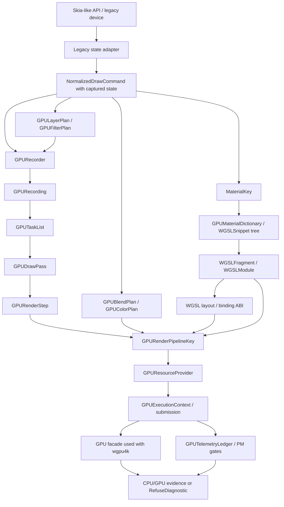

# GPU Renderer Specs

Status: Draft
Date: 2026-06-13
Target: proposed GPU-first successor direction for the active WGSL/WebGPU
renderer work.

This spec pack captures the agreed kernel for a new Kanvas GPU renderer module.
It is intentionally narrower than a full implementation plan, but it should
name the full technical scope before implementation slices are planned. It
defines the module shape, naming policy, command boundary, WGSL material model,
material dictionary, pipeline key split, execution context, WGSL layout ABI,
blend/color state, route policy, telemetry gates, legacy cleanup policy, and
validation expectations that future implementation tickets must follow.

The current `.upstream/target/high-performance-wgsl-pipeline-target.md` and
`.upstream/target/skia-like-realtime-renderer-target.md` remain active project
context until a target update is explicitly accepted. This pack records the new
direction being designed: GPU-first, Graphite-inspired, inline on the `GPU`
facade used with `wgpu4k`, and WGSL-only for shader implementation.

## Source Of Truth

- Parent rendering context:
  `.upstream/target/high-performance-wgsl-pipeline-target.md`
- Active realtime context:
  `.upstream/target/skia-like-realtime-renderer-target.md`
- Existing WGSL paint specs:
  `.upstream/specs/wgsl-pipeline/README.md`
- Existing geometry/coverage specs:
  `.upstream/specs/geometry-coverage/README.md`
- Local Skia Graphite source evidence:
  `/Users/chaos/workspace/kanvas-forge/skia-main/src/gpu/graphite/`
- WGSL language validation model:
  `https://gpuweb.github.io/gpuweb/wgsl/`

## Hard Constraints

- Do not port Ganesh or Graphite.
- Do not rebuild Skia's SkSL compiler, IR, or VM.
- Do not introduce a Kanvas-owned multi-API graphics abstraction around the
  `GPU` facade used with `wgpu4k`.
- Keep the shader implementation target as WGSL.
- Do not implement SkSL as a renderer shader target, including partial SkSL
  compiler, IR, VM, or translation behavior.
- Treat SkSL only as Skia API compatibility vocabulary where required; Kanvas
  does not dynamically compile arbitrary SkSL.
- Keep supported runtime effects registered through Kanvas descriptors with
  Kotlin/CPU behavior and parser-validated WGSL GPU implementations.
- Submit WGSL to the GPU only after the complete assembled module has been
  validated and reflected through `wgsl4k`; fragment-only validation is not a
  support claim.
- Keep `ygdrasil-io/wgsl4k` behavior explicit. If parsing, reflection, or
  generation behavior is ambiguous, capture evidence and open a `wgsl4k`
  issue instead of hiding a workaround.
- Do not mark rendering support complete without CPU/GPU evidence or an
  explicit refusal, stable route diagnostics, and promotion gates.
- Do not claim realtime or performance readiness from correctness evidence
  alone.

## Accepted Kernel Decisions

- Create the new GPU-first renderer module as `:gpu-renderer`.
- Use public concept names with `GPU`, `CPU`, and `WGSL` in uppercase.
- Use `org.graphiks.kanvas` as the implementation package base for the new
  renderer, with `org.graphiks.kanvas.gpu.renderer` as the `:gpu-renderer`
  root.
- Interpret `GPU` as the WebGPU-like facade used with `wgpu4k`, not as a browser
  only target and not as a free-form Vulkan/Metal abstraction.
- Keep `:gpu-renderer` pure: it must not depend directly on `SkPaint`,
  `SkShader`, `SkPath`, or other Skia-like API types.
- Define the `NormalizedDrawCommand` contracts in `:gpu-renderer` and feed the
  core with high-level normalized draw commands.
- Capture draw state before it enters the core. The core does not replay a
  Canvas-style save/restore/matrix/clip stack.
- Separate `MaterialKey` from executable pipeline keys.
- Expand and intern `MaterialKey` through `GPUMaterialDictionary` and
  `WGSLSnippet` metadata before WGSL module assembly.
- Define GPU execution, surface/target, command submission, readback, and
  device-generation contracts before route activation.
- Keep WGSL as the shader language. Graphite's SkSL paint machinery maps to
  Kanvas `MaterialKey`, `GPURenderPipelineKey`, and parser-validated WGSL
  fragments. Compute work uses separate compute program and pipeline keys.
- Treat WGSL layout, binding, reflection, and Kotlin packing as an explicit
  ABI contract. Complete WGSL validation without matching ABI evidence is not a
  support claim.
- Use explicit `GPUBlendPlan`, `GPUColorPlan`, and `GPUTargetState` contracts
  for blend, color, alpha, premul, and target behavior.
- Model high-level layer/saveLayer semantics with `GPULayerPlan` and filter
  graph execution with `GPUFilterPlan`; keep `GPUDrawLayer` as the lower-level
  pass/layer planning structure.
- Use Kanvas-idiomatic package and class organization under
  `org.graphiks.kanvas.gpu.renderer`. Graphite vocabulary is kept as an
  equivalence table and source-evidence reference, not mirrored as a package
  tree, inheritance hierarchy, or API surface.
- Prefer `GPUNative` routes. Allow `CPUPreparedGPU` only when CPU work produces
  an explicit artifact consumed by the GPU. Forbid silent full CPU fallback.
- Forbid CPU-rendered texture compatibility in this target: the CPU must not
  render a complete unsupported draw or layer into a texture for GPU composite.
- Treat `CPUReferenceOnly` as evidence/oracle behavior, not as a product GPU
  route.
- Treat `RefuseDiagnostic` as a valid, stable outcome when no route is
  supported.
- Treat `KanvasPipelineIR` as legacy/migration context for the new renderer,
  not as the durable semantic center of the new GPU module.
- Keep telemetry, cache counters, budget policy, warmup policy, and
  performance gates separate from correctness support claims.
- Finish the technical scope specs before narrowing work into implementation
  slices.
- After the specs are complete, use rect/rrect geometry with solid and linear
  materials as the first implementation vertical slice. This is a sequencing
  decision, not a limit on the renderer specs.
- Prove isolated `:gpu-renderer` contracts first, then integrate with
  `gpu-raster`.

## Spec Index

| Spec | Purpose |
|---|---|
| `00-architecture-kernel.md` | `:gpu-renderer` module boundary, naming rules, Graphite equivalence table, sequencing, and non-goals. |
| `01-normalized-draw-commands.md` | High-level draw command contract with captured transform, clip, layer, material, bounds, and ordering facts. |
| `02-gpu-recording-task-graph.md` | `GPURecorder`, `GPUDrawAnalysis`, `GPUOcclusionTracker`, `GPUDrawLayerPlanner`, `GPURecording`, `GPUTaskList`, `GPUDrawPass`, and `GPURenderStep` responsibilities. |
| `03-material-key-wgsl.md` | Render-only `MaterialKey`, render/compute WGSL modules, `wgsl4k` validation, runtime-effect descriptor rules, and `GPUFilterPlan` boundary. |
| `04-pipeline-key-cache-resources.md` | `GPURenderPipelineKey`, `GPUComputePipelineKey`, `GPUResourceProvider`, `CPUPreparedGPUArtifactRegistry`, capabilities, caches, resources, and invalidation policy. |
| `05-routing-policy.md` | `GPUNative`, `CPUPreparedGPU`, `CPUReferenceOnly`, and `RefuseDiagnostic` selection and diagnostics. |
| `06-legacy-adapter-cleanup.md` | `gpu-raster`/`SkWebGpuDevice.kt` migration boundary and cleanup rules with no render change. |
| `07-validation-conformance.md` | Unit, conformance, GPU evidence, PM artifacts, promotion gates, and retirement criteria. |
| `08-layer-and-filter-plans.md` | `GPULayerPlan`, `GPUFilterPlan`, saveLayer semantics, offscreen targets, filter DAGs, and layer/filter diagnostics. |
| `09-draw-family-support-matrix.md` | Target support/refusal matrix for draw families, route maturity, required plans, artifacts, diagnostics, and evidence gates. |
| `10-gpu-execution-context-submission.md` | `GPUExecutionContext`, target/surface facts, command scopes, submission, readback, and device-generation policy. |
| `11-wgsl-layout-binding-abi.md` | WGSL bind group policy, binding layouts, uniform/storage layouts, Kotlin packing, and reflection ABI validation. |
| `12-blend-color-target-state.md` | `GPUBlendPlan`, `GPUColorPlan`, `GPUTargetState`, destination reads, layer/filter interaction, and blend/color diagnostics. |
| `13-performance-telemetry-cache-gates.md` | `GPUTelemetryLedger`, cache domains, budgets, warmup, performance gates, quarantine, and PM evidence. |
| `14-first-slice-contract.md` | First isolated rect/rrect plus solid/linear slice contracts, fixtures, WGSL requirements, diagnostics, and promotion gates. |
| `15-draw-layer-planner-and-sort-policy.md` | Graphite-inspired draw invocation expansion, layer insertion, sort windows, stencil/destination-read ordering, merge policy, and planner diagnostics. |
| `16-material-dictionary-and-snippet-registry.md` | Graphite-inspired `GPUMaterialDictionary`, `WGSLSnippet`, `WGSLSnippetNode`, `GPUMaterialProgramID`, requirement propagation, runtime-effect registration, and material WGSL assembly policy. |

## Target Shape

## Relationship To Existing Packs

The existing `wgsl-pipeline/` and `geometry-coverage/` packs remain valid
evidence and migration context. This pack changes the target center for future
GPU renderer work:

- `KanvasPipelineIR` remains useful historical and compatibility evidence.
- New work must not assume `KanvasPipelineIR` is the durable core of the new
  GPU module.
- Existing CPU and GPU conformance tasks remain evidence gates until replaced
  by stronger GPU renderer gates.
- Any implementation ticket that changes active routing must point to both this
  pack and the older evidence it supersedes.

## Implementation Sequencing

This pack records the full technical contract first. Implementation tickets
must be cut from that contract after the specs are coherent rather than
shrinking the specs to the first deliverable.

The accepted first implementation vertical slice is:

- rect and rounded-rect geometry;
- solid color and linear-gradient materials;
- parser-validated complete WGSL modules;
- `GPUMaterialDictionary` expansion for solid and linear material snippets;
- validated WGSL binding ABI and Kotlin packing plans;
- explicit blend/color/target-state plans;
- execution-context test double or accepted GPU lane evidence;
- telemetry counters for route, key, pipeline, module, cache, and refusal state;
- isolated `:gpu-renderer` tests for command contracts, keys, route decisions,
  diagnostics, and resource planning;
- `gpu-raster` integration only after the isolated tests prove the contract.

The slice must not remove or narrow command families, route taxonomy, material
descriptors, render/compute pipeline-key rules, or validation gates needed for later renderer
coverage.

The concrete fixture and promotion contract for this first slice is defined in
`14-first-slice-contract.md`.

## Status Policy

Specs start as `Draft`. A spec can move to `Accepted` only when the target
direction is approved, implementation evidence exists, conformance or explicit
refusal diagnostics are tested, and the PM evidence package links the relevant
commit or PR.

Editorial clarifications do not change status. A spec that changes route
policy, public command shape, key semantics, or cleanup gates must remain
`Draft` until re-reviewed.

## Current Out-Of-Scope Decisions

The kernel does not yet choose:

- exact class-to-subpackage placement inside
  `org.graphiks.kanvas.gpu.renderer`, beyond the responsibility packages named
  in `00-architecture-kernel.md`;

These are blocked intentionally. Implementation tickets must not infer answers
from examples in this pack.
