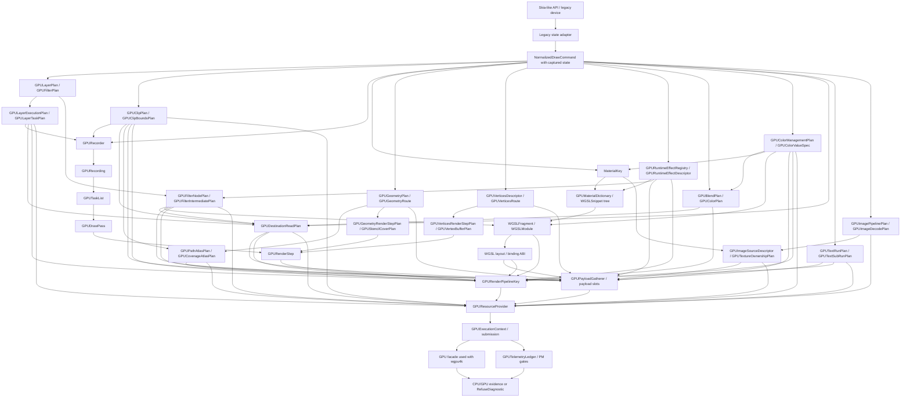

# GPU Renderer Specs

Status: Draft
Date: 2026-06-13
Target: proposed GPU-first successor direction for the active WGSL/WebGPU
renderer work.

This spec pack captures the agreed kernel for a new Kanvas GPU renderer module.
It is intentionally narrower than a full implementation plan, but it should
name the full technical scope before implementation slices are planned. It
defines the module shape, naming policy, command boundary, WGSL material model,
material dictionary, payload gathering, pipeline key split, execution
context, WGSL layout ABI, blend/color state, route policy, telemetry gates,
texture/image ownership, path/coverage atlas strategy, destination-read
strategy, text/glyph pipeline target, image/bitmap/codec pipeline target,
filter/effect pipeline target, clip/stencil/mask pipeline target, legacy
cleanup policy, path/stroke/geometry pipeline target, layer/saveLayer
execution, color-management pipeline, and validation expectations that future
implementation tickets must follow. It also defines the `DrawVertices` and
mesh-like target so
user-provided vertex geometry has a clear GPU route/refusal contract before
implementation slicing, and the registered runtime-effect registry so
material, filter, blender, live-edit, and future clip-shader uses share one
descriptor source of truth.

The current `.upstream/target/high-performance-wgsl-pipeline-target.md` and
`.upstream/target/skia-like-realtime-renderer-target.md` remain active project
context until a target update is explicitly accepted. This pack records the new
direction being designed: GPU-first, Graphite-inspired, inline on the `GPU`
facade used with `wgpu4k`, and WGSL-only for shader implementation.

## Source Of Truth

- Parent rendering context:
  `.upstream/target/high-performance-wgsl-pipeline-target.md`
- Active realtime context:
  `.upstream/target/skia-like-realtime-renderer-target.md`
- Existing WGSL paint specs:
  `.upstream/specs/wgsl-pipeline/README.md`
- Existing geometry/coverage specs:
  `.upstream/specs/geometry-coverage/README.md`
- Local Skia Graphite source evidence:
  `/Users/chaos/workspace/kanvas-forge/skia-main/src/gpu/graphite/`
- WGSL language validation model:
  `https://gpuweb.github.io/gpuweb/wgsl/`

## Hard Constraints

- Do not port Ganesh or Graphite.
- Do not rebuild Skia's SkSL compiler, IR, or VM.
- Do not introduce a Kanvas-owned multi-API graphics abstraction around the
  `GPU` facade used with `wgpu4k`.
- Keep the shader implementation target as WGSL.
- Do not implement SkSL as a renderer shader target, including partial SkSL
  compiler, IR, VM, or translation behavior.
- Treat SkSL only as Skia API compatibility vocabulary where required; Kanvas
  does not dynamically compile arbitrary SkSL.
- Keep supported runtime effects registered through Kanvas descriptors with
  Kotlin/CPU behavior and parser-validated WGSL GPU implementations.
- Resolve registered runtime effects through `GPURuntimeEffectRegistry`,
  `GPURuntimeEffectDescriptor`, `GPURuntimeEffectUniformSchema`,
  `GPURuntimeEffectChildSlotPlan`, `GPURuntimeEffectWGSLPlan`,
  `GPURuntimeEffectCPUOracle`, `GPURuntimeEffectRouteContract`,
  `GPURuntimeEffectLiveEditPlan`, and `GPURuntimeEffectDiagnostic`.
- Treat runtime-effect descriptor ID/version, uniform schema, child slots,
  WGSL identity, CPU oracle, route placement, registry generation, live
  parameter metadata, and compatibility lookup keys as explicit contracts.
  Forbid accepting arbitrary Skia/SkSL source, arbitrary WGSL strings, or
  source hashes as product shader support.
- Submit WGSL to the GPU only after the complete assembled module has been
  validated and reflected through `wgsl4k`; fragment-only validation is not a
  support claim.
- Keep `ygdrasil-io/wgsl4k` behavior explicit. If parsing, reflection, or
  generation behavior is ambiguous, capture evidence and open a `wgsl4k`
  issue instead of hiding a workaround.
- Do not mark rendering support complete without CPU/GPU evidence or an
  explicit refusal, stable route diagnostics, and promotion gates.
- Do not claim realtime or performance readiness from correctness evidence
  alone.

## Accepted Kernel Decisions

- Create the new GPU-first renderer module as `:gpu-renderer`.
- Use public concept names with `GPU`, `CPU`, and `WGSL` in uppercase.
- Use `org.graphiks.kanvas` as the implementation package base for the new
  renderer, with `org.graphiks.kanvas.gpu.renderer` as the `:gpu-renderer`
  root.
- Interpret `GPU` as the WebGPU-like facade used with `wgpu4k`, not as a browser
  only target and not as a free-form Vulkan/Metal abstraction.
- Keep `:gpu-renderer` pure: it must not depend directly on `SkPaint`,
  `SkShader`, `SkPath`, or other Skia-like API types.
- Define the `NormalizedDrawCommand` contracts in `:gpu-renderer` and feed the
  core with high-level normalized draw commands.
- Capture draw state before it enters the core. The core does not replay a
  Canvas-style save/restore/matrix/clip stack.
- Separate `MaterialKey` from executable pipeline keys.
- Expand and intern `MaterialKey` through `GPUMaterialDictionary` and
  `WGSLSnippet` metadata before WGSL module assembly.
- Gather per-draw and per-render-step payload values through
  `GPUPayloadGatherer` and pass-local payload slots; keep payload values
  out of durable keys.
- Resolve image and texture sources through explicit `GPUTextureOwnershipPlan`,
  `GPUTextureDescriptor`, `GPUTextureViewDescriptor`, `GPUSamplerDescriptor`,
  `GPUImageSourceDescriptor`, and `GPUSampledTextureBinding` contracts.
- Keep concrete texture handles, imported handles, surface leases, uploaded
  artifact keys, and pixel contents out of `MaterialKey`.
- Resolve encoded image sources, already-decoded CPU image pixels, codec
  selection, still/animated decode, color conversion, orientation, mip
  preparation, upload artifacts, and image diagnostics through
  `GPUImagePipelinePlan`, `GPUImageCodecRegistry`, `GPUImageDecodePlan`,
  `GPUAnimatedImagePlan`, `GPUImageUploadPlan`, and
  `GPUImageDiagnostic`.
- Prefer pure Kotlin codecs, but allow platform or external codecs only behind
  dumpable `KanvasImageCodec` descriptors with codec ID, version, capability,
  conformance-tier, and nondeterminism diagnostics.
- Treat PNG, JPEG, WebP, GIF, BMP, ICO, WBMP, HEIF, and AVIF as the accepted
  target image/codec surface, with HEIF and AVIF dependency-gated by accepted
  codec capabilities.
- Forbid implicit first-frame animation behavior and unvalidated color/profile
  conversion. Animation frame selection, disposal, blend, loop count,
  required-frame dependency, ICC/CICP/profile facts, premul/unpremul,
  orientation, bit depth, and HDR handling are explicit image-pipeline facts.
- Resolve path and coverage atlas use through `GPUPathAtlasPlan`,
  `GPUCoverageAtlasPlan`, `GPUAtlasPolicy`, `GPUAtlasBudgetPolicy`,
  `GPUAtlasEntryRef`, and typed `PathAtlasArtifact` or
  `CoverageMaskArtifact` routes.
- Treat atlas generation, atlas entry coordinates, use tokens, upload/compute
  mutations, and eviction state as resource/payload facts, not material
  identity.
- Resolve captured clip state through `GPUClipStackDescriptor`,
  `GPUClipPlan`, `GPUClipBoundsPlan`, `GPUClipScissorPlan`,
  `GPUClipAnalyticPlan`, `GPUClipStencilPlan`, `GPUClipMaskPlan`,
  `GPUClipOrderingToken`, and `GPUClipDiagnostic`.
- Treat clip stack descriptors, effective elements, scissor, stencil
  producers, coverage masks, clip shaders, budgets, and ordering as explicit
  plans. Forbid silently approximating unsupported clips or CPU-rendering a
  complete clipped draw/layer into a texture.
- Resolve path, stroke, and geometry execution through `GPUShapeDescriptor`,
  `GPUPathDescriptor`, `GPUStrokeDescriptor`, `GPUGeometryPlan`,
  `GPUGeometryRoute`, `GPUPathBoundsPlan`, `GPUStrokeExpansionPlan`,
  `GPUStencilCoverPlan`, `GPUPreparedGeometryPlan`,
  `GPUGeometryRenderStepPlan`, and `GPUGeometryDiagnostic`.
- Treat path fill, inverse fill, stroke, dash, path effects, flattening,
  tessellation, stencil-cover, prepared geometry, and coverage masks as
  explicit geometry plans. Forbid silently approximating path/stroke semantics
  or CPU-rendering a complete unsupported draw into a texture.
- Resolve `DrawVertices` and future 2D mesh-like draws through
  `GPUVerticesDescriptor`, `GPUVertexLayoutPlan`, `GPUVertexColorPlan`,
  `GPUVertexTexCoordPlan`, `GPUPrimitiveBlendPlan`, `GPUIndexBufferPlan`,
  `GPUVertexBufferPlan`, `GPUVerticesRoute`, `GPUVerticesRenderStepPlan`,
  `GPUMeshDescriptor`, and `GPUVerticesDiagnostic`.
- Treat topology, vertex/index layouts, per-vertex colors, texcoords,
  primitive-color blending, buffer packing, mesh budgets, and upload ordering
  as explicit plans. Forbid silently CPU-rasterizing vertices/mesh output into
  a texture.
- Resolve destination-dependent blends, backdrop/filter reads, and layer
  destination reads through `GPUDestinationReadPlan`,
  `GPUDestinationReadStrategy`, `GPUDestinationReadBounds`,
  `GPUDestinationReadBinding`, and explicit copy/intermediate/layer-isolation
  routes.
- Consume pure Kotlin text stack outputs through `GPUTextRunPlan`,
  `GPUTextSubRunPlan`, `GPUTextRoute`, `GPUTextRenderStep`,
  `GPUTextAtlasPlan`, `GPUTextBinding`, and typed text artifacts registered by
  `21-text-glyph-pipeline.md`.
- Forbid framebuffer-fetch assumptions and active-attachment sampling in the
  WebGPU target. Destination reads require fixed-function blend, target copy,
  existing intermediate, layer isolation, or stable refusal.
- Treat current surface/swapchain textures as `GPUSurfaceTextureLease` values
  scoped to a frame/target generation, not durable resource identities.
- Define GPU execution, surface/target, command submission, readback, and
  device-generation contracts before route activation.
- Keep WGSL as the shader language. Graphite's SkSL paint machinery maps to
  Kanvas `MaterialKey`, `GPURenderPipelineKey`, and parser-validated WGSL
  fragments. Compute work uses separate compute program and pipeline keys.
- Treat WGSL layout, binding, reflection, and Kotlin packing as an explicit
  ABI contract. Complete WGSL validation without matching ABI evidence is not a
  support claim.
- Use explicit `GPUBlendPlan`, `GPUColorPlan`, and `GPUTargetState` contracts
  for blend, color, alpha, premul, and target behavior.
- Resolve complete color-management behavior through
  `GPUColorManagementPlan`, `GPUColorValueSpec`,
  `GPUColorSpaceDescriptor`, `GPUColorConversionPlan`,
  `GPUColorTransformPlan`, `GPUWorkingColorSpacePlan`,
  `GPUGradientColorPlan`, `GPUColorUniformPlan`, `GPUHDRColorPlan`,
  `GPUGainmapPlan`, `GPUColorStorePlan`, `GPUColorCachePlan`, and
  `GPUColorDiagnostic`.
- Treat ICC/CICP/profile metadata, transfer functions, gamut, alpha domain,
  precision, interpolation space, HDR/gainmap policy, and final store
  conversion as explicit plans. Forbid silently reinterpreting raw, premul,
  unpremul, untagged, HDR, or profile-dependent values.
- Model high-level layer/saveLayer semantics with `GPULayerPlan` and filter
  graph execution with `GPUFilterPlan`; keep `GPUDrawLayer` as the lower-level
  pass/layer planning structure.
- Execute accepted layer/saveLayer plans through `GPULayerExecutionPlan`,
  `GPULayerTargetPlan`, `GPULayerInitializationPlan`,
  `GPULayerBackdropPlan`, `GPULayerFilterChainPlan`,
  `GPULayerCompositePlan`, `GPULayerElisionPlan`, `GPULayerTaskPlan`,
  `GPULayerOrderingToken`, `GPULayerBudgetPolicy`, and
  `GPULayerDiagnostic`.
- Treat layer bounds as hints, not clips. Layer creation clip, layer source
  bounds, backdrop/previous-content reads, filter expansion, restore clip, and
  composite bounds must be separate facts.
- Resolve detailed filter/effect execution through `GPUFilterGraphDescriptor`,
  `GPUFilterNodePlan`, `GPUFilterBoundsPlan`, `GPUFilterIntermediatePlan`,
  `GPUFilterRuntimeEffectPlan`, `GPUFilterCachePlan`, and
  `GPUFilterDiagnostic`.
- Treat image-filter DAGs, backdrop filters, filter intermediates, runtime
  filter effects, and color-filter DAG placement as explicit graph/resource
  plans. Forbid silently dropping unsupported filters or CPU-rendering a full
  filtered layer/scene into a texture.
- Use Kanvas-idiomatic package and class organization under
  `org.graphiks.kanvas.gpu.renderer`. Graphite vocabulary is kept as an
  equivalence table and source-evidence reference, not mirrored as a package
  tree, inheritance hierarchy, or API surface.
- Prefer `GPUNative` routes. Allow `CPUPreparedGPU` only when CPU work produces
  an explicit artifact consumed by the GPU. Forbid silent full CPU fallback.
- Forbid CPU-rendered texture compatibility in this target: the CPU must not
  render a complete unsupported draw or layer into a texture for GPU composite.
- Treat `CPUReferenceOnly` as evidence/oracle behavior, not as a product GPU
  route.
- Treat `RefuseDiagnostic` as a valid, stable outcome when no route is
  supported.
- Treat `KanvasPipelineIR` as legacy/migration context for the new renderer,
  not as the durable semantic center of the new GPU module.
- Keep telemetry, cache counters, budget policy, warmup policy, and
  performance gates separate from correctness support claims.
- Finish the technical scope specs before narrowing work into implementation
  slices.
- After the specs are complete, use rect/rrect geometry with solid and linear
  materials as the first implementation vertical slice. This is a sequencing
  decision, not a limit on the renderer specs.
- Prove isolated `:gpu-renderer` contracts first, then integrate with
  `gpu-raster`.

## Spec Index

| Spec | Purpose |
|---|---|
| `00-architecture-kernel.md` | `:gpu-renderer` module boundary, naming rules, Graphite equivalence table, sequencing, and non-goals. |
| `01-normalized-draw-commands.md` | High-level draw command contract with captured transform, clip, layer, material, bounds, and ordering facts. |
| `02-gpu-recording-task-graph.md` | `GPURecorder`, `GPUDrawAnalysis`, `GPUOcclusionTracker`, `GPUDrawLayerPlanner`, `GPURecording`, `GPUTaskList`, `GPUDrawPass`, and `GPURenderStep` responsibilities. |
| `03-material-key-wgsl.md` | Render-only `MaterialKey`, render/compute WGSL modules, `wgsl4k` validation, runtime-effect descriptor rules, and `GPUFilterPlan` boundary. |
| `04-pipeline-key-cache-resources.md` | `GPURenderPipelineKey`, `GPUComputePipelineKey`, `GPUResourceProvider`, `CPUPreparedGPUArtifactRegistry`, capabilities, caches, resources, and invalidation policy. |
| `05-routing-policy.md` | `GPUNative`, `CPUPreparedGPU`, `CPUReferenceOnly`, and `RefuseDiagnostic` selection and diagnostics. |
| `06-legacy-adapter-cleanup.md` | `gpu-raster`/`SkWebGpuDevice.kt` migration boundary and cleanup rules with no render change. |
| `07-validation-conformance.md` | Unit, conformance, GPU evidence, PM artifacts, promotion gates, and retirement criteria. |
| `08-layer-and-filter-plans.md` | `GPULayerPlan`, `GPUFilterPlan`, saveLayer semantics, offscreen targets, filter DAGs, and layer/filter diagnostics. |
| `09-draw-family-support-matrix.md` | Target support/refusal matrix for draw families, route maturity, required plans, artifacts, diagnostics, and evidence gates. |
| `10-gpu-execution-context-submission.md` | `GPUExecutionContext`, target/surface facts, command scopes, submission, readback, and device-generation policy. |
| `11-wgsl-layout-binding-abi.md` | WGSL bind group policy, binding layouts, uniform/storage layouts, Kotlin packing, and reflection ABI validation. |
| `12-blend-color-target-state.md` | `GPUBlendPlan`, `GPUColorPlan`, `GPUTargetState`, destination reads, layer/filter interaction, and blend/color diagnostics. |
| `13-performance-telemetry-cache-gates.md` | `GPUTelemetryLedger`, cache domains, budgets, warmup, performance gates, quarantine, and PM evidence. |
| `14-first-slice-contract.md` | First isolated rect/rrect plus solid/linear slice contracts, fixtures, WGSL requirements, diagnostics, and promotion gates. |
| `15-draw-layer-planner-and-sort-policy.md` | Graphite-inspired draw invocation expansion, layer insertion, sort windows, stencil/destination-read ordering, merge policy, and planner diagnostics. |
| `16-material-dictionary-and-snippet-registry.md` | Graphite-inspired `GPUMaterialDictionary`, `WGSLSnippet`, `WGSLSnippetNode`, `GPUMaterialProgramID`, requirement propagation, runtime-effect registration, and material WGSL assembly policy. |
| `17-payload-gathering-and-slots.md` | Graphite-inspired `GPUPayloadGatherer`, payload gather/write/binding/upload plans, uniform/resource payload blocks, pass-local slots, gradient payload stores, fingerprints, and payload diagnostics. |
| `18-texture-image-ownership.md` | Graphite-inspired texture/image ownership policy: descriptors, views, samplers, image sources, uploaded CPU pixels, imported textures, target/surface leases, sampled bindings, and texture diagnostics. |
| `19-path-coverage-atlas-strategy.md` | Graphite-inspired path/coverage atlas strategy: atlas plans, entry keys, generations, budgets, retry/split actions, payload bindings, diagnostics, and validation gates. |
| `20-destination-read-strategy.md` | Graphite-inspired destination-read strategy: requirements, bounds, target copy snapshots, existing intermediates, layer isolation, bindings, budgets, barriers, diagnostics, and validation gates. |
| `21-text-glyph-pipeline.md` | Graphite-inspired text/glyph pipeline target: text run plans, subruns, A8/SDF atlas routes, outline/color/bitmap/SVG glyph routes, text bindings, atlas uploads, budgets, diagnostics, and validation gates. |
| `22-image-bitmap-codec-pipeline.md` | Graphite-inspired image/bitmap/codec pipeline target: codec registry, still/animated decode, color/profile/orientation/HDR handling, pixel preparation, uploaded image artifacts, upload scheduling, caches, diagnostics, and validation gates. |
| `23-filter-effect-pipeline.md` | Graphite-inspired filter/effect pipeline target: image-filter DAGs, filter node routes, bounds/crop/tile/sample plans, render/compute intermediates, backdrop/destination reads, registered runtime effects, budgets, diagnostics, and validation gates. |
| `24-clip-stencil-mask-pipeline.md` | Graphite-inspired clip/stencil/mask pipeline target: captured clip descriptors, effective elements, scissor, analytic clips, stencil producer-consumer routes, coverage masks, clip shaders, budgets, diagnostics, and validation gates. |
| `25-path-stroke-geometry-pipeline.md` | Graphite-inspired path/stroke/geometry pipeline target: path descriptors, fill/inverse semantics, stroke expansion, dash/path-effect policy, flattening, tessellation, stencil-cover, prepared geometry, render steps, budgets, diagnostics, and validation gates. |
| `26-draw-vertices-mesh-pipeline.md` | Graphite-inspired DrawVertices/mesh pipeline target: vertices descriptors, topology, vertex/index layouts, colors, texcoords, primitive blending, buffer plans, mesh-like future descriptors, budgets, diagnostics, and validation gates. |
| `27-registered-runtime-effects-registry.md` | Graphite-inspired registered runtime-effect registry: descriptor IDs/versions, compatibility lookup, uniforms, child slots, WGSL validation, CPU oracle, route contracts, live-edit metadata, budgets, diagnostics, and validation gates. |
| `28-layer-savelayer-execution.md` | Graphite-inspired layer/saveLayer execution target: save records, bounds planning, offscreen targets, initialization/backdrop, filters, restore composite, elision, task ordering, budgets, diagnostics, and validation gates. |
| `29-color-management-pipeline.md` | Graphite-inspired color-management target: value specs, color-space/profile descriptors, ICC/CICP, transfer/gamut transforms, working spaces, gradients, images, runtime color uniforms, HDR/gainmap, store plans, budgets, diagnostics, and validation gates. |

## Target Shape

## Relationship To Existing Packs

The existing `wgsl-pipeline/` and `geometry-coverage/` packs remain valid
evidence and migration context. This pack changes the target center for future
GPU renderer work:

- `KanvasPipelineIR` remains useful historical and compatibility evidence.
- New work must not assume `KanvasPipelineIR` is the durable core of the new
  GPU module.
- Existing CPU and GPU conformance tasks remain evidence gates until replaced
  by stronger GPU renderer gates.
- Any implementation ticket that changes active routing must point to both this
  pack and the older evidence it supersedes.

## Implementation Sequencing

This pack records the full technical contract first. Implementation tickets
must be cut from that contract after the specs are coherent rather than
shrinking the specs to the first deliverable.

The accepted first implementation vertical slice is:

- rect and rounded-rect geometry;
- solid color and linear-gradient materials;
- parser-validated complete WGSL modules;
- `GPUMaterialDictionary` expansion for solid and linear material snippets;
- `GPUPayloadGatherer` payload slots for solid, linear, rect, and rrect
  values;
- validated WGSL binding ABI and Kotlin packing plans;
- explicit blend/color/target-state plans;
- execution-context test double or accepted GPU lane evidence;
- telemetry counters for route, key, pipeline, module, cache, and refusal state;
- isolated `:gpu-renderer` tests for command contracts, keys, route decisions,
  diagnostics, and resource planning;
- `gpu-raster` integration only after the isolated tests prove the contract.

The slice must not remove or narrow command families, route taxonomy, material
descriptors, render/compute pipeline-key rules, or validation gates needed for later renderer
coverage.

The concrete fixture and promotion contract for this first slice is defined in
`14-first-slice-contract.md`.

## Status Policy

Specs start as `Draft`. A spec can move to `Accepted` only when the target
direction is approved, implementation evidence exists, conformance or explicit
refusal diagnostics are tested, and the PM evidence package links the relevant
commit or PR.

Editorial clarifications do not change status. A spec that changes route
policy, public command shape, key semantics, or cleanup gates must remain
`Draft` until re-reviewed.

## Current Out-Of-Scope Decisions

The kernel does not yet choose:

- exact class-to-subpackage placement inside
  `org.graphiks.kanvas.gpu.renderer`, beyond the responsibility packages named
  in `00-architecture-kernel.md`;

These are blocked intentionally. Implementation tickets must not infer answers
from examples in this pack.
