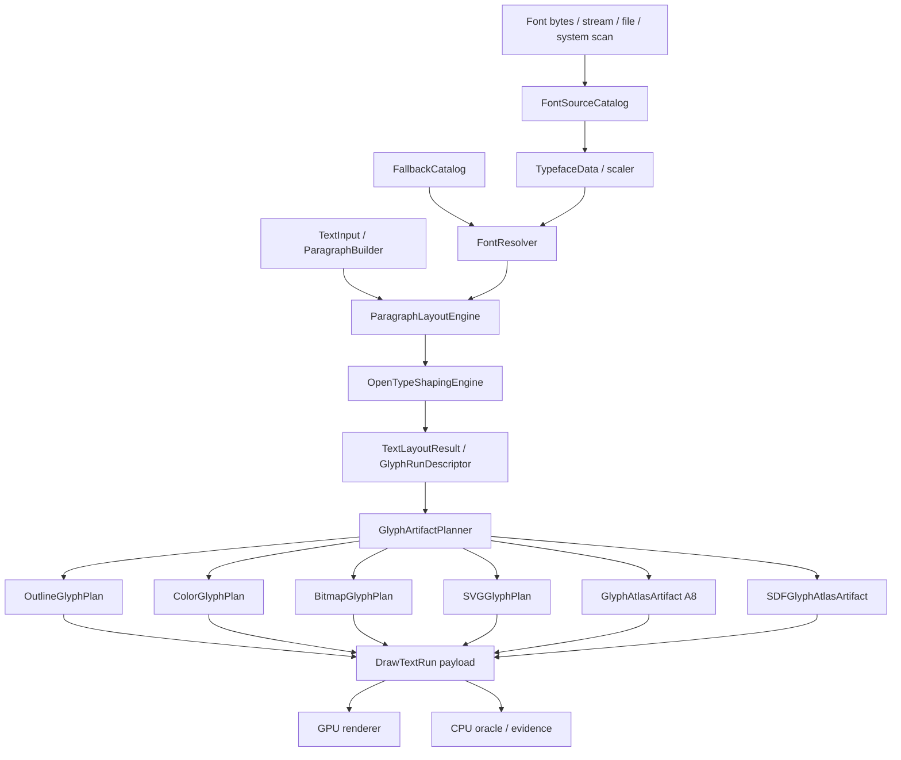

# Pure Kotlin Text Stack Specs

Status: Draft
Date: 2026-06-13
Target: complete Kanvas pure Kotlin font, text, glyph, and paragraph stack.

This pack defines the final Kanvas target for text rendering infrastructure.
It is parallel to `.upstream/specs/gpu-renderer/`: the GPU renderer owns GPU
recording, routing, pipelines, resources, and submission; this pack owns font
loading, OpenType parsing, scaling, shaping, paragraph layout, glyph
representations, glyph artifacts, caches, and text-specific validation.

The target is pure Kotlin for normative behavior. HarfBuzz, FreeType,
Fontations, platform shapers, AWT, JNI, CoreText, DirectWrite, and fontconfig
may appear only in optional drift reports or future optional modules. They are
not product dependencies and are not normative test oracles for this pack.

## Source Of Truth

- GPU renderer target specs:
  `.upstream/specs/gpu-renderer/README.md`
- Current pure Kotlin OpenType evidence:
  `docs/opentype-font-backend.md`
- Existing portable font entry points:
  `kanvas-skia/src/main/kotlin/org/skia/foundation/`
- Existing OpenType implementation:
  `kanvas-skia/src/main/kotlin/org/skia/foundation/opentype/`
- Existing glyph cache prototype:
  `kanvas-skia/src/main/kotlin/org/skia/foundation/SkCpuGlyphCache.kt`
- Existing WebGPU glyph atlas prototype:
  `gpu-raster/src/main/kotlin/org/skia/gpu/webgpu/SkWebGpuGlyphAtlas.kt`
- GPU renderer text family dependency gate:
  `.upstream/specs/gpu-renderer/09-draw-family-support-matrix.md`

## Legacy Font Pack Retirement

Older font specs are transitional current-state evidence only. This pack owns
the durable target, the support taxonomy, and the forward migration gates for
the pure Kotlin font system.

Current behavior may be referenced as prototype or migration evidence, but it
does not become complete support by being documented here. Current refusals
stay active until a pure Kotlin target contract has implementation evidence,
CPU oracle evidence, GPU evidence where GPU support is claimed, and stable
diagnostics.

The durable legacy gates that must survive retirement of older font specs are
carried in `09-migration-from-current-font-pack.md`.

## Hard Constraints

- Keep normative implementation pure Kotlin.
- Do not make HarfBuzz, FreeType, Fontations, AWT, JNI, platform shapers, or
  native font APIs required for product behavior or normative tests.
- Do not port Skia Ganesh or Graphite text systems, glyph ops, atlas managers,
  or subrun machinery.
- Do not rebuild Skia's SkSL compiler, IR, or VM.
- Keep WGSL as the GPU shader implementation target through the GPU renderer.
- Keep the GPU renderer free of direct `Sk*` API types and free of font parsing
  or shaping responsibilities.
- Keep `SkCanvas.drawString` simple and deterministic. Complex shaping and
  paragraph layout are explicit through `SkShaper`, `SkTextBlob`, or the
  paragraph API.
- Treat LCD subpixel text as future research outside the complete Kanvas target.
- Treat pixel-perfect FreeType/HarfBuzz parity as non-normative. Drift reports
  may compare against external engines, but Kanvas-owned fixtures and CPU
  oracles define pass/fail.

## Accepted Target Decisions

- Create a new spec pack at `.upstream/specs/pure-kotlin-text/`.
- Scope is the complete Kanvas text target, not exhaustive coverage of every
  OpenType/SFNT feature ever specified.
- Use dedicated pure Kotlin modules and package roots under
  `org.graphiks.kanvas`, with Skia-like API compatibility adapted in
  `:kanvas-skia`.
- Use uppercase acronyms in public concepts and specs: `CPU`, `GPU`, `WGSL`,
  `SDF`, `SVG`, `PNG`, `CFF`, `CFF2`, `COLR`, `CPAL`, `GSUB`, `GPOS`, `GDEF`,
  and `A8`.
- Support TrueType `glyf`, CFF, and CFF2 outlines in the final target.
- Do not require a complete hinting VM. Outlines, masks, and SDFs are
  deterministic Kanvas output, not pixel-perfect FreeType output.
- Provide an architecture-complete shaping engine with a Kanvas-required script
  matrix. Scripts outside the required matrix use explicit diagnostics until
  promoted.
- Include a Skia Paragraph inspired paragraph engine in the final target.
- Make outlines, COLRv0/COLRv1, PNG bitmap glyphs, SVG glyphs, A8 glyph atlases,
  and SDF glyph atlases part of the complete target.
- Support bitmap glyph payloads for PNG only. Other bitmap payload formats
  refuse with stable diagnostics.
- Use two text outputs: semantic layout results and font-owned GPU-consumable
  glyph artifacts.
- Use Kanvas-owned normative validation plus optional external drift reports.
- Use indicative performance budgets first; promote to blocking gates only
  after Kanvas baselines exist.

## Spec Index

| Spec | Purpose |
|---|---|
| `ROADMAP.md` | Milestone roadmap, claim model, Linear slicing rules, validation gates, and release checkpoints for the complete pure Kotlin font system. |
| `00-architecture-and-module-boundaries.md` | Module shape, ownership, package roots, data contracts, and relationship to `:gpu-renderer` and `:kanvas-skia`. |
| `01-font-source-sfnt-and-scalers.md` | Font sources, SFNT/OpenType parsing, collections, fallback catalogs, `glyf`, CFF, CFF2, metrics, variations, and no-pixel-perfect-hinting policy. |
| `02-opentype-layout-shaping-engine.md` | Unicode segmentation, script matrix, bidi runs, GSUB/GPOS/GDEF, shaping features, clusters, fallback runs, and diagnostics. |
| `03-paragraph-engine.md` | Skia Paragraph inspired builder, styles, runs, line breaking, wrapping, bidi paragraph layout, line metrics, selection, placeholders, and hit testing. |
| `04-glyph-representation-and-artifacts.md` | Outline, A8, SDF, atlas, strike keys, glyph artifacts, cache/invalidation, and CPU-prepared GPU artifact contracts. |
| `05-color-fonts-bitmap-svg-emoji.md` | COLR/CPAL, COLRv1 paint graph, PNG bitmap glyphs, SVG-in-OpenType rendering, emoji dispatch, and color glyph diagnostics. |
| `06-gpu-renderer-handoff.md` | `TextLayoutResult`, `GlyphRunDescriptor`, `GlyphArtifactPlanner`, `DrawTextRun`, route policy, and GPU renderer handoff contracts. |
| `07-validation-conformance-and-drift.md` | Normative Kanvas validation, fixtures, evidence packs, diagnostics, GM classification, and non-normative drift reports. |
| `08-performance-budgets-and-telemetry.md` | Indicative budgets, telemetry counters, cache metrics, upload metrics, warm/cold paths, and later promotion policy. |
| `09-migration-from-current-font-pack.md` | How current font specs, code, tests, refusals, and prototypes migrate into the complete pure Kotlin target. |

## Target Shape



## Validation

Spec-only changes should run:

```bash
rtk git diff --check
```

Implementation changes must run focused tests for the owning subsystem and must
not claim support without:

- generated or bundled fixture provenance;
- semantic layout or glyph artifact dump;
- CPU oracle evidence;
- GPU evidence when a GPU route is claimed;
- stable route and refusal diagnostics;
- external drift report only when it is useful and explicitly non-normative.

## Status Policy

All files in this pack start as `Draft`. A spec can move to `Accepted` only
when the target direction is approved and implementation evidence proves the
contract, including diagnostics for refused behavior. Editorial clarifications
do not change status.
