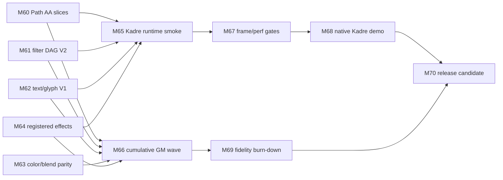

# Agent Execution And Linear Planning

Status: Draft
Target: `.upstream/target/skia-like-realtime-renderer-target.md`
Spec pack: `.upstream/specs/skia-like-realtime/README.md`

## Purpose

This spec defines how Kanvas agents should turn the Skia-like real-time target
into Linear tickets, implementation branches, review evidence, and PM-visible
milestone outcomes. It prevents future work from drifting back into historical
MEP checklists or from claiming support without generated evidence.

## Planning Rule

Every M60-M70 ticket must cite:

- the active target document;
- at least one exact spec file from this pack;
- the rendering family or runtime family being changed;
- the support claim being added, preserved, or explicitly refused;
- the expected PM-visible evidence.

Removed MEP archive files may be recovered from Git history for historical
context only. They must not define active backlog, acceptance criteria, or
progress percentages.

## Ticket Shape

Each Linear ticket should include:

- problem statement;
- current behavior and known limitation;
- target behavior;
- implementation scope;
- out-of-scope notes;
- generated artifacts to update;
- validation commands;
- definition of done;
- PM-visible result;
- non-claims and fallback policy.
- dependency escalation rule, when the ticket touches Kadre or `wgsl4k`.

The ticket should be small enough for one agent to finish and verify. If a
ticket spans rendering code, dashboard evidence, performance gates, and PM demo
copy, split it into implementation, evidence, and PM packaging tickets.

## Milestone Ticket Families

| Milestone | Ticket families |
|---|---|
| M60 | Path AA feature slices, CPU coverage oracle updates, GPU coverage route, generated scene evidence, refusal policy preservation, performance impact report. |
| M61 | Filter DAG planner, intermediate texture allocation, CPU/GPU filter parity rows, unsupported DAG diagnostics, graph visualization for PM. |
| M62 | Font loading boundary, glyph mask raster, glyph atlas upload/cache, simple text scenes, text refusal policy for shaping/color/emoji gaps. |
| M63 | Blend/color matrix/gradient expansion, premul policy, color-space diagnostics, GM-derived color scenes, diff thresholds. |
| M64 | Runtime-effect registry, WGSL parser validation, uniform reflection and packing, CPU/GPU parity rows, unsupported Skia/SkSL compatibility-facade diagnostics. |
| M65 | Kadre-hosted scene runtime model, frame loop, invalidation, cache telemetry, interactive controls, live PM report export. |
| M66 | GM candidate ranking, promotion batches, inventory-to-evidence migration, family counters, refusal burn-down. |
| M67 | Family performance budgets, frame budget gates, warm/cold cache metrics, quarantine/rebaseline flow, release-blocking policy. |
| M68 | Native demo packaging, flagship scene, telemetry overlay, reproducible PM script, artifact export. |
| M69 | Diff burn-down by family, threshold policy, visual regression triage, Skia CPU reference alignment. |
| M70 | Release-candidate checklist, API freeze, known limitation matrix, CI gate freeze, PM release package. |
| M88 | RC2 API/demo freeze, gate freeze, support/refusal matrix, reproducible PM script, release notes, final M81-M88 Linear/GitHub audit. |

## Agent Handoff Contract

An implementation agent must report:

- files changed;
- behavior changed;
- exact validation commands and results;
- generated reports or artifacts;
- support claims promoted to `pass`;
- support claims kept or moved to `expected-unsupported`;
- residual risks;
- follow-up tickets, if required.

Review agents should reject work that:

- changes a status without generated evidence;
- broadens thresholds globally to hide a diff;
- removes a refusal without a replacement support path;
- treats static inventory as rendering proof;
- adds font, codec, or SkSL substitutes to clear a label;
- writes PM copy that presents SkSL as the Kanvas shader implementation target;
- changes `PipelineKey` with axes that are only uniform values;
- introduces GPU-only behavior without a CPU reference or explicit exception.
- works around a suspected `wgsl4k` parser/IR/generator issue inside Kanvas
  instead of stopping and opening a dedicated `ygdrasil-io/wgsl4k` ticket.

## Definition Of Done

For a milestone to be complete:

- all tickets in the milestone are closed or explicitly deferred with reason;
- target/spec docs are updated if scope changed;
- dashboard or PM demo evidence is reproducible;
- generated support/refusal artifacts are linked in the sprint report;
- performance-sensitive changes include measured payloads or a non-gating
  rationale;
- README progress is recalculated from weighted target areas;
- Linear status matches the repository evidence.

For M88 specifically, completion also requires:

- `FOR-104` and `FOR-174` through `FOR-178` are Done, or explicitly deferred
  with evidence;
- the PR is merged to `master`;
- `reports/wgsl-pipeline/m88-realtime-rc2/rc2-evidence.json` validates as
  `status=pass`;
- the PM bundle manifest contains `m88ReleaseCandidate2`;
- all M81-M88 issues are Done, Deferred with reason, or Blocked with precise
  evidence before the overall sprint goal is marked complete.

## Readiness Accounting

Agents must not update the README percentage by feel. A sprint can move the
target score only by changing counted evidence in the target's readiness
denominators:

- rendering feature families with generated support/refusal contracts;
- selected GM/reference rows with declared `referenceKind`;
- runtime capabilities with telemetry and smoke evidence;
- measured performance/cache/frame gates;
- PM/release artifacts that can be regenerated or opened.

Every sprint report that changes readiness must list:

- previous numerator and denominator;
- new numerator and denominator;
- links to the generated evidence;
- weighted score before and after;
- any milestone delta cap from the target document.

If evidence is useful but does not fit a denominator yet, update the spec first
instead of moving the score.

## Milestone Dependency DAG

M66 is cumulative: M60-M64 rows count toward the 50-100 GM/reference target
when they satisfy M66 evidence rules. M66 tickets should add missing rows and
normalize counters, not duplicate already promoted support claims.

## Dependency Escalation

Kadre:

- use `ygdrasil-io/poc-koreos` as the default runtime windowing source for
  M65/M68;
- because it is incubating and unpublished, include it as a git submodule when
  implementation starts unless it has been published by then;
- keep headless CI/package gates independent from Kadre resolution unless the
  workflow explicitly initializes `external/poc-koreos`;
- document native demo setup with `git submodule update --init --recursive
  external/poc-koreos` when a ticket requires local Kadre execution;
- do not substitute another window shell without updating this spec and the
  target document.

`wgsl4k`:

- treat parser, IR, and generator behavior as evolving;
- if behavior is ambiguous, invalid, or surprising, stop the Kanvas-side
  assumption and create a ticket in `ygdrasil-io/wgsl4k`;
- record the blocking input WGSL, expected behavior, actual behavior, and the
  Kanvas feature or milestone affected;
- keep the Kanvas ticket blocked or explicitly scoped around the missing
  dependency behavior instead of adding a hidden local workaround.

## Default Closed Decisions

Use these defaults unless a ticket explicitly overrides them:

- first live demo shell: Kadre desktop windowing from `ygdrasil-io/poc-koreos`
  as a git submodule while unpublished;
- first live frame goal: 60 FPS target for curated scenes, 30 FPS warning for
  heavy scenes;
- first text scope: Latin/simple glyph masks before shaping-heavy scripts;
- first PM evidence style: side-by-side reference, CPU, GPU, diff, route
  diagnostics, and stats.

## Open Decision

The flagship M68/M70 PM scene remains open. Candidate themes are:

- dashboard-like technical grid;
- document and text scene;
- design-tool canvas;
- animated creative scene.

The choice should be made before M65 finishes so runtime telemetry, feature
selection, and release packaging converge on one visible story.
