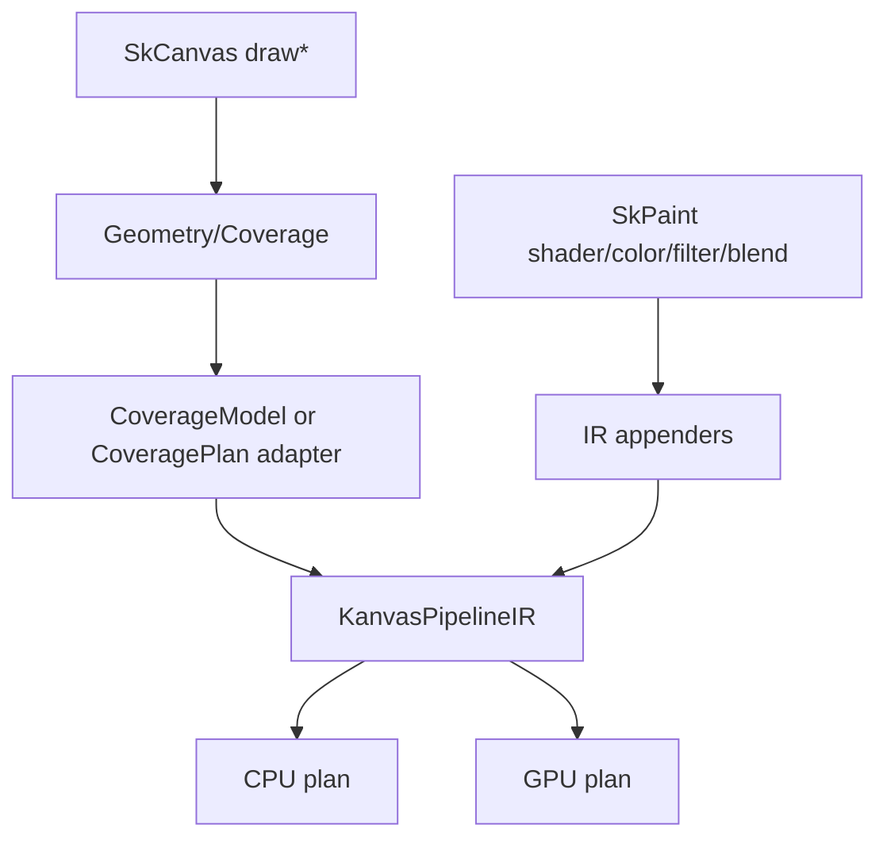

# Spec 01: PipelineIR Contracts

Status: Draft
Target: `.upstream/target/high-performance-wgsl-pipeline-target.md`

## Purpose

Define the backend-neutral paint pipeline contract consumed by CPU and WebGPU.
`KanvasPipelineIR` describes Skia-like paint semantics after draw geometry has
provided coverage. It is a semantic plan, not the final CPU loop and not the
final WGSL program.

## Ownership

Current owner:

- `render-pipeline/src/main/kotlin/org/skia/pipeline/KanvasPipelineIR.kt`

Consumers:

- CPU execution in `:render-pipeline`, moving toward `:cpu-raster` ownership as
  the backend broadens.
- WebGPU generated pipeline selection in `:gpu-raster`.
- Runtime-effect descriptors in `:cpu-raster` and `:gpu-raster`.
- Geometry/Coverage adapters from `.upstream/specs/geometry-coverage/`.

## Pipeline Boundary

`KanvasPipelineIR` starts after geometry has identified coverage. The paint
pipeline may consume a `CoverageModel` directly or consume the result of a
`CoveragePlan` lowering adapter. It must not inspect raw clip-stack operations
or backend-specific path tessellation details.

## Required Contracts

`PipelineOp` records normalized operations in semantic order:

1. seed coordinates;
2. shader or constant color evaluation;
3. paint-color modulation;
4. color-filter or color-space operations;
5. coverage modulation;
6. destination load when needed;
7. blend or composite;
8. store.

The current implementation contains the first pilot subset:

- `SeedDeviceCoords`;
- `ConstantColor`;
- `LinearGradient`;
- `PaintColorModulate`;
- `ApplyCoverage`;
- `BlendMode`;
- `ColorSpaceXform`;
- `LoadDst`;
- `Store`.

Future operations must state whether they are semantic, backend-specific, or
compatibility-only. Backend-specific operations do not belong in
`KanvasPipelineIR`; they belong in CPU/GPU plans.

## Value Semantics

`ColorValueSpec` names the color value domain:

- alpha domain: unpremul, premul, raw, destination;
- color-space role: sRGB, destination, working, explicit, raw bytes;
- precision domain: U8, F16, F32.

New shader, color-filter, image-filter, and runtime-effect appenders must name
their input and output value specs when precision, alpha, or color space can
change behavior.

`CoverageModel` is the paint-side coverage input. It currently supports:

- full coverage;
- span coverage;
- alpha mask;
- analytic rect coverage.

Detailed geometry semantics, path facts, clip facts, and backend coverage
strategies belong to `CoveragePlan`, not directly to paint ops.

## Append Semantics

Appending must be transactional:

- `AppendResult.Success` commits the appended operations.
- `AppendResult.Unsupported` leaves the builder unchanged and lets the caller
  select a fallback.
- `AppendResult.Fatal` leaves the builder unchanged and reports a hard failure.

Appender code must not partially mutate the IR before discovering unsupported
state. This is required so CPU and GPU backends can make independent fallback
decisions from the same semantic input.

## FallbackPlan

`FallbackPlan` records the selected compatibility or refusal path:

- `CpuShadeRow`: use legacy CPU shader row execution.
- `HandwrittenGpuCompat`: use a named handwritten WGSL path.
- `RefuseDiagnostic`: fail explicitly with a stable diagnostic.
- `ExplicitLayerOrReadbackCompat`: use a known compatibility layer/readback
  path.

Fallbacks are part of the IR dump. They are not silent branches in backend
code.

## Dump Stability

`KanvasPipelineIR.dump()` is a developer and PM evidence artifact. It must:

- include a version marker;
- output ops in stable order;
- use stable enum/data names;
- include fallback state;
- avoid memory addresses, unordered map traversal, or object identity.

Any dump format change that breaks expected snapshots must be reviewed as a
contract change.

## Backend Normalization

Backends may fuse operations into specialized plans:

- CPU can collapse `ConstantColor + ApplyCoverage + SrcOver + Store` into one
  scalar/vector kernel.
- GPU can lower the same sequence into one generated WGSL fragment and one
  WebGPU pipeline.

The fused backend plan must be semantically equivalent to the normalized IR or
return an explicit fallback.

## Non-Goals

- Do not encode WebGPU bind groups, WGSL structs, or entry-point names in
  `PipelineOp`.
- Do not encode CPU loop shape or vector lane width in `PipelineOp`.
- Do not treat a generated WGSL module as the source of truth for paint
  semantics.
- Do not add a general SkSL representation.

## Acceptance Criteria

- IR contracts live in a backend-neutral module.
- Snapshot tests pin dump ordering for each new op.
- Unsupported append cases leave the prior IR unchanged.
- CPU and GPU plans can consume the same IR or refuse with explicit fallback.
- Geometry/Coverage handoff is through `CoverageModel` or a documented
  `CoveragePlan` adapter.
