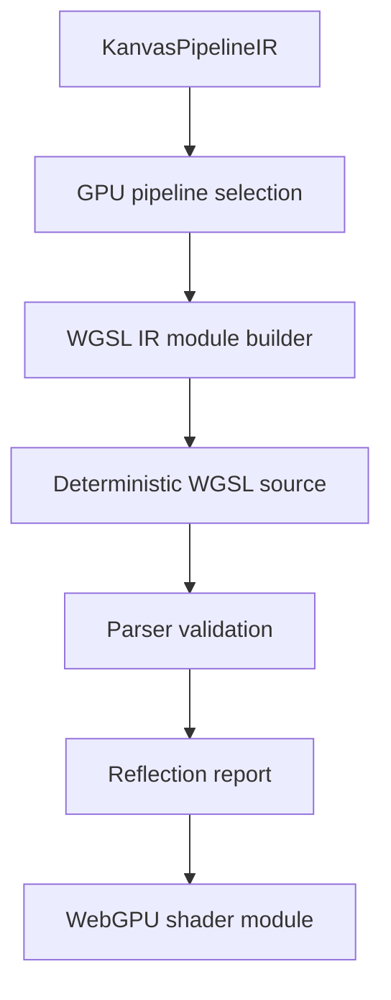

# Spec 02: WGSL Parser, Reflection, And Module Builder

Status: Draft
Target: `.upstream/target/high-performance-wgsl-pipeline-target.md`

## Purpose

Use the `webgpu-ktypes` WGSL parser/generator as a correctness and generation
tool for Kanvas WebGPU modules. The parser validates existing and generated
WGSL, reflects layout data, and supports deterministic module construction.

It is not a SkSL compiler, not a CPU execution model, and not an extension
point for arbitrary user WGSL.

## Remaining Gaps

This spec remains `Draft` after the M24 review.

Accepted evidence exists for generated WGSL goldens, registered runtime-effect
WGSL, `WgslValidationReportTest`, and the `pipelineConformance` gate. The full
parser/reflection/module-builder contract is not accepted yet because:

- existing handwritten WGSL resources still surface parser diagnostics in
  `:gpu-renderer:wgslValidateAll`;
- broad generated uniform packers are not implemented for every layout shape;
- remote publication policy for parser artifacts remains dependency-gated.

Evidence links:

- PR #1142 / `12684fb7259644bb2932e930026c7134177e1964`:
  `pipelineConformance`.
- PR #1143 / `637e42344a335504bfe8d95b63351dfc40ebd872`:
  PM convergence report.
- PR #1144 / `2035b455535e35452097154d9b5d0f05eea8a866`:
  report regeneration fix.

## Dependency Contract

Until remote publication is settled, Kanvas may consume the parser artifacts
from `mavenLocal()`.

Expected local dependency shape:

- artifacts include `io.ygdrasil:core`, `io.ygdrasil:parser`,
  `io.ygdrasil:generator`, and optional tooling artifacts;
- snapshot version is recorded by the consuming ticket or Linear evidence
  comment;
- local publication HOWTOs live in developer-environment docs or Linear
  comments, not in this checked-in spec.

If the artifacts are not resolvable, parser-dependent tasks must fail with a
diagnostic that names the missing coordinate and selected repository list.

Parser dependency use must stay inside the smallest module boundary that needs
it. Code outside that boundary should consume Kanvas-level descriptors and
reports, not parser internals.

The repo-native wgsl4k contribution and submodule plan lives in
`.upstream/specs/wgsl4k-evolution/`. That pack is the active dependency gate
for adding missing parser/reflection behavior through a tracked
`https://github.com/ygdrasil-io/wgsl4k.git` branch and PR. It does not promote
any Kanvas route by itself.

## Validation

Every WGSL source touched by generated-pipeline work must parse through the
parser before it is treated as executable evidence.

Validation corpus:

- existing resources under `gpu-renderer/src/main/resources/shaders/`;
- generated WGSL modules;
- reusable helper fragments;
- registered runtime-effect WGSL implementations;
- negative fixtures for diagnostics when practical.

Validation reports must include:

- source path or generated module id;
- success/failure;
- parser diagnostics with spans where available;
- entry points and stages;
- bindings;
- reflected uniform layout when available.

Build or CI failures are required for parser errors in generated modules.
Existing handwritten resources can initially report diagnostics in a focused
task, but any resource edited by a ticket must have parser validation evidence.

## Reflection

Reflection data is authoritative for packer verification and generated layout
checks.

Required reflected facts:

- entry points and stages;
- `@group` and `@binding`;
- uniform struct names;
- member offsets, alignment, and size;
- texture and sampler declarations;
- vertex inputs and fragment outputs when present.

If reflection cannot produce a fact, the report must include a diagnostic
instead of inventing a default silently. A temporary fallback value can be used
only when named in the ticket and covered by a test.

## Uniform Packers

Uniform packers must be generated or verified from reflected layout.

Rules:

- packer tests compare Kotlin byte offsets and sizes against reflection;
- mismatch diagnostics name the struct, field, expected offset, and actual
  offset;
- padding is explicit;
- packers must not depend on unordered field traversal;
- changing a WGSL uniform struct requires updating or regenerating the packer
  evidence in the same PR.

Uniform values are runtime data. They must not enter `PipelineKey` unless they
change layout, code shape, or render-pipeline state.

## WGSL Assembly

Reusable WGSL fragments should be assembled through a deterministic builder.

Assembly inputs:

- common coordinate helpers;
- coverage helpers;
- blend helpers;
- color-space helpers;
- color-filter helpers;
- shader helpers for gradients, bitmap sampling, runtime effects, and future
  families.

Assembly output:

- exactly the required entry points;
- only required helper declarations;
- deterministic binding layout;
- deterministic source order;
- parser validation and reflection.

Declaration ordering:

1. aliases and constants;
2. structs;
3. globals and bindings;
4. helper functions sorted by dependency and stable helper id;
5. generated pipeline functions in normalized IR order;
6. entry points.

Golden tests must pin generated source for each promoted shader family.

## WGSL IR Module Builder

When parser internals expose a manipulable WGSL IR plus source generation,
Kanvas should prefer that path for module construction.

WGSL IR describes concrete GPU program structure:

- structs;
- bindings;
- functions;
- expressions;
- entry points;
- texture and sampler declarations;
- helper calls.

It must not describe Skia-like semantic operations. Those belong to
`KanvasPipelineIR`.

## Runtime Effects

Registered runtime-effect WGSL implementations must parse and reflect like any
other generated or helper module. The runtime-effect support matrix must name
the WGSL implementation id and the validation evidence.

Arbitrary SkSL sources supplied to `SkRuntimeEffect` are not compiled into
WGSL.

## Parser Safety

Current parser use is internal-source only: checked-in WGSL resources,
generated modules, and registered runtime-effect WGSL implementations. Before
accepting WGSL from external users or untrusted runtime inputs, a follow-up ADR
must define:

- maximum accepted source size;
- parser timeout or cancellation behavior;
- out-of-memory failure policy;
- whether parsing runs in-process or in an isolated worker;
- diagnostic behavior for parser denial-of-service safeguards.

Until that ADR exists, parser entry points must reject untrusted WGSL inputs.

## Non-Goals

- Do not accept arbitrary user WGSL as renderer code.
- Do not build a CPU interpreter for WGSL.
- Do not generate one shader per uniform value.
- Do not let parser snapshot behavior become an undocumented contract.

## Acceptance Criteria

- Parser version and artifact coordinates are recorded for parser-related
  milestones.
- Each generated module has a parser validation test.
- Each reflected packer has a packer-vs-reflection test.
- Generated source is deterministic and covered by golden tests.
- Parser and reflection diagnostics are visible in Linear or PR evidence.
- Parser-dependent failures name the missing artifact or unsafe input class.
