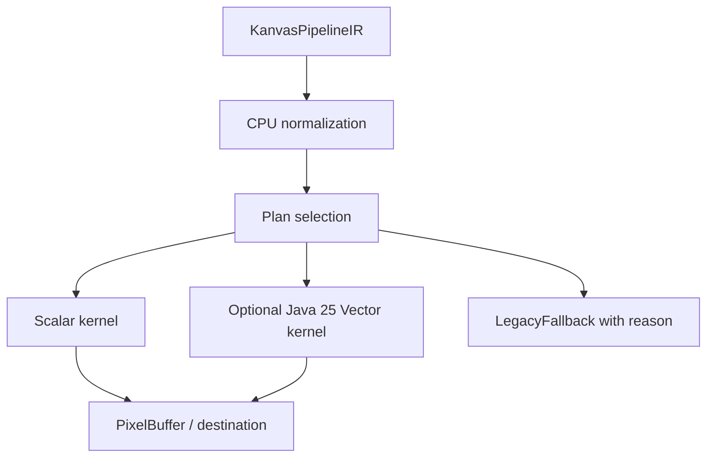

# Spec 03: CPU Pipeline Backend

Status: Accepted
Target: `.upstream/target/high-performance-wgsl-pipeline-target.md`

## M24 Acceptance Evidence

Accepted on 2026-05-27 for the scope covered by the M24 conformance gate.

Evidence links:

- PR #1142 / `12684fb7259644bb2932e930026c7134177e1964`: `pipelineConformance`.
- PR #1143 / `637e42344a335504bfe8d95b63351dfc40ebd872`: PM convergence report.
- PR #1144 / `2035b455535e35452097154d9b5d0f05eea8a866`: report regeneration fix.

Acceptance is limited to the implemented and tested families named in the
conformance report. Future shader, blend, runtime-effect, or migration families
must add their own evidence before default promotion.

## Purpose

Define how the CPU backend consumes `KanvasPipelineIR`. The CPU path remains
the reference behavior for Skia-like rendering while the project moves from
legacy `shadeRow` compatibility toward compiled scalar and optional Java 25
Vector API plans.

## Ownership

Current pilot code lives in `:render-pipeline`:

- `CpuScalarPipelineExecutor`;
- `CpuVectorSolidRectKernel`;
- `CpuPipelineExecutionOptions`;
- `CpuExecutionResult`.

Future broader CPU backend ownership may move execution code into
`:kanvas` CPU/reference route, but the `KanvasPipelineIR` semantic contract remains in
`:render-pipeline`.

## Execution Model

The CPU backend compiles or selects a plan from the IR. It must not execute the
IR as an unbounded per-pixel interpreter in hot paths once a family is promoted.

Initial supported families:

- solid color + coverage + `SrcOver` into clear destination;
- linear gradient + coverage + `SrcOver` into clear destination;
- future color matrix and common pack/store helpers;
- coverage modulation as defined by `CoverageModel` and, later,
  `CoveragePlan` adapters.

Unsupported families return an explicit fallback result.

## Reference Behavior

CPU pipeline output must be compared against existing CPU behavior before any
GPU parity claim.

Required comparisons:

- old CPU path vs CPU pipeline for each promoted shader family;
- scalar vs vector output for each vectorized kernel;
- CPU pipeline vs WebGPU generated path for cross-backend milestones;
- `:kanvas` compatibility facade oracle when Geometry/Coverage is involved.

The CPU backend is allowed to keep compatibility routes until equivalence is
proven.

## Scalar Kernels

Scalar kernels are mandatory for every CPU-supported family.

Rules:

- no per-pixel object allocation in promoted hot loops;
- primitive arrays or explicit span buffers are preferred;
- unsupported blend/shader/color-filter combinations return stable fallback
  reasons;
- kernel ids are stable enough for diagnostics and benchmark reports;
- color, alpha, coverage, and store order follows `KanvasPipelineIR`.

## Java 25 Vector API

The Java 25 Vector API is optional acceleration.

Rules:

- scalar output is the correctness baseline;
- vector code is isolated behind a JVM-specific implementation boundary;
- top-level code loads vector support through reflection or another explicit
  optional mechanism;
- vector kernels use preferred species and scalar tails;
- vector paths are selected only when enabled and benchmarks prove benefit;
- unavailable vector support reports diagnostics and falls back to scalar.

The rest of the project must not directly require `jdk.incubator.vector`
classes.

Default selection of a vector kernel requires at least `1.5x` speedup over the
scalar kernel on the named reference machine for the same correctness fixture.
Lower speedups can remain opt-in experiments, but they cannot gate default
promotion.

First good vector targets:

- solid source-over-clear fill;
- coverage modulation;
- gradient interpolation;
- color matrix;
- premul/unpremul and clamp/pack.

Avoid early vectorization of:

- branch-heavy path coverage;
- arbitrary runtime effects;
- scattered bitmap sampling with complex tile modes.

## Memory Model

Promoted CPU plans should use:

- primitive arrays for pixels and packed color;
- reusable span buffers;
- explicit temporary float lanes when needed;
- immutable descriptors for plan setup;
- frame-local scratch storage when it reduces allocation.

Kotlin data classes are acceptable for descriptors and dumps. They are not
acceptable in inner pixel loops for promoted paths.

## Allocation Verification

The no-per-pixel-allocation rule is testable, not only a review guideline.
Before a CPU kernel is promoted to default:

- the benchmark command must report allocation evidence;
- preferred JVM evidence is JMH or equivalent `gc.alloc.rate.norm`;
- the target for the canonical hot-loop benchmark is `0.0 B/op`;
- any non-zero allocation requires an explicit exception naming where the
  allocation occurs and why it is outside the per-pixel loop.

## Diagnostics

CPU execution reports:

- result kind: success or legacy fallback;
- kernel id;
- vector selected or vector fallback reason;
- touched pixel/span counters where available;
- unsupported family/blend/color-filter reason.

Diagnostics must be suitable for Linear evidence comments and PM demo reports.

## Non-Goals

- Do not make Vector API availability a build or runtime correctness
  requirement.
- Do not compile arbitrary WGSL or SkSL into CPU code.
- Do not bypass `KanvasPipelineIR` by adding backend-only semantic behavior.
- Do not remove legacy `shadeRow` compatibility until migration evidence is
  complete.

## Acceptance Criteria

- Each promoted CPU family has old-path vs pipeline pixel evidence.
- Scalar tests exist before vector tests.
- Vector tests prove scalar/vector equivalence and report selected/fallback
  status.
- Benchmarks name machine, JDK, command, scalar baseline, vector result, and
  speedup when claiming performance.
- Unsupported cases produce stable fallback diagnostics.
- Default vector promotion meets the `1.5x` reference-machine gate or remains
  explicitly opt-in.
