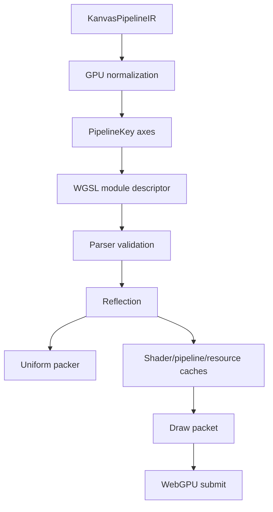

# Spec 04: GPU Generated WGSL Backend

Status: Accepted
Target: `.upstream/target/high-performance-wgsl-pipeline-target.md`

## M24 Acceptance Evidence

Accepted on 2026-05-27 for the scope covered by the M24 conformance gate.

Evidence links:

- PR #1142 / `12684fb7259644bb2932e930026c7134177e1964`: `pipelineConformance`.
- PR #1143 / `637e42344a335504bfe8d95b63351dfc40ebd872`: PM convergence report.
- PR #1144 / `2035b455535e35452097154d9b5d0f05eea8a866`: report regeneration fix.

Acceptance is limited to the implemented and tested families named in the
conformance report. Future shader, blend, runtime-effect, or migration families
must add their own evidence before default promotion.


## Purpose

Define how the WebGPU backend consumes `KanvasPipelineIR` and moves from
handwritten WGSL combinations to parser-validated generated WGSL modules.

The GPU backend specializes the shared semantic IR. It does not define paint
semantics by itself.

## Ownership

Current owner:

- `gpu-renderer/src/main/kotlin/org/skia/gpu/webgpu/`

Important current surfaces:

- `SkWebGpuDevice`;
- `GeneratedSolidRectWgsl`;
- `GeneratedLinearGradientWgsl`;
- `WgslValidationReport`;
- `PipelineKeyClassification`;
- `GpuCacheTelemetrySnapshot`;
- `BlendPlan`.

## GPU Plan Flow



Generated WGSL modules must be selected through a stable pipeline plan and key,
not by ad hoc draw-path branching.

## Supported Initial Families

Initial generated families:

- rect + solid color + `SrcOver`;
- rect + linear gradient + optional color-filter payload + `SrcOver`;
- runtime-effect descriptor pilot when a WGSL implementation id is registered.

Existing handwritten shader paths may remain as compatibility routes while
generated paths are validated.

## PipelineKey

`PipelineKey` axes are allowed only when they materially affect one of:

- bind-group layout, texture/sampler presence, uniform struct shape, vertex
  input shape, or attachment layout;
- generated WGSL code shape, helper set, entry-point structure, static branch
  removal, or shader graph shape;
- WebGPU render-pipeline state, such as blend state, format class, topology,
  multisampling, depth, or stencil.

Uniform-only values must not enter the key unless an accepted benchmark proves
that specialization is worth the cache pressure.

Axis classes:

| Axis class | Meaning |
|---|---|
| `Layout` | Changes bindings, uniform schema, texture/sampler set, vertex input, or attachments. |
| `Code` | Changes generated helper set, entry point, static branches, or shader graph shape. |
| `PipelineState` | Changes WebGPU fixed-function render-pipeline state. |
| `UniformOnly` | Changes only values consumed by already-generated code. |

`UniformOnly` axes are diagnostic facts, not cache-key axes for generated
pipelines.

Pipeline key serialization must be deterministic and independent of unordered
map/set traversal.

### PipelineKey Identity

The canonical key preimage is the human-readable dump. The dump format is:

```text
pipeline.key v=1 layout=[axis=value,...] code=[axis=value,...] state=[axis=value,...]
```

Rules:

- axes are grouped by axis class in the order `layout`, `code`, `state`;
- axes within each group sort lexicographically by axis id;
- values are normalized strings with no object identity, memory address, or
  unordered collection traversal;
- `UniformOnly` facts may appear in a separate diagnostic dump, but not in the
  cache key preimage;
- the cache key hash is `sha256(preimage)`, encoded lowercase hex;
- debug dumps must include both preimage and hash;
- the full hash is the authoritative key unless a future ADR accepts a
  truncated form plus collision bucket policy.

Collision policy: when two different preimages produce the same hash, the cache
must treat that as a fatal diagnostic in debug/test builds and must fall back to
a safe miss in production. A collision must not reuse an incompatible module or
pipeline.

## Generated WGSL

Generated modules must:

- be deterministic;
- include only required helpers;
- parse successfully before shader module creation;
- expose reflected layout for packer verification;
- have golden source tests for promoted families;
- avoid one-module-per-uniform-value cache explosions.

Handwritten source templates may be used during transition, but promoted
families should move toward parser-aware assembly or WGSL IR construction.

## Blend And Composition

Blend decisions must go through `BlendPlan`:

- fixed-function WebGPU blending for allowlisted modes;
- shader/layer composite plan when destination color is required;
- explicit refusal when unsupported.

Generated WGSL must not silently approximate unsupported blend modes.

## Cache Policy

Required cache classes:

- shader module source/reflection registry;
- compiled WebGPU render pipeline cache;
- resource cache for textures, samplers, staging buffers, and reusable backend
  resources.

Telemetry must expose:

- shader module hits/misses;
- pipeline hits/misses;
- resource hits/misses;
- pipeline creations;
- resident entry counts.

Unbounded input domains require a budget or an explicit no-eviction
justification with finite key count evidence.

## Concurrency

Initial WebGPU generated-pipeline work uses a single owner thread for
`SkWebGpuDevice`, WebGPU handles, caches, and telemetry mutation.

Rules:

- shader module, pipeline, and resource caches are read and written on the
  device owner thread;
- telemetry counters are snapshot-based and do not need atomics while this
  ownership rule holds;
- any background pipeline build thread must hand immutable descriptors to the
  device owner thread before touching WebGPU handles;
- introducing shared mutable caches, atomics, or locks requires a follow-up ADR
  and stress tests.

## Resource Lifecycle

GPU resources must document ownership and reset behavior:

- whether a handle survives device reset;
- which cache owns it;
- when temporary textures are closed;
- whether re-upload or recreation is automatic or explicit;
- what diagnostic is emitted on invalid use.

Generated pipelines must not hide resource leaks behind compatibility paths.

## GPU Gates

Promoted generated families require:

- CPU-vs-GPU visual comparison for selected fixtures;
- parser validation for generated modules;
- reflected uniform layout evidence;
- deterministic `PipelineKey` dump;
- no unexpected fallback reasons;
- at least 60 warmup frames before steady-state measurement unless the scene
  provides a documented 3-sigma stabilization rule;
- zero pipeline creations over 120 consecutive steady-state frames for the demo
  scene, or an explicit accepted exception;
- at most 16 resident generated WGSL modules for a PM demo scene unless the
  scene names a higher finite bound and review accepts the cache pressure.

## Non-Goals

- Do not port Graphite or Ganesh.
- Do not create a general shader language compiler.
- Do not add uniform values to `PipelineKey` by default.
- Do not retire handwritten compatibility before evidence exists.
- Do not silently fall back to a visually weaker path.

## Acceptance Criteria

- Every generated family has generated-source golden tests.
- Every touched WGSL module parses.
- Every reflected layout has packer evidence.
- `PipelineKey` axes are classified before use.
- Cache telemetry is captured in tests or PM evidence.
- Handwritten fallback retirement follows `07-validation-performance-and-migration.md`.
- `PipelineKey` dumps include both canonical preimage and `sha256` hash.
