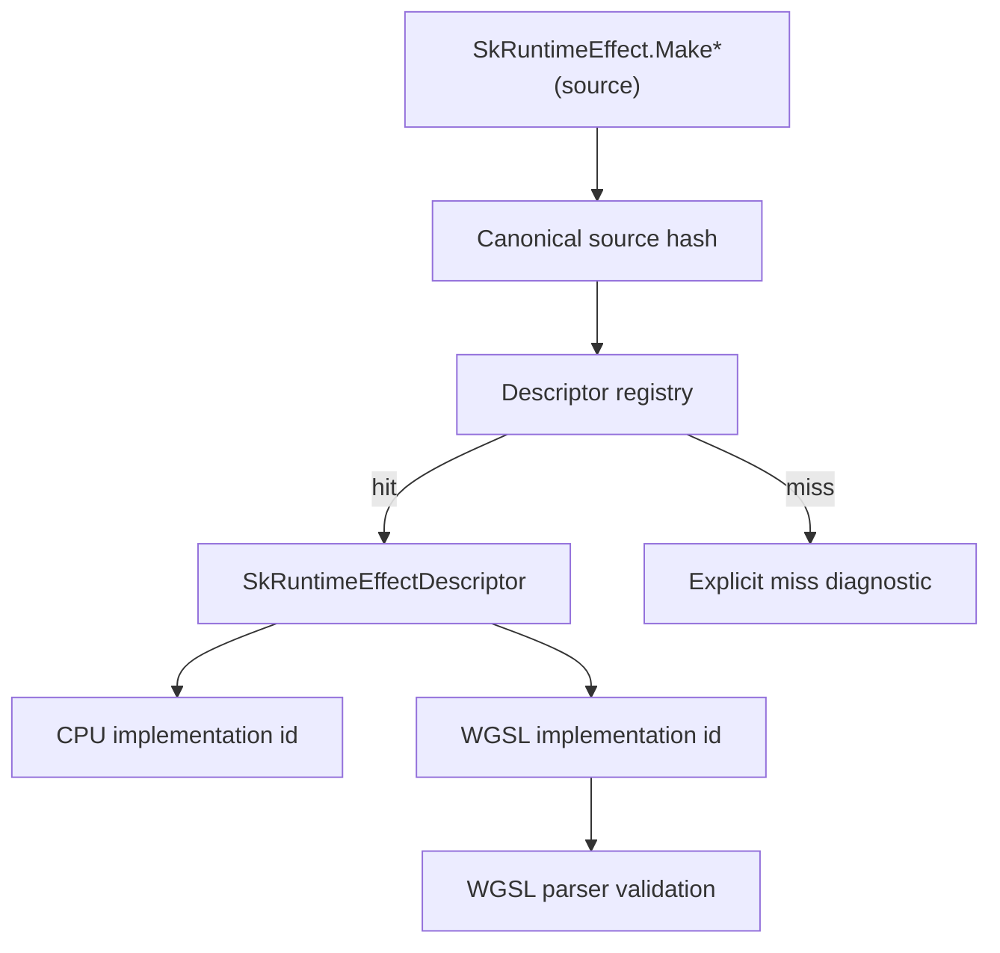

# Spec 06: Runtime Effects Descriptor

Status: Accepted
Target: `.upstream/target/high-performance-wgsl-pipeline-target.md`

## M24 Acceptance Evidence

Accepted on 2026-05-27 for the scope covered by the M24 conformance gate.

Evidence links:

- PR #1142 / `12684fb7259644bb2932e930026c7134177e1964`: `pipelineConformance`.
- PR #1143 / `637e42344a335504bfe8d95b63351dfc40ebd872`: PM convergence report.
- PR #1144 / `2035b455535e35452097154d9b5d0f05eea8a866`: report regeneration fix.

Acceptance is limited to the implemented and tested families named in the
conformance report. Future shader, blend, runtime-effect, or migration families
must add their own evidence before default promotion.

## Purpose

Keep `SkRuntimeEffect` source-compatible for supported Kanvas call sites while
avoiding a SkSL compiler. Runtime effects are resolved through registered
descriptors and explicit Kotlin/WGSL implementations.

## Boundary

Kanvas does not compile arbitrary SkSL. A supported effect is a registered
compatibility entry.

## Descriptor Contract

`SkRuntimeEffectDescriptor` records:

- stable id;
- effect kind: shader, color filter, blender, or image-filter helper;
- uniforms;
- children;
- flags;
- CPU implementation id;
- optional WGSL implementation id.

The descriptor is part of the compatibility support matrix. Adding, changing,
or removing an entry is a public Kanvas compatibility change even if it is not
an upstream Skia API change.

## Canonical Lookup

The registry resolves caller-provided source through canonical normalization
and hashing.

Rules:

- comment and whitespace differences may normalize to the same source;
- hash stability is test-covered;
- duplicate registration is an error in production;
- tests may opt into override behavior only through an explicit test-only
  registry option or helper;
- misses produce a diagnostic that includes the canonical hash or stable id;
- tests can clear registry state only through test-only helpers.

## CPU Implementation

CPU implementation ids refer to registered Kotlin implementations.

Rules:

- implementation behavior is tested against existing CPU fixtures or upstream
  GM-derived expectations;
- uniform and child metadata must match descriptor declarations;
- unsupported child kinds or flags return explicit diagnostics;
- runtime-effect CPU support must not require WGSL.

## GPU WGSL Implementation

GPU implementation ids refer to registered WGSL modules or fragments.

Rules:

- WGSL implementation parses successfully;
- reflection verifies uniform and child binding layout;
- generated pipeline selection can include the runtime-effect implementation id
  only when it changes code shape or layout;
- unsupported GPU runtime effect paths refuse or use an explicit compatibility
  route.

## Support Matrix

Each supported runtime effect entry must name:

- canonical source hash or stable id;
- effect kind;
- uniform declarations and layout facts;
- child declarations;
- CPU implementation id;
- WGSL implementation id or GPU unsupported reason;
- tests or GMs exercising the effect;
- fallback behavior for missing backends.

The authoritative support matrix is the runtime-effect descriptor registry.
That registry must expose a deterministic walker for generated reports and
tests. A generated Markdown or JSON report can be committed for PM/readability,
but it is derived evidence, not the source of truth.

## Descriptor Coverage Policy

Every newly supported runtime-effect family must enter the support matrix in
one of these states before it can be treated as release-ready:

- descriptor-backed: the descriptor registry entry names the stable id,
  canonical hash or canonical source identity, effect kind, uniforms,
  children, flags, CPU implementation id, and WGSL implementation id when GPU
  support exists;
- CPU-only: the descriptor registry entry names the same metadata and records
  an explicit GPU unsupported reason instead of a WGSL implementation id;
- dispatch-only legacy: the dispatch registry exposes explicit read-only
  metadata for the Kotlin implementation, and the matrix row carries a named
  missing-descriptor reason;
- dependency-gated: the row or linked issue names the external dependency that
  prevents descriptor, CPU, or WGSL evidence from being completed.

WGSL-backed entries additionally require parser/reflection evidence for the
registered WGSL module or fragment. A WGSL implementation id without parser
evidence is not valid support.

Support matrix rows must always expose descriptor status and missing reason
fields. Reports must include counts for descriptor-backed,
dispatch-only/missing-descriptor, CPU-only, and GPU-backed entries so PM
evidence can distinguish shipped support from accepted exceptions.

Adding a runtime-effect registration through dispatch without descriptor
metadata is acceptable only for existing legacy support. New dispatch-only
entries must either provide explicit matrix metadata in the same change or
remain unsupported until a follow-up ticket defines the dependency gate.

## Non-Goals

- Do not implement arbitrary SkSL parsing or compilation.
- Do not accept user-provided WGSL as the effect implementation.
- Do not silently approximate unregistered effects.
- Do not use runtime-effect support to bypass `KanvasPipelineIR` semantics.

## Acceptance Criteria

- Registered descriptor lookup is tested.
- Missing effect diagnostics are stable.
- CPU implementation id is validated by a CPU render or unit test.
- WGSL implementation id, when present, has parser/reflection evidence.
- CPU/GPU output comparison exists for the pilot effect when both backends are
  declared supported.
- Duplicate registration fails by default and override behavior is test-only.
