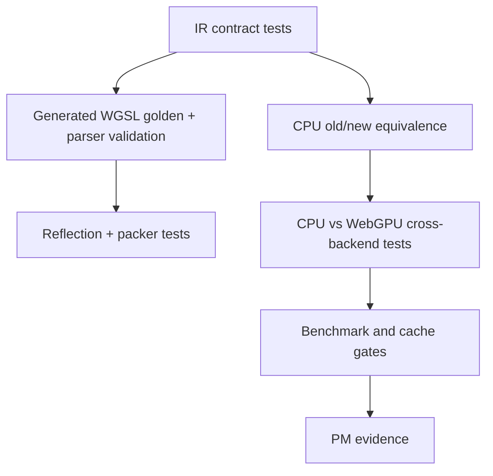

# Spec 07: Validation, Performance, And Migration

Status: Accepted
Target: `.upstream/target/high-performance-wgsl-pipeline-target.md`

## M24 Acceptance Evidence

Accepted on 2026-05-27 for the scope covered by the M24 conformance gate.

Evidence links:

- PR #1142 / `12684fb7259644bb2932e930026c7134177e1964`: `pipelineConformance`.
- PR #1143 / `637e42344a335504bfe8d95b63351dfc40ebd872`: PM convergence report.
- PR #1144 / `2035b455535e35452097154d9b5d0f05eea8a866`: report regeneration fix.

Acceptance is limited to the implemented and tested families named in the
conformance report. Future shader, blend, runtime-effect, or migration families
must add their own evidence before default promotion.


## Purpose

Define how pre-Geometry WGSL pipeline work proves correctness, performance,
and safe migration from proof-of-concept paths.

## Validation Layers



Required layers:

- `KanvasPipelineIR` dump and transactional append tests;
- parser validation for touched/generated WGSL;
- reflected layout and packer verification;
- CPU old-path vs CPU pipeline equivalence;
- scalar vs vector equivalence for vector kernels;
- CPU vs WebGPU comparison for generated GPU paths;
- fallback/refusal diagnostics;
- cache telemetry and benchmark evidence for promoted GPU paths.

## CI Gates

The intended CI gates are:

| Gate | Purpose |
|---|---|
| `wgsl-parser-validate` | Parse touched and generated WGSL modules. |
| `wgsl-reflection-packer` | Verify Kotlin packers against reflected layouts. |
| `pipeline-ir-snapshots` | Pin IR, fallback, and diagnostic dump versions. |
| `cpu-pipeline-equivalence` | Compare old CPU path, scalar pipeline, and vector output where relevant. |
| `gpu-generated-cross-backend` | Compare generated WebGPU output against CPU reference. |
| `gpu-cache-warmup` | Assert warmup/stable pipeline creation and module-count gates. |

Until these are separate workflows, milestone PRs must run the equivalent
focused Gradle tasks and paste the command/evidence into Linear or the PR.

The standard production convergence entry point is:

```bash
rtk ./gradlew --no-daemon pipelineConformance
```

This task aggregates parser validation, generated WGSL golden tests,
PipelineKey tests, BlendPlan tests, runtime descriptor registry/routing tests,
CPU PipelineIR/executor/geometry oracle tests, and WebGPU selector tests. It
does not run slow benchmark gates; benchmark evidence remains explicit through
the named benchmark tasks.

GPU adapter-dependent tests may report JUnit `SKIPPED` when the local or CI
environment has no usable WebGPU adapter. Such skips are residual risk and must
be named in the evidence summary; they are not a green GPU adapter pass.

For PM review, generate the compact convergence report with:

```bash
rtk ./gradlew --no-daemon pipelineConformanceReport
```

The report is written to
`build/reports/pipeline-conformance/m24-pipeline-conformance-report.md` and
summarizes commit, commands, JUnit pass/fail/skipped counts, parser/generated
WGSL status, PipelineKey and BlendPlan status, descriptor routing, runtime
effects, vector benchmark decision, route dump references, skipped checks, and
residual risks.

## Correctness Evidence

Each promoted family needs a clear reference:

| Family | Required reference |
|---|---|
| Solid rect | CPU old path and generated GPU cross-backend comparison. |
| Linear gradient | CPU scalar reference and GPU generated comparison with named threshold. |
| Color filter | CPU color-filter reference and alpha/color-space fixtures. |
| Blend mode | CPU blend reference with non-opaque source and destination. |
| Runtime effect | registered CPU implementation and optional registered WGSL implementation. |
| Geometry/Coverage handoff | `.upstream/specs/geometry-coverage/` oracle rules. |

Initial falsifiable thresholds:

| Metric | Initial value |
|---|---|
| Cross-backend channel delta for sRGB byte fixtures | max channel delta <= 1 for at least 99.5 percent of pixels, with no pixel above 3 unless the family-specific policy says otherwise. |
| DeltaE family policy | Required before using DeltaE as the review metric; until then, use channel delta/PSNR/SSIM policies named by the test. |
| Generated WGSL modules resident in PM demo scene | <= 16 unless a reviewed scene-specific bound is documented. |
| Warmup before stable GPU measurement | >= 60 frames or documented 3-sigma stabilization. |
| Steady-state pipeline creations | 0 over 120 consecutive frames. |
| Vector default promotion speedup | >= 1.5x scalar on the named reference machine. |

Thresholds must be versioned outside ad hoc assertions when a family graduates
from pilot to migration candidate.

## Performance Evidence

Benchmark reports should capture:

- command and environment;
- machine and JDK;
- backend and adapter when GPU is involved;
- warmup and measured iterations;
- scalar baseline;
- vector result when applicable;
- generated GPU result and handwritten compatibility result when applicable;
- allocations or temporary buffer bytes when measurable;
- pipeline cache hit/miss and pipeline creations after warmup;
- generated shader module count.

Claims of "faster" or "ready to retire" require benchmark evidence, not only
passing pixel tests.

CPU vector default-promotion evidence must include
`rtk ./gradlew --no-daemon :render-pipeline:cpuVectorAllocationBenchmark`.
The report must name the allocation metric, its units, the `0.0 B/op`
hot-loop target, measured scalar/vector bytes per operation, and any explicit
exception for allocations outside the per-pixel loop. A rejected benchmark is
valid evidence and must remain visible with its decision line.

## GPU Success Gates

Generated GPU families require:

- no parser diagnostics;
- deterministic generated source;
- reflected layout evidence;
- stable pipeline key dump;
- no unexpected fallback reasons;
- zero render-pipeline creation in stable frames after warmup for the demo
  scene, or a documented exception;
- bounded module and pipeline counts.

## Migration Stages

| Stage | Meaning |
|---|---|
| Shadow | Build/dump the new descriptor or generated path without changing pixels. |
| Compare | Execute old and new paths into comparable outputs and record diff. |
| Gated | New path can run behind explicit flag or primitive/family gate. |
| Default | New path is selected by default for the named family. |
| Rollback | Default is revoked back to Gated or Compare with a Linear ticket, stable reason, and re-promotion criteria. |
| Retired | Old handwritten/legacy path is removed or kept only as documented compatibility. |

Default cutover is allowed only after correctness evidence, fallback tests, and
performance gates for that family.

## Retirement Rules

Retiring a handwritten or legacy path requires:

- generated/scalar/vector replacement selected by default;
- old/new pixel evidence;
- parser/reflection evidence when WGSL is involved;
- fallback behavior documented for unsupported inputs;
- PM evidence attached to the Linear milestone;
- CI and review green;
- no broader family accidentally captured by the gate.

If a compatibility path remains, it must be named in diagnostics and have a
retirement criterion.

Rollback is not a failure of the model. It is the required state when a latent
driver, scene, or correctness issue appears after default promotion.

## Golden Corpus

Golden artifacts live under the owning module:

```text
<module>/src/test/resources/golden/<family>/<stable-id>.<ext>
```

Recommended extensions:

- `.wgsl` for generated source;
- `.json` for descriptors, reflection reports, pipeline keys, and dumps;
- `.png` for visual outputs or diff images.

Rebaseline rules:

- rebaseline requires an explicit review note explaining why the golden changed;
- generated WGSL goldens must be deterministic across OSes;
- CI must fail on unexpected golden drift;
- bulk updates should use a named Gradle task or documented `UPDATE_GOLDENS=1`
  path, not manual copy/paste;
- auto-merge is not allowed for PRs that change golden artifacts.

## PM Evidence

Each milestone should leave one concise artifact in Linear:

```text
Milestone:
Capability:
Evidence:
Commands:
Artifacts:
Known limitations:
Next dependency:
Commit or PR:
```

Good artifacts:

- IR dump;
- generated WGSL diff;
- reflected layout report;
- cross-backend image diff;
- benchmark table;
- cache telemetry snapshot;
- fallback/refusal report.

Example:

```text
Milestone: M4 - Generated solid rect WGSL
Capability: WebGPU renders solid-rect SrcOver through parser-validated generated WGSL.
Evidence:
  - golden WGSL: gpu-renderer/src/test/resources/golden/solid-rect/gpu.generated.solid-rect.srcover@v1.wgsl
  - parser report: GeneratedSolidRectWgslTest
  - cross-backend: GeneratedSolidRectMigrationTest, p99.5 channel delta = 0
Commands:
  - rtk ./gradlew :gpu-renderer:test --tests '*GeneratedSolidRect*'
Artifacts:
  - generated WGSL dump
  - pipeline key dump
Known limitations: non-opaque destination coverage remains under BlendPlan M7.
Next dependency: M5 uniform packer verification.
Commit or PR: #1127
```

## Milestone Acceptance

M0:

- parser artifacts can be resolved;
- smoke task or test parses one WGSL resource;
- parser version and dependency source are recorded.

M1:

- `KanvasPipelineIR` contracts and stable dumps exist;
- unsupported appends are transactional;
- fallback plan is visible.

M2:

- existing WGSL resources can be parsed in a focused task/test;
- at least one uniform layout is reflected.

M3:

- CPU scalar solid and gradient pilots render;
- old-path equivalence is tested.

M4:

- generated solid WGSL is deterministic;
- parser validation passes;
- GPU output matches the selected reference.

M5:

- Kotlin packer layout is verified against reflection;
- mismatch diagnostics name the failing field.

M6:

- pipeline key axes are classified;
- cache telemetry is exposed;
- repeated scene shows warmup vs stable counters.

M7:

- `BlendPlan` allowlist and refusal diagnostics are tested.

M8:

- generated gradient WGSL renders with parser validation and CPU comparison.

M9:

- one runtime effect has a descriptor with CPU/GPU metadata and miss
  diagnostics.

M10:

- one Java 25 Vector API kernel reports scalar fallback and measured speedup.

M11:

- one shader family uses generated/scalar/vector path by default with
  retirement evidence.

## Definition Of Done

A pre-Geometry WGSL pipeline slice is done when:

- it satisfies the accepted spec section;
- relevant tests or generated artifacts exist;
- fallback behavior is explicit and asserted;
- parser/reflection evidence exists for WGSL changes;
- CPU reference evidence exists for behavior changes;
- GPU evidence exists for generated GPU promotion;
- performance claims are measured;
- Linear has a concise evidence comment or linked PR/commit.
