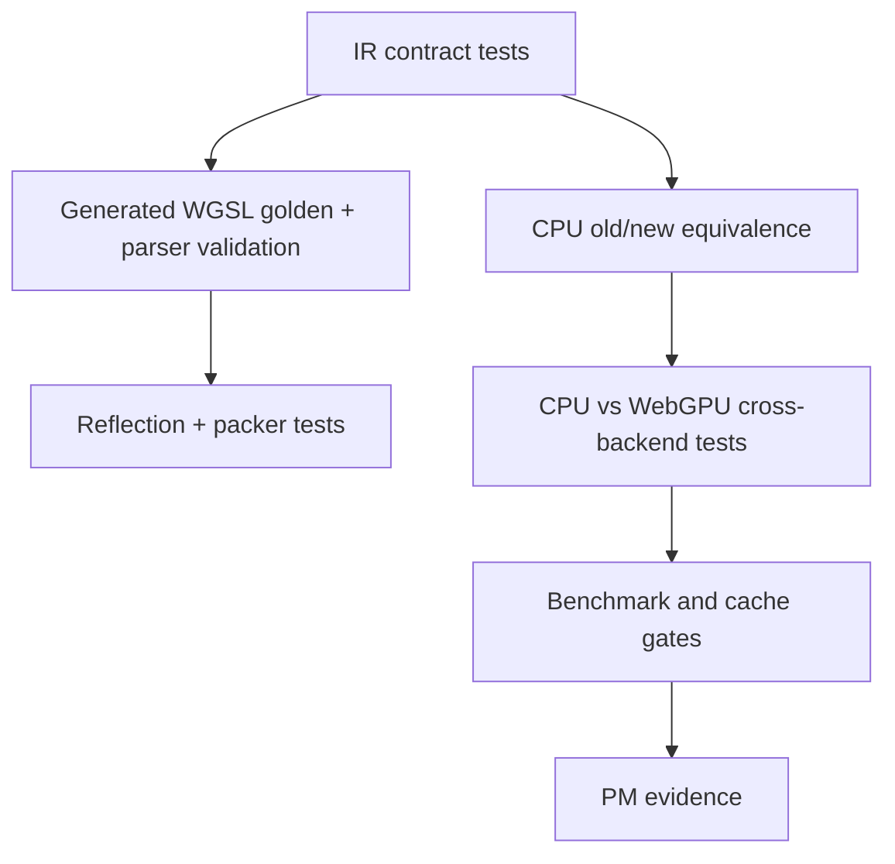

# Spec 07: Validation, Performance, And Migration

Status: Draft
Target: `.upstream/target/high-performance-wgsl-pipeline-target.md`

## Purpose

Define how pre-Geometry WGSL pipeline work proves correctness, performance,
and safe migration from proof-of-concept paths.

## Validation Layers



Required layers:

- `KanvasPipelineIR` dump and transactional append tests;
- parser validation for touched/generated WGSL;
- reflected layout and packer verification;
- CPU old-path vs CPU pipeline equivalence;
- scalar vs vector equivalence for vector kernels;
- CPU vs WebGPU comparison for generated GPU paths;
- fallback/refusal diagnostics;
- cache telemetry and benchmark evidence for promoted GPU paths.

## Correctness Evidence

Each promoted family needs a clear reference:

| Family | Required reference |
|---|---|
| Solid rect | CPU old path and generated GPU cross-backend comparison. |
| Linear gradient | CPU scalar reference and GPU generated comparison with named threshold. |
| Color filter | CPU color-filter reference and alpha/color-space fixtures. |
| Blend mode | CPU blend reference with non-opaque source and destination. |
| Runtime effect | registered CPU implementation and optional registered WGSL implementation. |
| Geometry/Coverage handoff | `.upstream/specs/geometry-coverage/` oracle rules. |

Thresholds must be versioned outside ad hoc assertions when a family graduates
from pilot to migration candidate.

## Performance Evidence

Benchmark reports should capture:

- command and environment;
- machine and JDK;
- backend and adapter when GPU is involved;
- warmup and measured iterations;
- scalar baseline;
- vector result when applicable;
- generated GPU result and handwritten compatibility result when applicable;
- allocations or temporary buffer bytes when measurable;
- pipeline cache hit/miss and pipeline creations after warmup;
- generated shader module count.

Claims of "faster" or "ready to retire" require benchmark evidence, not only
passing pixel tests.

## GPU Success Gates

Generated GPU families require:

- no parser diagnostics;
- deterministic generated source;
- reflected layout evidence;
- stable pipeline key dump;
- no unexpected fallback reasons;
- zero render-pipeline creation in stable frames after warmup for the demo
  scene, or a documented exception;
- bounded module and pipeline counts.

## Migration Stages

| Stage | Meaning |
|---|---|
| Shadow | Build/dump the new descriptor or generated path without changing pixels. |
| Compare | Execute old and new paths into comparable outputs and record diff. |
| Gated | New path can run behind explicit flag or primitive/family gate. |
| Default | New path is selected by default for the named family. |
| Retired | Old handwritten/legacy path is removed or kept only as documented compatibility. |

Default cutover is allowed only after correctness evidence, fallback tests, and
performance gates for that family.

## Retirement Rules

Retiring a handwritten or legacy path requires:

- generated/scalar/vector replacement selected by default;
- old/new pixel evidence;
- parser/reflection evidence when WGSL is involved;
- fallback behavior documented for unsupported inputs;
- PM evidence attached to the Linear milestone;
- CI and review green;
- no broader family accidentally captured by the gate.

If a compatibility path remains, it must be named in diagnostics and have a
retirement criterion.

## PM Evidence

Each milestone should leave one concise artifact in Linear:

```text
Milestone:
Capability:
Evidence:
Commands:
Artifacts:
Known limitations:
Next dependency:
Commit or PR:
```

Good artifacts:

- IR dump;
- generated WGSL diff;
- reflected layout report;
- cross-backend image diff;
- benchmark table;
- cache telemetry snapshot;
- fallback/refusal report.

## Milestone Acceptance

M0:

- parser artifacts can be resolved;
- smoke task or test parses one WGSL resource;
- parser version and dependency source are recorded.

M1:

- `KanvasPipelineIR` contracts and stable dumps exist;
- unsupported appends are transactional;
- fallback plan is visible.

M2:

- existing WGSL resources can be parsed in a focused task/test;
- at least one uniform layout is reflected.

M3:

- CPU scalar solid and gradient pilots render;
- old-path equivalence is tested.

M4:

- generated solid WGSL is deterministic;
- parser validation passes;
- GPU output matches the selected reference.

M5:

- Kotlin packer layout is verified against reflection;
- mismatch diagnostics name the failing field.

M6:

- pipeline key axes are classified;
- cache telemetry is exposed;
- repeated scene shows warmup vs stable counters.

M7:

- `BlendPlan` allowlist and refusal diagnostics are tested.

M8:

- generated gradient WGSL renders with parser validation and CPU comparison.

M9:

- one runtime effect has a descriptor with CPU/GPU metadata and miss
  diagnostics.

M10:

- one Java 25 Vector API kernel reports scalar fallback and measured speedup.

M11:

- one shader family uses generated/scalar/vector path by default with
  retirement evidence.

## Definition Of Done

A pre-Geometry WGSL pipeline slice is done when:

- it satisfies the accepted spec section;
- relevant tests or generated artifacts exist;
- fallback behavior is explicit and asserted;
- parser/reflection evidence exists for WGSL changes;
- CPU reference evidence exists for behavior changes;
- GPU evidence exists for generated GPU promotion;
- performance claims are measured;
- Linear has a concise evidence comment or linked PR/commit.
