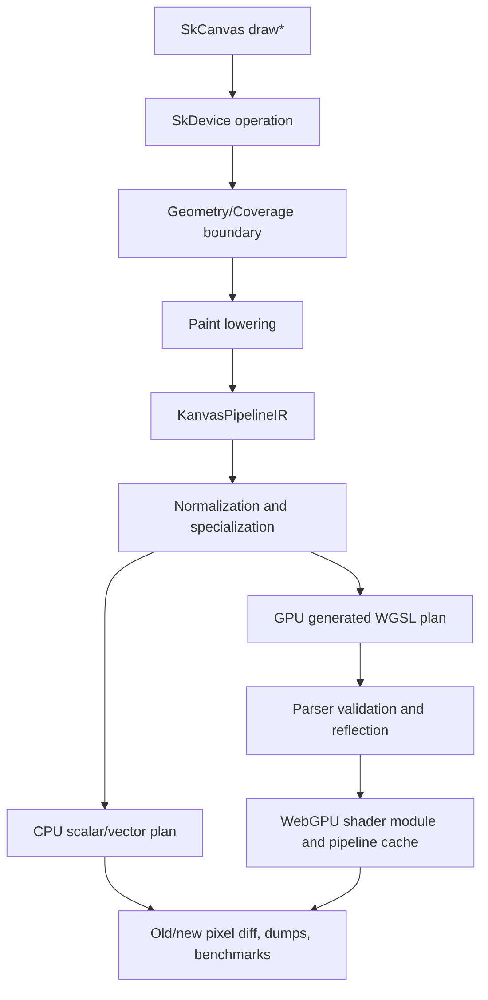
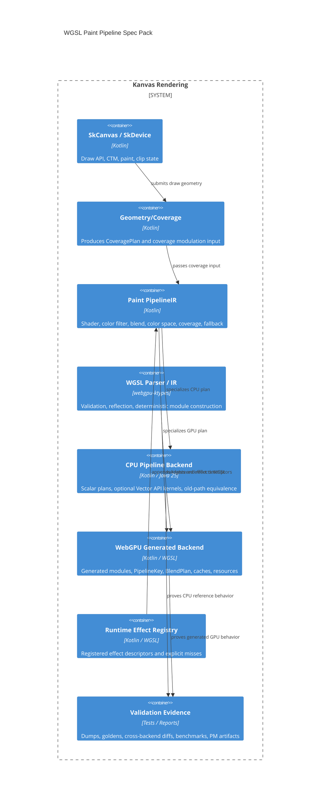

# WGSL Paint Pipeline Specs

Status: Draft
Target: `.upstream/target/high-performance-wgsl-pipeline-target.md`

This spec pack turns the validated pre-Geometry WGSL paint-pipeline target into
implementation-ready technical contracts. It covers the Linear M0-M11 work:
parser integration, `KanvasPipelineIR`, CPU scalar/vector execution, generated
WGSL, `PipelineKey`, `BlendPlan`, runtime-effect descriptors, validation, and
migration policy.

Geometry and coverage are specified separately under
`.upstream/specs/geometry-coverage/`. The handoff is deliberate: geometry
produces coverage, the paint pipeline consumes coverage.

## Source Of Truth

- Target architecture:
  `.upstream/target/high-performance-wgsl-pipeline-target.md`
- Execution method:
  `.upstream/target/linear-agent-methodology.md`
- Linear project:
  `Kanvas - WGSL Pipeline Target`, milestones M0-M11
- Geometry handoff:
  `.upstream/specs/geometry-coverage/README.md`
- Upstream/rebaseline evidence:
  `reports/upstream-rebaseline/` and `.upstream/source/map/`

Hard constraints:

- Do not port Ganesh or Graphite.
- Do not rebuild Skia's SkSL compiler, IR, or VM.
- Keep WebGPU as the GPU backend.
- Keep `KanvasPipelineIR` as the Skia-like semantic pipeline contract.
- Use WGSL IR only as the concrete GPU module construction layer.
- Keep `SkRuntimeEffect` as a compatibility facade backed by registered
  Kotlin/WGSL implementations.
- Treat Java 25 Vector API code as an optional performance path, never as a
  correctness dependency.

## Status Policy

Specs start as `Draft`. A spec can move to `Accepted` only when the owning
Linear milestone has merged implementation evidence, fallback behavior is
asserted in tests or reports, and the PM evidence comment links the relevant
commit or PR. Editorial fixes do not change status.

## Spec Index

| Spec | Purpose |
|---|---|
| `00-current-state-inventory.md` | Current M0-M11 implementation state, evidence, and gaps. |
| `01-pipeline-ir-contracts.md` | `KanvasPipelineIR`, operation ordering, value semantics, fallback plans, and coverage handoff. |
| `02-wgsl-parser-reflection-module-builder.md` | Parser dependency, validation, reflection, WGSL IR/module builder, and uniform packer rules. |
| `03-cpu-pipeline-backend.md` | CPU scalar/vector execution, memory model, reference behavior, and benchmarks. |
| `04-gpu-generated-wgsl-backend.md` | Generated WGSL pipeline selection, `PipelineKey`, caches, resource lifecycle, and GPU gates. |
| `05-blend-fallback-diagnostics.md` | `BlendPlan`, fallback taxonomy, diagnostic dumps, and refusal behavior. |
| `06-runtime-effects-descriptor.md` | Registered runtime-effect descriptors, support matrix, CPU/GPU implementations, and misses. |
| `07-validation-performance-and-migration.md` | Test layers, PM evidence, migration stages, retirement policy, and milestone acceptance. |

Decision records live under `adr/`.

## Target Shape

## Milestone Coverage

| Milestone | Linear | Spec owner |
|---|---|---|
| M0 Parser deps ready | GRA-18 | `02-wgsl-parser-reflection-module-builder.md` |
| M1 Pipeline IR foundation | GRA-19 | `01-pipeline-ir-contracts.md` |
| M2 WGSL validation and reflection | GRA-20 | `02-wgsl-parser-reflection-module-builder.md` |
| M3 CPU scalar pilot | GRA-21 | `03-cpu-pipeline-backend.md` |
| M4 Generated WGSL pilot | GRA-22 | `04-gpu-generated-wgsl-backend.md` |
| M5 Uniform packer generated/verified | GRA-23 | `02-wgsl-parser-reflection-module-builder.md` |
| M6 GPU pipeline key and cache telemetry | GRA-24 | `04-gpu-generated-wgsl-backend.md` |
| M7 BlendPlan and fallback diagnostics | GRA-25 | `05-blend-fallback-diagnostics.md` |
| M8 Generated gradient WGSL | GRA-26 | `04-gpu-generated-wgsl-backend.md` |
| M9 Runtime effect descriptor pilot | GRA-27 | `06-runtime-effects-descriptor.md` |
| M10 Java 25 Vector pilot | GRA-28 | `03-cpu-pipeline-backend.md` |
| M11 Migration batch 1 | GRA-29 | `07-validation-performance-and-migration.md` |

## Spec Acceptance Rules

A WGSL paint-pipeline spec is accepted only when it names:

- affected modules and ownership boundaries;
- explicit non-goals;
- data contracts and invariants;
- CPU reference behavior or explicit CPU refusal;
- GPU generated behavior or explicit GPU refusal;
- parser/reflection requirements when WGSL is touched;
- stable fallback reasons and diagnostic dumps;
- tests, visual artifacts, benchmark counters, or generated goldens;
- unresolved questions that must block implementation tickets.

## Design Decisions

The initial design questions are tracked as ADRs so implementation tickets do
not reopen them ad hoc:

- `adr/0001-pipeline-ir-is-semantic-boundary.md`: keep `KanvasPipelineIR` as
  the shared semantic boundary.
- `adr/0002-wgsl-ir-is-gpu-module-layer.md`: use WGSL IR for concrete GPU
  module construction only.
- `adr/0003-java25-vector-is-optional.md`: keep scalar CPU execution as the
  correctness path and Vector API as measured acceleration.
- `adr/0004-pipeline-key-axis-taxonomy.md`: add only layout, code, or pipeline
  state axes to generated GPU keys.
- `adr/0005-runtime-effects-are-registered.md`: keep runtime effects explicit
  and registered instead of compiling arbitrary SkSL.
- `adr/0006-webgpu-device-thread-ownership.md`: keep WebGPU device, caches, and
  telemetry updates on the render/device owner thread until a future ADR
  introduces shared compilation.
