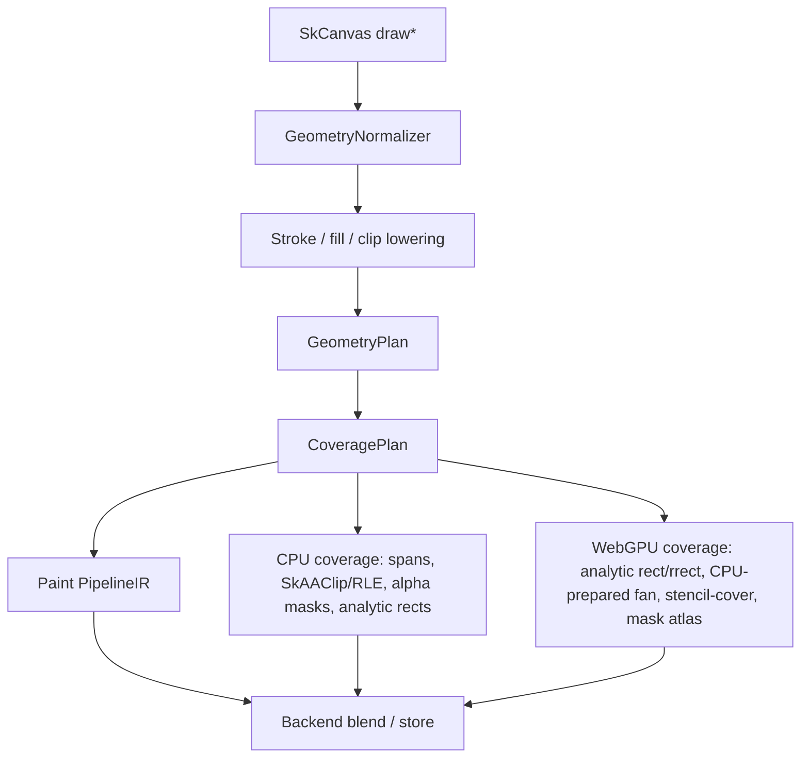
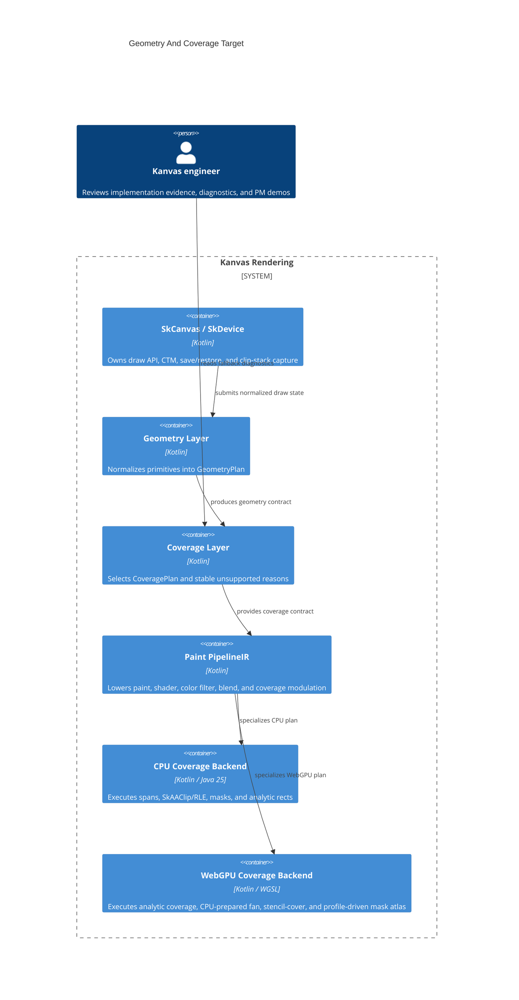

# Target: high-performance WGSL pipeline architecture

Date: 2026-05-26

This document describes the intended end state for Kanvas after the proof
of concept phase. It is a target architecture, not an epic breakdown. The
follow-up planning work should decompose this target into measurable epics
and milestones.

## Context

Kanvas has working CPU raster coverage, a WebGPU backend, handwritten WGSL
shader resources, and a compatibility facade for runtime effects. A WGSL
parser exists at `/Volumes/Cache/webgpu-ktypes/wgsl` and is expected to be
integrated soon.

The target keeps the current upstream-sync decisions:

- Do not port Ganesh or Graphite.
- Do not rebuild Skia's SkSL compiler, IR, or VM.
- Keep WebGPU as the GPU backend.
- Keep `SkRuntimeEffect` as a compatibility facade.
- Use registered Kotlin/WGSL implementations for runtime effects.
- Use the WGSL parser to reduce handwritten boilerplate and improve
  correctness, not to recreate SkSL.

The long-term goal is to move from backend-specific proof-of-concept paths
to a shared, high-performance rendering architecture inspired by Skia's CPU
pipeline model.

## Design Thesis

Skia's most relevant lesson for Kanvas is not the exact implementation of
`SkRasterPipeline`. The lesson is the separation of responsibilities:

1. Geometry produces coverage.
2. Paint objects lower into an ordered color pipeline.
3. Shaders, color filters, blenders, color-space transforms, coverage, and
   stores are composed consistently.
4. The backend is free to specialize the final pipeline aggressively.

Kanvas should adopt that model with a smaller, typed IR that can target both
CPU raster and WebGPU. The IR should be close enough to Skia's mental model
that upstream behavior maps naturally, but not so low-level that Kanvas must
inherit every Skia internal stage and legacy format path.

The target is:

```text
SkCanvas draw*
  -> SkDevice operation
  -> geometry extraction / rasterization
  -> paint lowering to KanvasPipelineIR
  -> backend specialization
       CPU: scalar or Java 25 Vector API kernels
       GPU: parser-validated/generated WGSL modules
  -> blend/store/present
```

## Target Properties

### Behavioral Fidelity

The CPU backend remains the primary reference for Skia-like behavior. GPU
results are validated against CPU and upstream GM references with explicit
similarity thresholds.

For bounded Kadre replay-pack scenes, `ReplayCpuOracle` is the shared CPU
reference API for command interpretation, sampled checksums, nontransparent
pixels, bitmap sampled pixels, and expected-unsupported reasons. This is a
replay oracle for the typed M72-M80 command subset, not a broad SkCanvas or
display-list CPU renderer.

The pipeline must preserve:

- Skia-style local-matrix shader behavior.
- Paint color modulation.
- Color filters after shader evaluation.
- Blend-mode semantics.
- Coverage and clip interaction.
- Destination color-space conventions already established by current tests.
- Runtime-effect compatibility for registered effects.

### High Performance

The IR is descriptive. It is not executed as a naive per-pixel interpreter
in hot paths.

The backend flow is:

```text
PipelineIR
  -> normalization
  -> specialization key
  -> fused execution plan
  -> scalar/vector CPU kernel or WGSL pipeline
```

The CPU backend should specialize common pipelines such as:

- solid color + coverage + `SrcOver`;
- linear/radial/sweep gradient + coverage + blend;
- bitmap nearest/bilinear sampling;
- color matrix / blend color filter;
- common premul, unpremul, clamp, pack, and store paths.

The GPU backend should specialize by render-pipeline key and use WGSL
modules whose layouts are parser-reflected rather than manually duplicated
in Kotlin.

### Incremental Adoption

Existing `SkShader.setupForDraw()` / `shadeRow()` behavior remains valid
during migration. A shader can participate in the new architecture by
implementing append/lowering behavior. Shaders that are not ported yet
continue through compatibility stages.

This avoids a big-bang rewrite:

```text
legacy shader
  -> ShadeRowFallbackOp

ported shader
  -> appendStages(...)
  -> native pipeline stages
```

Migration fallbacks must be explicit, not inferred from missing support.

Representative shape:

```kotlin
sealed interface FallbackPlan {
    val reason: String
    val supportedBackends: Set<BackendKind>

    data class CpuShadeRow(override val reason: String) : FallbackPlan
    data class HandwrittenGpuCompat(override val reason: String, val shaderId: String) : FallbackPlan
    data class RefuseDiagnostic(override val reason: String) : FallbackPlan
    data class ExplicitLayerOrReadbackCompat(override val reason: String) : FallbackPlan
}
```

Each fallback must declare:

- supported backends;
- stable diagnostic reason;
- whether GPU should refuse, route to an existing handwritten WGSL path, or
  use an explicit compatibility path;
- tests that assert the fallback reason when the image path is intentionally
  unavailable.

`ShadeRowFallbackOp` is a CPU migration bridge. It is not automatically a GPU
fallback.

## Core Architecture

### Shared Pipeline IR

Add a backend-neutral pipeline module that owns the common lowering model:

```text
:render-pipeline
  PipelineIR
  PipelineOp
  PipelineStageRec
  MatrixRec
  CoverageModel
  PipelineKeyClassification
  UniformLayout
  ColorSpaceBlock
  CoveragePlan adapter
  PipelineNormalizer
```

This module should not depend on WebGPU. Its shared contracts must not require
Java Vector API support, although CPU execution experiments in the module may
use Java 25 Vector paths behind scalar fallbacks. It is the contract between
`kanvas-skia`, `cpu-raster`, and `gpu-raster`.

Representative API shape:

```kotlin
interface PipelineAppendable {
    fun appendStages(rec: PipelineStageRec, matrix: MatrixRec): AppendResult
}

sealed interface AppendResult {
    data object Success : AppendResult
    data class Unsupported(val reason: String) : AppendResult
    data class Fatal(val reason: String) : AppendResult
}

class PipelineStageRec(
    val pipeline: PipelineBuilder,
    val dstColorType: SkColorType,
    val dstColorSpace: SkColorSpace?,
    val paintColor: SkColor4f,
    val devBounds: SkRect,
)

sealed interface PipelineOp {
    data object SeedDeviceCoords : PipelineOp
    data class Transform2D(val matrix: SkMatrix) : PipelineOp
    data class ConstantColor(val color: SkColor4f) : PipelineOp
    data class LinearGradient(val payload: LinearGradientPayload) : PipelineOp
    data class RadialGradient(val payload: RadialGradientPayload) : PipelineOp
    data class SweepGradient(val payload: SweepGradientPayload) : PipelineOp
    data class BitmapSample(val payload: BitmapSamplePayload) : PipelineOp
    data class RuntimeEffect(val payload: RuntimeEffectPayload) : PipelineOp
    data class ColorSpaceXform(val payload: ColorSpacePayload) : PipelineOp
    data class ColorFilter(val payload: ColorFilterPayload) : PipelineOp
    data class BlendMode(val mode: SkBlendMode) : PipelineOp
    data class ApplyCoverage(val coverage: CoverageModel) : PipelineOp
    data object LoadDst : PipelineOp
    data object Store : PipelineOp
}
```

`CoveragePlan` is the geometry/coverage-side descriptor documented in
`.upstream/specs/geometry-coverage/`. It is not a direct replacement for the
current `CoverageModel` in `KanvasPipelineIR`. A lowering adapter maps the
supported subset of `CoveragePlan` into `PipelineOp.ApplyCoverage(CoverageModel)`
or into an explicit backend strategy plus diagnostic.

The actual op set should grow from measured needs, not from an attempt to
mirror every Skia internal opcode.

`appendStages` must be transactional. `Success` may mutate the builder.
`Unsupported` must leave the builder unchanged so the caller can select a
documented fallback path. `Fatal` means the draw cannot be represented or
executed safely and should produce a stable diagnostic instead of falling
through silently. Implementations should build into a temporary child builder
and commit only on success when partial mutation would otherwise be possible.

### IR Value Semantics

Pipeline values must carry enough type information to make alpha and color
space transitions auditable before CPU/GPU specialization.

Representative shape:

```kotlin
enum class AlphaDomain {
    Unpremul,
    Premul,
    Raw,
    Destination,
}

sealed interface ColorSpaceRole {
    data object SRGB : ColorSpaceRole
    data object Destination : ColorSpaceRole
    data object Working : ColorSpaceRole
    data class Explicit(val colorSpace: SkColorSpace?) : ColorSpaceRole
    data object RawBytes : ColorSpaceRole
}

enum class PrecisionDomain {
    U8,
    F16,
    F32,
}

data class ColorValueSpec(
    val alpha: AlphaDomain,
    val colorSpace: ColorSpaceRole,
    val precision: PrecisionDomain,
)
```

Every critical `PipelineOp` should declare preconditions and postconditions for
its color values. At minimum this applies to:

- shader evaluation;
- raw image shader sampling;
- gradient interpolation;
- `SkWorkingColorSpaceShader`;
- color filters;
- blenders;
- runtime effects, including `layout(color)` uniforms;
- saveLayer restore/composite;
- final store.

Initial target contracts:

| Operation | Input | Output |
|---|---|---|
| Shader eval | local/device coords + op payload | unpremul RGBA float in declared working space, unless op is `Raw` |
| Raw image sample | image bytes + sampling payload | `Raw` value with explicit conversion stage required before blend |
| Color filter | unpremul RGBA float in active working/destination role | unpremul RGBA float in same declared role unless filter declares a working-format transition |
| Blender | premul source and premul destination in declared blend encoding | premul RGBA in blend encoding |
| Runtime shader | coords + uniforms + children | declared `ColorValueSpec`; unsupported specs are diagnostic failures |
| SaveLayer restore | premul layer texture in layer encoding + paint pipeline | premul source for parent blend |
| Store | premul RGBA in destination encoding | destination pixel format |

Pipeline normalization may insert explicit conversion ops between mismatched
specs. It must not silently reinterpret raw, premul, unpremul, working-space,
or destination-space values.

Focused tests should cover runtime-effect `layout(color)`, raw image shader
sampling, gradient interpolation spaces, color-filter working formats,
blenders with partial alpha, and saveLayer color-space restoration.

### Matrix Model

Adopt a Skia-like `MatrixRec`.

Responsibilities:

- Carry CTM and pending local matrices through shader wrappers.
- Apply inverse transforms at the point a shader needs local coordinates.
- Fold local-matrix wrappers instead of stacking per-pixel work.
- Surface singular matrix behavior explicitly.

This is important because it lets `SkLocalMatrixShader`,
`SkWorkingColorSpaceShader`, image shaders, gradients, and runtime effects
share coordinate handling instead of each reimplementing it.

### Paint Lowering

Paint lowering should produce a single logical pipeline:

```text
seed coords
-> shader stages or constant paint color
-> paint alpha modulation
-> color filter stages
-> color-space / working-space stages
-> load destination
-> blender stages
-> coverage / clip modulation
-> store
```

The ordering must be explicit and tested. Wrapper shaders such as local
matrix, color-filter shader, working-color-space shader, coord-clamp shader,
and blend shader become compositional appenders instead of backend-specific
special cases.

Detailed implementation specs for the pre-Geometry paint-pipeline milestones
live under `.upstream/specs/wgsl-pipeline/`. Those specs refine this target into
PipelineIR contracts, WGSL parser/reflection rules, CPU/GPU backend mappings,
runtime-effect descriptors, diagnostics, validation, migration, and ADRs.

### Geometry And Coverage

Geometry remains separate from paint. The paint pipeline consumes coverage; it
does not decide how a shape becomes covered pixels.

Detailed implementation specs live under
`.upstream/specs/geometry-coverage/`. Those specs refine this target into
contracts, lowering rules, backend mappings, diagnostics, validation, and ADRs.

This follows the useful Graphite lesson without porting Graphite: a draw should
separate geometric state, paint state, clipping, ordering, and backend
execution strategy. Kanvas keeps that separation smaller and backend-neutral so
CPU and WebGPU can share semantics.

Target flow:

```text
SkCanvas draw*
  -> GeometryNormalizer
  -> stroke / fill / clip lowering
  -> GeometryPlan
  -> CoveragePlan
       CPU: spans, SkAAClip/RLE, alpha masks, analytic rects
       GPU: analytic rect/rrect, CPU-prepared convex fan, stencil-cover, mask atlas
  -> Paint PipelineIR
  -> backend blend/store
```

Mermaid view:



C4 container view:



Clip-stack lowering happens before `GeometryPlan`: intersect, difference,
region, path, and shader clips are normalized into a `ClipInteraction`
descriptor referenced by the plan. Paint lowering later sees only
coverage/clip modulation, not raw clip-stack state.

`.upstream/specs/geometry-coverage/01-contracts-geometry-coverage.md` is the
source of truth for the concrete `GeometryPlan`, `GeometryPrimitive`,
`ClipInteraction`, `CoveragePlan`, and reason-code contract shapes. This target
only records the architecture responsibilities so the target and specs do not
drift.

`GeometryPlan` owns the transformed shape contract:

- primitive kind: rect, rrect, oval, path, vertices, glyph mask, image rect;
- fill type and inverse-fill behavior;
- stroke style after path-effect application;
- source-to-device transform facts, stored in the plan rather than implied by
  ambient CTM state;
- conservative and tight bounds;
- clip interaction;
- fallback reason when the shape cannot be represented safely.

`CoveragePlan` owns how that geometry reaches fragments or spans. It should be
represented in the IR as a coverage model, not buried in each shader
implementation. The model describes the shape and contract of coverage; it does
not force every backend to use the same storage channel.

CPU execution can keep spans, RLE clips, and masks in native scanline form.
GPU execution can keep analytic rect/rrect coverage in WGSL, use convex fan or
stencil-cover for paths, and introduce a coverage atlas only when profiling
shows that repeated path masks justify it.

The convex-fan GPU path is CPU-prepared: flattening and fan tessellation produce
a WebGPU triangle list. This is not a compute-shader tessellation path.

`CoverageCachePolicy` is coverage-owned. It must not silently inherit image or
glyph atlas lifetime rules; path coverage, glyph masks, and image resources can
have different invalidation keys and residency pressure.

Glyphs enter geometry as glyph-run coverage requests and normally lower to an
alpha-mask coverage contract through the text/glyph mask atlas flow. Text
rendering still owns glyph discovery and atlas population; the geometry layer
does not own glyph atlas invalidation.

Unsupported geometry or coverage must use the same explicit diagnostic style as
other pipeline fallbacks. A `GeometryPlan.Unsupported` means the draw cannot
produce a safe geometry contract; it should either select a declared
`:kanvas-skia` compatibility CPU route or produce a stable diagnostic. A
backend-specific
`CoveragePlan.Unsupported` means the geometry was understood but the selected
backend cannot execute that coverage strategy. It must not silently reroute to a
different backend or drop coverage. If geometry is unsupported, the derived
coverage should normally be `CoveragePlan.Unsupported` with the same reason
unless an explicit `FallbackPlan` says otherwise.

The shared contract prevents semantic drift. It does not force CPU and GPU to
use the same storage representation.

Non-goals for this geometry layer:

- Do not port Graphite `DrawList`, `DrawPass`, `Renderer`, `RenderStep`, or
  resource scheduler.
- Do not introduce SkSL or Graphite paint-key machinery.
- Do not move paint lowering decisions into geometry.
- Do not add GPU compute tessellation until profiling identifies CPU-side
  geometry preparation as a bottleneck.

Initial geometry milestones should be tracked separately from the WGSL paint
pipeline:

1. Inventory current rect/path/stroke/clip behavior across CPU and GPU.
2. Introduce `GeometryPlan` and `CoveragePlan` descriptors.
3. Extract shared flattening and stroking invariants.
4. Make `:kanvas-skia` CPU coverage the reference oracle.
5. Formalize GPU coverage strategies and fallback diagnostics.
6. Add PM-visible geometry-heavy CPU/GPU diff evidence.

The legacy `:kanvas` implementation may be used as historical or porting
evidence, but it must not become load-bearing for this target.

### Concurrency Contract

The architecture should make threading explicit before implementation starts.

Target contract:

- `SkCanvas`, mutable `SkSurface`, and per-draw builders are not thread-safe.
- Distinct surfaces may render in parallel if they do not share mutable
  backend-owned objects without synchronization.
- Pipeline descriptors and generated WGSL module descriptors are immutable
  after construction.
- Shared CPU/GPU caches are either thread-safe or explicitly confined to a
  render/backend thread.
- Temporary span buffers, uniform pack buffers, and frame-local arenas are
  thread-local, frame-local, or protected by owner scopes.
- GPU upload and WebGPU command submission happen through the backend's
  render queue/thread, not arbitrary coroutine contexts.

The diagnostics layer should expose enough owner/thread context to explain
fallbacks and cache behavior in parallel render tests.

## WGSL Parser Role

The parser should become a build/runtime tooling layer for WGSL correctness
and layout generation.

### Build-Time Validation

Every WGSL resource in `gpu-raster/src/main/resources/shaders/` should be
parsed in CI. The build should fail on syntax or semantic errors that the
parser can catch.

The validation corpus should grow from:

- existing GPU shader resources;
- generated WGSL modules;
- small shader fragments used by the pipeline generator;
- upstream-derived runtime-effect fixtures that Kanvas explicitly supports.

### Reflection

Use parser output to reflect:

- entry points and stages;
- `@group` / `@binding`;
- uniform structs;
- member offsets, alignment, and size;
- texture and sampler declarations;
- vertex inputs and fragment outputs.

The goal is to remove manual duplication of WGSL layout in Kotlin packers.
Uniform packing should be generated or verified from reflected layout.

### WGSL Assembly

Use parser-aware assembly for reusable fragments:

```text
common/coords.wgsl
common/coverage.wgsl
common/blend.wgsl
common/colorspace.wgsl
common/color_filter.wgsl
shader/linear_gradient.wgsl
shader/bitmap_sample.wgsl
```

The assembly step should produce final WGSL modules with:

- one vertex entry point;
- one fragment entry point;
- only required helpers;
- deterministic binding layout;
- deterministic source output for golden tests.

This is not a general shader language compiler. It is a controlled module
builder for Kanvas pipeline fragments.

Deterministic output requires a canonical order:

- Bind groups and bindings sort by `(group, binding)`.
- Uniform structs sort members by reflected byte offset; ties are invalid.
- Helper fragments sort by topological dependency order, then stable helper
  id.
- Functions generated from `KanvasPipelineIR` follow normalized pipeline
  order.
- Structs, aliases, constants, globals, functions, and entry points are
  emitted in fixed declaration buckets.
- `PipelineKey` serialization is stable and does not depend on object identity
  or unordered `Map` / `Set` traversal.

CI should include cross-OS golden tests for generated WGSL source so ordering
drift is detected before it reaches runtime.

### WGSL IR Module Builder

If the Kotlin WGSL parser exposes a manipulable internal IR and a generator
from that IR back to WGSL source, Kanvas should use it as the GPU shader
module construction layer.

The intended layering is:

```text
KanvasPipelineIR
  -> GPU pipeline selection
  -> WGSL IR module builder
  -> deterministic WGSL source
  -> parser validation / reflection
  -> WebGPU shader module
```

The WGSL IR should not replace `KanvasPipelineIR`. They serve different
purposes:

- `KanvasPipelineIR` describes Skia-like rendering semantics: shader,
  color filter, blender, color space, matrix behavior, coverage, and store.
- WGSL IR describes a concrete GPU program: structs, bindings, functions,
  expressions, entry points, texture/sampler declarations, and helper calls.

This separation keeps the CPU backend free to compile the same
`KanvasPipelineIR` into scalar or Java Vector API kernels instead of forcing
CPU execution through a GPU-shader-shaped model.

Primary uses for WGSL IR construction:

- Generate final WGSL modules from validated helper fragments.
- Generate rect, polygon, stencil-cover, image, and layer-composite variants
  from shared shader/color-filter/blend/color-space building blocks.
- Generate `struct Uniforms` declarations and matching binding layouts.
- Generate deterministic source for golden tests and debugging.
- Validate registered runtime-effect WGSL implementations.
- Remove copy-pasted helper code from handwritten WGSL files over time.

The builder should operate at pipeline creation time or build time, not per
draw. A draw should select a cached generated module through a `PipelineKey`,
pack uniforms, bind resources, and submit.

Guardrails:

- Do not accept arbitrary user WGSL as an implicit renderer extension.
- Do not build a CPU interpreter for arbitrary WGSL.
- Do not generate a unique shader for every uniform value.
- Do not let WGSL IR become the source of truth for Skia-like paint
  semantics.
- Keep generated WGSL deterministic so diffs and golden tests remain stable.

The first useful generated module should be deliberately small, for example:

```text
Rect + SolidColor + optional ColorMatrix + SrcOver
```

or:

```text
Rect + LinearGradient + optional ColorMatrix + SrcOver
```

That proves helper assembly, uniform reflection, source generation, WebGPU
pipeline creation, and cross-backend comparison without forcing a broad
rewrite of existing handwritten shaders.

### Runtime Effects

`SkRuntimeEffect` remains source-compatible with supported call sites.

Target behavior:

```text
SkRuntimeEffect.MakeForShader(source)
  -> canonical lookup
  -> registered effect descriptor
       CPU: Kotlin kernel implementation
       GPU: WGSL module or fragment descriptor
       reflection: uniforms and children
```

The parser can validate registered WGSL implementations and provide layout
reflection. It should not attempt to compile arbitrary SkSL.

If a runtime effect is not registered, failure should remain explicit and
diagnostic. Silent fallback is not acceptable.

This is an intentional compatibility boundary versus upstream Skia. Kanvas
does not promise arbitrary valid SkSL execution. The supported surface is a
versioned runtime-effect support matrix:

- canonical source hash or stable effect id;
- supported effect kind: shader, color filter, blender, or image-filter
  helper;
- uniform and child declarations;
- CPU implementation id;
- GPU WGSL implementation id;
- tests or GMs that exercise the effect.

Adding or removing support from this matrix is a public compatibility change
for Kanvas, even though it is not a Skia API change.

## CPU Backend

### Execution Model

The CPU backend owns:

```text
:cpu-raster
  CpuPipelineCompiler
  CpuPipelinePlan
  CpuPipelineExecutor
  ScalarKernels
  VectorKernels
  PixelLoadStore
  SpanRunner
```

The CPU path should compile a `PipelineIR` into a `CpuPipelinePlan`:

```kotlin
interface CpuPipelineExecutor {
    fun runSpan(plan: CpuPipelinePlan, span: SpanInput, dst: PixelBuffer)
}

sealed interface CpuKernel {
    fun run(ctx: CpuPipelineContext, x: Int, y: Int, count: Int)
}
```

The plan can contain fused kernels rather than one kernel per IR op.

Examples:

```text
SolidSrcOver8888Kernel
SolidSrcOverF16Kernel
LinearGradientSrcOverF16Kernel
BitmapBilinearSrcOver8888Kernel
ColorMatrixThenSrcOverKernel
```

### Java 25 SIMD

Use Java 25's `jdk.incubator.vector` API behind an isolated JVM-specific
implementation. The rest of the project should not directly depend on
Vector API classes.

Rules:

- Scalar kernels are always available.
- Vector kernels are selected only when the module is present and a benchmark
  proves benefit.
- Vector code uses preferred species and scalar tails.
- Vector kernels operate on packed arrays or temporary planar lanes, not on
  object-heavy pixel abstractions.
- Vector support is a performance feature, not a correctness dependency.

The likely first vector targets are:

- solid color coverage modulation;
- `SrcOver` on float lanes;
- gradient `t` computation and color interpolation;
- color matrix;
- premul/unpremul;
- clamp and pack/unpack.

Avoid early vectorization of:

- branch-heavy path coverage;
- arbitrary runtime effects;
- scattered bitmap sampling with complex tile modes.

### Memory Model

Hot CPU paths should avoid per-pixel allocation. Preferred representations:

- primitive arrays;
- reusable span buffers;
- packed handles;
- frame-local arenas where useful;
- explicit temporary buffers for RGBA float lanes.

Kotlin data classes are acceptable for descriptors and immutable plans, not
for per-pixel loops.

## GPU Backend

### Execution Model

The GPU backend owns:

```text
:gpu-raster
  WebGpuPipelineCompiler
  WgslModuleRegistry
  WgslPipelineCache
  ReflectedUniformPacker
  DrawPacketEncoder
  WebGpuResourceCache
```

The GPU path lowers `PipelineIR` into a `GpuPipelinePlan`:

```text
PipelineIR
  -> PipelineKey
  -> WGSL module descriptor
  -> reflected bind-group layout
  -> uniform packer
  -> cached WebGPU render pipeline
  -> draw packet
```

Pipeline keys should encode only specialization axes that materially affect
compiled WGSL or WebGPU pipeline state. Resource axes mean resource topology,
layout, usage, and capability facts, not concrete resource identity,
residency, or pixel contents:

- geometry path: rect, polygon, stencil-cover, image blit, layer composite;
- shader family;
- blend mode when implemented by WebGPU blend state;
- destination/intermediate format class;
- sampling mode when it changes shader or bind layout;
- fill/coverage mode when it changes pipeline state.

Specialization axes must be classified before they are added to
`PipelineKey`:

```kotlin
sealed interface SpecializationAxis {
    data class LayoutAffecting(val id: String) : SpecializationAxis
    data class CodeAffecting(val id: String) : SpecializationAxis
    data class PipelineStateAffecting(val id: String) : SpecializationAxis
    data class UniformOnly(val id: String) : SpecializationAxis
}
```

Classification rules:

- `LayoutAffecting`: changes bind-group layout, texture/sampler presence,
  uniform struct shape, vertex input shape, or attachment layout.
- `CodeAffecting`: changes required helpers, loop shape, static branch
  removal, child shader graph shape, or generated entry-point structure.
- `PipelineStateAffecting`: changes WebGPU render pipeline state, blend state,
  primitive topology, format class, multisampling, or depth/stencil state.
- `UniformOnly`: changes only values consumed by already-generated code and
  existing layouts.

Only the first three categories belong in `PipelineKey`. `UniformOnly` values
must be measured before promotion to specialization. The measurement package
for a proposed key axis should include shader count, pipeline cache hit/miss
rate, pipeline creations per frame after warmup, uniform upload bytes, and
draw count.

Tile modes, matrices, colors, gradient stops, color-space transforms, and
clip data may be uniforms only when they truly do not alter layout, helper
selection, pipeline state, or generated loop structure.

### Blend Plan

GPU blending must be selected through an explicit `BlendPlan`, not by ad hoc
choice between fixed-function state and WGSL helper code.

Representative shape:

```kotlin
sealed interface BlendPlan {
    data class FixedFunction(val mode: SkBlendMode, val format: FormatClass) : BlendPlan
    data class ShaderCompositeFromTexture(val mode: SkBlendMode) : BlendPlan
    data class LayerComposite(val mode: SkBlendMode) : BlendPlan
    data class Unsupported(val mode: SkBlendMode, val reason: String) : BlendPlan
}
```

Contracts:

- `FixedFunction` is an allowlist only. Each `(mode, format, alpha convention)`
  entry requires CPU-vs-GPU tests with partial source alpha, non-opaque
  destination, and each supported intermediate format class.
- `ShaderCompositeFromTexture` is used when blend math must read destination
  color in shader code. WebGPU cannot read and write the same color attachment
  in one render pass, so this plan implies a separate texture/pass/copy
  strategy.
- `LayerComposite` is used when Skia semantics require an intermediate layer
  or when the destination must be sampled as a texture for correctness.
- `Unsupported` must produce a stable diagnostic and must not silently draw
  with a weaker mode.

The blend plan becomes part of diagnostics and benchmark telemetry.

### Device Lifecycle

WebGPU lifecycle is part of the architecture, not an implementation detail.

The backend must define behavior for:

- device lost;
- adapter or queue replacement;
- surface reconfiguration and resize;
- intermediate format changes;
- backend shutdown and recreation.

On device loss, WebGPU-owned objects become invalid:

- render pipelines;
- shader modules;
- buffers;
- textures and texture views;
- samplers;
- bind groups;
- backend-owned image/surface resources.

Logical descriptors may survive if they do not own WebGPU resources:

- `PipelineIR`;
- generated WGSL source or WGSL IR descriptors;
- immutable shader/material descriptors;
- CPU-side image pixels where still retained.

Every GPU handle type should document whether it survives device reset. If it
does not survive, attempts to use it after reset should fail with a stable
diagnostic or trigger documented re-upload/recreation.

### Cache Policy

GPU caches must be bounded unless their key space is proven finite and small.

Required cache classes:

- `WgslModuleRegistry`: generated WGSL source and reflection descriptors.
- `WgslPipelineCache`: compiled WebGPU render pipelines.
- `WebGpuResourceCache`: textures, samplers, staging buffers, and reusable
  backend resources.

Each cache should expose:

- resident entry count;
- approximate resident bytes where measurable;
- hit count and miss count;
- eviction count;
- reset/device-lost invalidation count;
- configurable budget or explicit no-eviction justification.

Default policy should be LRU by approximate resident bytes for unbounded input
domains. Finite caches may use no eviction only when the maximum key count is
documented and covered by tests.

### WGSL Generation

The end state is not one handwritten WGSL file per shader/path combination.
The end state is deterministic WGSL generation from reusable, validated
fragments.

Example:

```text
Rect + LinearGradient + ColorMatrix + SrcOver
  -> fullscreen-triangle vertex fragment
  -> analytic rect coverage helper
  -> linear gradient helper
  -> color matrix helper
  -> blend helper or WebGPU blend-state selection
```

Existing handwritten shaders can be treated as seed implementations. They
should be migrated only when the generated path has tests and equivalent
or better performance.

### Resource Lifetime

WebGPU resource ownership remains explicit:

- textures, buffers, bind groups, samplers, and pipelines are backend-owned;
- high-level paint/shader objects hold logical descriptors or handles;
- uploads happen through render/backend queues;
- cross-device resource sharing remains illegal unless explicitly supported.

Resource lifetime must be compatible with the device lifecycle and cache
policy above. Backend-owned resources should carry enough provenance to answer
"which device/cache owns this?" in diagnostics.

## Color Management

The pipeline should preserve the current working-space behavior while making
the stages explicit.

Target model:

- public/source colors enter lowering as finite unpremul floats with an
  associated color space when one is available;
- shader-stage logical output is unpremul RGBA float in the active working
  color space unless a specialized op documents otherwise;
- color filters consume and produce unpremul RGBA float;
- blend inputs are premultiplied in the backend's declared blend encoding;
- coverage multiplies premultiplied source alpha/color at the final
  source-to-destination composition boundary;
- destination encoding is handled by explicit color-space stages;
- GPU intermediate conventions remain documented and tested per backend path.

Color-space transforms should be represented as payloads that both CPU and
WGSL can implement from the same descriptor.

The current WebGPU backend may keep an encoded premul intermediate when that
is required to match existing cross-test references. That convention must be
named in the GPU plan and verified with intermediate dumps, not inferred from
final pixels only.

HDR transfer functions can remain out of scope until a specific GM/API delta
requires them.

## Testing And Validation

The target architecture requires test layers that measure correctness and
performance separately.

### Correctness

- Golden screenshot tests for representative GMs.
- CPU old-path vs CPU pipeline equivalence tests during migration.
- CPU pipeline vs GPU pipeline cross-backend tests.
- WGSL parser validation tests for all resources and generated modules.
- Uniform layout reflection tests: reflected offsets vs packer output.
- Runtime-effect registry tests: missing effects fail with stable diagnostics.

Cross-backend thresholds must be versioned outside ad hoc test code. The
threshold policy should define, per GM family:

- metric: exact pixel match, max channel delta, PSNR, SSIM, DeltaE, or existing
  similarity score;
- threshold value;
- accepted backend/driver variance;
- reason for the threshold;
- owner for ratchet updates.

Suggested initial families:

- solid color and integer-aligned rects;
- AA geometry;
- gradients;
- bitmap sampling;
- blend modes;
- color filters;
- image filters and saveLayer composites;
- runtime effects.

The target document should reference this policy once it exists. It should not
hide thresholds in scattered test constants without an index.

### Performance

Benchmarks should track:

- empty draw overhead;
- solid rect spans;
- AA rect/rrect;
- gradient fill;
- bitmap shader nearest and bilinear;
- common color filters;
- saveLayer composite;
- path cover with shaded paint;
- allocations per frame;
- CPU scalar vs vector speedup;
- GPU pipeline cache hit rate;
- GPU uniform upload bytes and draw count.

Performance gates should compare to current baseline before each major
replacement, not to theoretical upstream Skia numbers.

### GPU Gates

Generated WGSL pipelines need GPU-specific success gates in addition to visual
correctness:

- zero render-pipeline creation in a stable frame after warmup for
  representative scenes;
- minimum pipeline cache hit rate per benchmark scene;
- maximum generated shader module count per scene and per GM family;
- bounded uniform upload bytes per frame;
- draw count stable against the handwritten path or explicitly justified;
- no unexpected fallback reasons in cross-backend runs;
- measured GPU time or wall-clock render time for solid rect, gradient, image
  sampling, blend/color-filter, and saveLayer composite scenes.

Initial benchmark scenes should include:

- solid rect batch;
- AA rect/rrect batch;
- linear/radial/sweep gradient fills;
- bitmap nearest and bilinear sampling;
- blend-mode matrix with partial alpha and non-opaque destination;
- saveLayer composite;
- generated shader warmup followed by stable repeated frames.

### Diagnostics

Add developer-facing dumps:

- pipeline IR dump;
- normalized/fused CPU plan dump;
- generated WGSL dump;
- reflected uniform layout dump;
- pipeline key dump;
- backend fallback reason.

This is essential because the architecture introduces an optimization layer
between public paint objects and backend execution.

## Non-Goals

This target explicitly does not include:

- Ganesh or Graphite ports;
- arbitrary SkSL compilation;
- arbitrary WGSL CPU interpretation;
- a full clone of Skia's internal `SkRasterPipeline` op inventory;
- one universal shader that handles every paint combination;
- silent fallback for unsupported runtime effects.

## Success Criteria

The architecture target is reached when:

- New shader/color-filter/blender behavior is added by implementing shared
  lowering first, not by duplicating CPU and GPU code paths independently.
- The CPU backend can execute common pipelines through fused scalar/vector
  plans.
- The GPU backend can build parser-validated WGSL modules from reusable
  fragments and reflected layouts.
- Existing handwritten WGSL remains supported but is no longer the only path.
- Runtime effects have a single registry entry that describes CPU and GPU
  implementations plus uniform/child layout.
- Cross-backend tests prove parity for the selected GM set.
- GPU generated-shader benchmarks meet the GPU gates after warmup.
- Performance benchmarks show that the pipeline layer does not regress common
  CPU raster paths and improves at least one vectorized shader/composite path.

## Planning Notes For Epic Breakdown

The next document should not turn this target into one large migration. It
should split the work by independently verifiable capabilities:

- IR skeleton and dumps.
- CPU solid/gradient pilot.
- WGSL parser validation integration.
- WGSL IR module builder pilot.
- Uniform reflection and packer generation.
- IR color/alpha value contracts.
- PipelineKey specialization taxonomy.
- BlendPlan allowlist and diagnostics.
- GPU generated-shader pilot.
- Runtime-effect descriptor unification.
- Java 25 vector kernels.
- Migration fallback policy.
- GPU success gates.
- Legacy path retirement criteria.

Each epic should name the tests, benchmarks, affected GMs, and fallback
behavior it owns.

That decomposition is now captured in `.upstream/specs/wgsl-pipeline/` for the
pre-Geometry M0-M11 paint-pipeline work and `.upstream/specs/geometry-coverage/`
for the Geometry/Coverage convergence work.
