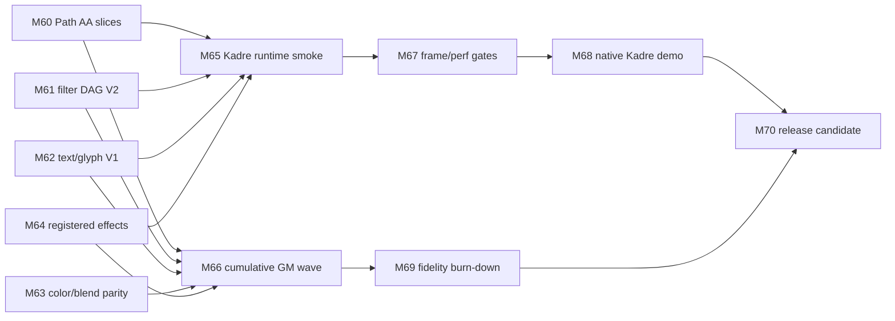

# Target: Skia-Like Breadth And Real-Time Renderer

Date: 2026-05-31
Status: Proposed
Previous target: `archives/target-closeout-2026-05-31/rendering-conformance-performance-target.md`
Parent architecture: `.upstream/target/high-performance-wgsl-pipeline-target.md`
Spec entry point: `.upstream/specs/skia-like-realtime/README.md`

## Purpose

The MEP evidence platform is complete for the selected target: promoted rows
have generated evidence, stable refusals, PM-visible artifacts, and
release-blocking performance gates where selected. The next target has two
tracks: first, increase Skia-like feature breadth and fidelity; second, build a
measured real-time rendering lane on top of that breadth. Real-time is not
claimed complete until M67/M68 gates provide measured frame evidence.

This is not a Ganesh or Graphite port. Kanvas keeps its WebGPU backend,
Kotlin/WGSL pipeline, explicit fallback diagnostics, generated evidence
discipline, and registered runtime-effect model.

## Big Target

Kanvas should become a Skia-like 2D renderer with a real-time lane:

- high-fidelity CPU/WebGPU rendering for selected Skia-relevant feature
  families;
- expanded support for Path AA, image filters, text/glyphs, blend/color
  filters, gradients, runtime effects, and GM-derived scenes;
- an interactive runtime that can animate, transform, filter, and inspect
  scenes at frame cadence;
- PM demos that show actual rendering behavior, not only static dashboard
  evidence;
- release gates that combine correctness, refusal policy, performance budgets,
  and real-time frame telemetry.

## Starting Point

MEP readiness is 100%, but that readiness covers the evidence and selected
performance target. It does not mean broad Skia parity.

Current strengths:

- generated dashboard evidence and PM bundle are release-visible;
- selected CPU/GPU/reference scene rows are reviewable;
- explicit `expected-unsupported` diagnostics prevent false support claims;
- seven selected performance rows have release-blocking measured lanes;
- WebGPU remains the intended GPU backend;
- WGSL parser/generator integration direction is established, but `wgsl4k`
  remains an active dependency and must not be treated as finished;
- Kadre from `ygdrasil-io/poc-koreos` is the intended incubating windowing
  host for live demos and can be included as a git submodule while it is not
  published.

Current gaps:

- broad Path AA, dash, cap, join, stroke-outline, and complex clip support;
- arbitrary image-filter DAGs and picture prepass;
- broad text, shaping, glyph cache, color font, emoji, and font fallback;
- wide Skia GM parity beyond promoted selected rows;
- real-time frame loop, invalidation, cache telemetry, and interactive demo;
- release-grade performance budgets across feature families;
- hosted/live PM demo flow beyond static artifacts.

## New Readiness Model

The previous 100% score remains historical for the MEP evidence target. The
new breadth-and-real-time target starts at 25% because the scope expands
from proof infrastructure to feature breadth and interactive runtime.

Readiness is calculated from counted denominators, not manually assigned sprint
percentages. A milestone may only move an area when its evidence updates the
corresponding denominator and is linked from the sprint report.

| Area | Weight | Denominator | Initial count | Initial progress | 100% means |
|---|---:|---|---:|---:|---|
| Rendering feature breadth | 30% | 10 target feature families with generated support/refusal contracts. | 2/10 | 20% | Path AA, filters, text, blend/color, bitmap, gradients, runtime effects, clipping, transforms/layers, and fallbacks all have selected generated evidence. |
| Skia-like fidelity | 20% | 100 selected GM/reference rows. | 25/100 | 25% | Selected rows have Skia reference or documented non-Skia oracle, diff stats, and burn-down classification. |
| Real-time runtime | 20% | 10 runtime capabilities. | 1/10 | 10% | Kadre host, frame loop, input, invalidation, resource telemetry, live controls, export, nonblank smoke, frame gate, and demo scene all exist. |
| Performance and cache readiness | 15% | 20 measured performance/cache gates. | 7/20 | 35% | Selected row, family, cache, and frame gates have measured baselines, thresholds, and quarantine policy. |
| PM/demo operability | 15% | 20 PM/release artifacts. | 7/20 | 35% | Dashboard, live demo, reports, limitations, release package, and hosted/export flows are reproducible. |

Weighted starting readiness: approximately 25%.

Current readiness after M61/M62 closeout: approximately 31%.

| Area | Weight | Current count | Current progress | Movement |
|---|---:|---:|---:|---|
| Rendering feature breadth | 30% | 4/10 | 40% | M61 adds bounded image-filter DAG V2 evidence; M62 clarifies text/font outline rendering and fallback refusals. |
| Skia-like fidelity | 20% | 27/100 | 27% | M61/M62 add selected generated reference/oracle rows without broad GM parity claims. |
| Real-time runtime | 20% | 1/10 | 10% | No Kadre/frame-loop capability landed in M61/M62. |
| Performance and cache readiness | 15% | 7/20 | 35% | No new measured performance/cache gate landed in M61/M62. |
| PM/demo operability | 15% | 9/20 | 45% | PM dashboard now exposes graph diagnostics and glyph-route/atlas non-claim diagnostics. |

Expected milestone deltas are capped until evidence lands:

| Milestone | Primary area movement | Maximum readiness delta |
|---|---|---:|
| M60 | Rendering breadth, fidelity, performance | +5% |
| M61 | Rendering breadth, fidelity, PM diagnostics | +5% |
| M62 | Rendering breadth, fidelity, PM diagnostics | +5% |
| M63 | Rendering breadth, fidelity, performance | +5% |
| M64 | Rendering breadth, runtime-effect operability | +4% |
| M65 | Real-time runtime smoke and telemetry | +6% |
| M66 | Cumulative GM/reference promotion wave | +8% |
| M67 | Performance/cache/frame gates | +8% |
| M68 | Native Kadre demo package | +8% |
| M69 | Fidelity burn-down | +8% |
| M70 | Release-candidate closure | Remaining counted evidence only |

## Milestones

| Milestone | Name | Target outcome |
|---|---|---|
| M60 | Coverage & Path AA Expansion | Promote bounded curves, strokes, joins/caps, and nested AA clips without weakening broad refusals. |
| M61 | Image Filter DAG V2 | Render bounded multi-node image-filter graphs with explicit intermediate texture ownership. |
| M62 | Text & Glyph Rendering V1 | Render simple text through the font spec pack, bundled Liberation references, glyph masks, and a WebGPU glyph atlas. |
| M63 | Color, Blend & ColorFilter Parity | Expand common blend modes, color filters, premul/unpremul, gradients, and color policy. |
| M64 | Registered Runtime Effects | Support known runtime effects through registered Kotlin/WGSL descriptors and parser-reflected uniforms. |
| M65 | Real-Time Scene Runtime | Add a Kadre-hosted frame loop, display-list replay boundary, invalidation diagnostics, cache telemetry, live controls, and reporting-only frame metrics. |
| M66 | Skia GM Promotion Wave | Aggregate M60-M64 promotions and add only the missing rows needed to reach the selected 50-100 GM/reference set. |
| M67 | Performance Tiering | Promote reporting-only M65 frame metrics plus family pipeline budgets into candidate/release gates with quarantine and rebaseline policy. |
| M68 | Native Real-Time Demo | Package a runnable demo showing text, filters, paths, runtime effects, animation, and telemetry. |
| M69 | Fidelity Hardening Toward Skia CPU | Burn down visual diffs across promoted families without weakening thresholds globally. |
| M70 | Release Candidate Renderer | Freeze API, runtime, PM demo, CI gates, and known limitations for a renderer release candidate. |

## Dependency DAG

M66 is cumulative, not a separate support universe. Rows promoted by M60-M64
count toward the 50-100 target when they satisfy the M66 reference and evidence
rules.

## Architecture Rules

- Preserve one semantic pipeline across CPU and WebGPU.
- CPU remains the reference path for Skia-like behavior.
- WebGPU is the GPU backend; do not port Ganesh or Graphite.
- Do not rebuild Skia's SkSL compiler, IR, or VM.
- `SkRuntimeEffect` remains a compatibility facade backed by registered
  Kotlin/WGSL implementations.
- Generated WGSL must be deterministic and parser-validated.
- WGSL parser/generator work depends on `ygdrasil-io/wgsl4k`; if an agent
  finds ambiguous, invalid, or surprising parser/IR/generator behavior, it
  must stop that assumption, keep the Kanvas side explicit, and open a
  dedicated `wgsl4k` ticket instead of hiding the issue in Kanvas.
- Live windowing uses Kadre from `ygdrasil-io/poc-koreos`, currently incubating
  and unpublished. Kanvas may include it as a git submodule for M65/M68 work;
  do not replace it with an unrelated shell just to make the demo easier.
- `PipelineKey` axes must represent layout, shader code, resources, or
  pipeline state, not arbitrary uniform values.
- Missing support must produce stable diagnostics, not silent fallback.
- New `pass` claims require reference, CPU/GPU evidence, route diagnostics,
  diff/stat artifacts, and performance impact assessment when relevant.
- Font and codec work must use real dependencies or real implementations; do
  not add substitutes just to clear old backlog rows.

## wgsl4k Capability Baseline

Assumed usable for M60-M64 planning:

- parse and print deterministic WGSL modules used by the current generated
  shader subset;
- inspect entry points, resource bindings, structs, scalar/vector/matrix
  types, and uniform layouts needed by registered descriptors;
- round-trip modules without semantic edits when no unsupported syntax is
  involved;
- report parse/validation failures with enough source span context to attach
  minimized evidence to a ticket.

At-risk until proven by a Kanvas milestone:

- complex expression normalization used by generated effect code;
- edge cases in struct layout, alignment, arrays, and nested uniform payloads;
- diagnostics for parser recovery after invalid syntax;
- preserving comments or non-semantic formatting as stable golden output;
- any WGSL feature added for a new runtime-effect family.

Ticket trigger:

- any parser/IR/generator result that changes shader meaning, loses reflection
  data, rejects WGSL expected to be valid, accepts WGSL expected to be invalid,
  or makes generated output nondeterministic.

## PM Demos

Every milestone must include one PM-visible demo artifact:

- visual side-by-side reference/CPU/GPU/diff when the feature is correctness
  oriented;
- live frame telemetry when the feature affects real-time runtime;
- route diagnostics and fallback notices for unsupported subsets;
- concise non-claims so PM can distinguish support from planned scope.

## Open Decisions

The plan assumes Kadre-hosted desktop-first WebGPU real-time demo, Apple
M-series as the first measured adapter, and Latin text before complex shaping.
These are not blockers for planning; they should be confirmed before
M62/M65/M68 execution.

Closed choices recommended:

- first live demo platform: Kadre desktop windowing via
  `ygdrasil-io/poc-koreos`, included as a git submodule while unpublished;
- first real-time frame target: 60 FPS for curated scenes, with 30 FPS as a
  warning threshold for heavier scenes;
- first text scope: Latin/simple glyph masks before shaping-heavy scripts.

Open question:

- which PM demo scene should become the flagship release-candidate scene:
  dashboard-like technical grid, document/text scene, design-tool canvas, or
  animated creative scene?
