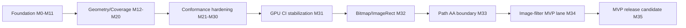

# kanvas

Kanvas is a Kotlin graphics stack that is converging toward a shared
high-performance rendering pipeline for CPU raster and WebGPU. The active
pipeline target is based on a typed Kanvas IR, WGSL parser/generator support,
CPU scalar/vector execution plans, and parser-validated generated WGSL for the
GPU backend.

## MVP Roadmap

Last updated: 2026-05-28

MVP readiness: 100%.

The percentage is a readiness score, not an effort estimate. A block only moves
when its milestone Definition of Done has CI, Linear, report, or artifact
evidence. Archived migration plans are historical evidence only and must not be
used as active backlog.

Active execution source:

- Linear project: [Kanvas - WGSL Pipeline Target](https://linear.app/forge-yg/project/kanvas-wgsl-pipeline-target-ef9e97757caa)
- Sprint closeout: [reports/wgsl-pipeline/2026-05-28-m33-m35-sprint-report.md](reports/wgsl-pipeline/2026-05-28-m33-m35-sprint-report.md)
- Architecture target: [.upstream/target/high-performance-wgsl-pipeline-target.md](.upstream/target/high-performance-wgsl-pipeline-target.md)
- Post-MVP big target: [.upstream/target/rendering-conformance-performance-target.md](.upstream/target/rendering-conformance-performance-target.md)
- Post-MVP conformance backlog: [.upstream/target/post-mvp-conformance-backlog.md](.upstream/target/post-mvp-conformance-backlog.md)
- Linear/agent methodology: [.upstream/target/linear-agent-methodology.md](.upstream/target/linear-agent-methodology.md)

| Block | Scope | Status | Weight | Progress | MVP evidence gate |
| --- | --- | --- | ---: | ---: | --- |
| Foundation pipeline | M0-M11: parser deps, PipelineIR, CPU scalar pilot, generated WGSL pilot, runtime effect pilot, Java 25 Vector pilot | Done | 15% | 100% | Parser/generator smoke, stable IR dumps, generated WGSL pilot evidence |
| Geometry/Coverage convergence | M12-M20: GeometryPlan/CoveragePlan contracts, shadow harness, CPU/GPU routing | Done | 20% | 100% | Descriptor-driven geometry coverage baseline and migration evidence |
| Conformance hardening | M21-M30: PipelineKey, parser validation, runtime matrix, CPU vector gate, evidence gates, residual scope | Done | 20% | 100% | Conformance report, release-readiness gates, residual work made explicit |
| GPU CI stabilization | M31: required GPU smoke gate separated from full non-blocking inventory | Done | 15% | 100% | Adapter-backed smoke gate and inventory classification policy |
| Bitmap/ImageRect remediation | M32: fix or evidence-classify `DrawBitmapRect3` and `DrawBitmapRectSkbug4734` GPU similarity deltas | Done | 10% | 100% | `GRA-93` through `GRA-100`; image-rect similarity regressions are zero and `DrawBitmapRectSkbug4734` is required smoke |
| Path AA inventory boundary | M33: classify edge-budget refusals and promote only stable AA coverage | Done | 10% | 100% | `GRA-105` through `GRA-108`; `coverage.edge-count-exceeded` remains inventory-only and `AnalyticAntialiasConvexWebGpuTest` is required smoke |
| Image-filter MVP lane | M34/M38: gate unsupported `Crop(input = nonNull)` graphs and promote the selected SimpleOffset child pre-pass | Done | 5% | 100% | `GRA-109` through `GRA-113` and `GRA-174` through `GRA-184`; selected `SimpleOffsetImageFilterWebGpuTest` is required smoke with dashboard evidence, while `image-filter.crop-input-nonnull-prepass-required` is retained only for out-of-scope Crop(input nonNull) graph shapes |
| MVP release candidate | M35: final smoke, inventory, PM demo, limitations, and release notes | Done | 5% | 100% | Required CI, conformance, smoke, full inventory, PM evidence package, and closeout evidence are complete |

Sprint verification on 2026-05-28 confirmed that Linear epics `GRA-101`,
`GRA-102`, and `GRA-103`, their M33-M35 child tasks, and the M33-M35
milestones are all `Done` / 100%.



### MVP Definition

The MVP is reached when:

- the required CPU and GPU smoke gates are green on CI;
- remaining GPU inventory failures are classified as expected unsupported,
  dependency-gated, or tracked follow-up work;
- generated/validated WGSL is the accepted path for promoted pipeline slices;
- CPU reference behavior and GPU similarity policy are visible in tests or
  reports;
- PM-facing evidence links Linear milestones, PRs, CI runs, and known
  limitations.

Non-goals for the MVP:

- porting Ganesh or Graphite;
- rebuilding Skia's SkSL compiler, IR, or VM;
- hiding GPU inventory failures by lowering floors in bulk;
- adding short-lived font or codec substitutes for dependency-gated gaps.

## Post-MVP Big Target

The MVP is complete. The next target is the Kanvas Rendering Conformance &
Performance Platform: a generated evidence system that turns CPU/GPU rendering
tests into PM-readable and engineering-actionable proof.

Current scene dashboard:

- source: [reports/wgsl-pipeline/scenes/](reports/wgsl-pipeline/scenes/)
- export task: `rtk ./gradlew --no-daemon pipelineSceneDashboard`
- generated output: `build/reports/wgsl-pipeline-scenes/index.html`
- target doc: [.upstream/target/rendering-conformance-performance-target.md](.upstream/target/rendering-conformance-performance-target.md)

Current dashboard evidence after M45 and GRA-221:

| Signal | Count | Meaning |
|---|---:|---|
| Scene rows | 13 | Static and generated rows merged by `pipelineSceneDashboard`. |
| `pass` | 11 | Reference, CPU, GPU, diff, stats, and route evidence exist for the selected scene. |
| `tracked-gap` | 0 | P0 adapter-backed capture gaps were closed by M42 and GRA-222. |
| `expected-unsupported` | 2 | GPU intentionally refuses the scene with a stable fallback reason. |
| `fail` | 0 | No dashboard row is currently a failing support claim. |
| `maturity.generated-evidence` | 3 | M41 generated rows: bitmap rect, crop image-filter pre-pass, linear gradient. |
| `maturity.static-evidence` | 10 | Reviewable static rows retained for families not yet generated. |
| `maturity.adapter-backed` | 2 | P0 GPU captures on named adapter. |
| CPU/GPU perf `measured` | 2 each | M43 benchmark payloads, reporting-only until CI gate policy is approved. |

Closed post-MVP milestones:

- M41: generated dashboard rows from test outputs;
- M42: closed adapter-backed P0 GPU capture gaps;
- M43: replaced selected estimated metrics with measured CPU/GPU benchmarks;
- M44: promoted one narrow Path AA family to rendered GPU support;
- M45: extended image-filter support to a bounded DAG subset;
- GRA-221: added scene tags, exact-tag filtering, tag search, and
  feature/maturity/risk aggregates.

Next sprint:

- M46: convert at least five additional static dashboard rows to generated
  evidence, targeting `maturity.generated-evidence >= 8`,
  `maturity.static-evidence <= 5`, `tracked-gap = 0`, and `fail = 0`.

Sprint review:
[reports/wgsl-pipeline/2026-05-28-m41-m45-sprint-review.md](reports/wgsl-pipeline/2026-05-28-m41-m45-sprint-review.md)

Support claims after the MVP require visible evidence: reference, CPU/GPU
render or explicit refusal, diffs, stats, route diagnostics, and stable fallback
policy. Static or estimated evidence must be labelled as such.

## Development Commands

Use the Gradle wrapper from the repository root:

```bash
./gradlew build
./gradlew check
./gradlew clean
```

For project workflow commands, prefer the repository `rtk` wrapper when it is
available, for example:

```bash
rtk git diff --check
rtk ./gradlew --no-daemon check
```
