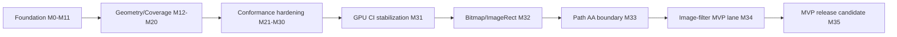

# kanvas

Kanvas is a Kotlin graphics stack that is converging toward a shared
high-performance rendering pipeline for CPU raster and WebGPU. The active
pipeline target is based on a typed Kanvas IR, WGSL parser/generator support,
CPU scalar/vector execution plans, and parser-validated generated WGSL for the
GPU backend.

## Post-MVP Big Target

Last updated: 2026-05-31

Post-MVP Big Target readiness for MEP: 96%.

This percentage is a PM readiness score for the full Post-MVP target, not an
effort estimate and not the completion state of the last sprint. It moves only
when Kanvas gains release-relevant capability with visible report, artifact,
dashboard, CI, or demo evidence.

The MVP is complete. The big target is now the Kanvas Rendering Conformance &
Performance Platform: a generated evidence system that turns CPU/GPU rendering
tests into PM-readable progress and engineering-actionable proof.

Current PM interpretation: M41-M47 built the evidence foundation, M48 expanded
representative Skia integration breadth, M49 promoted the dashboard into a
release-oriented readiness gate candidate, M50 converted that candidate plus the
front/font specs into executable evidence, M51 made the full Skia GM/sample
surface release-visible as inventory, M52 promoted 10 selected inventory
candidates into generated dashboard evidence, M53 promoted a second 12-row GM
feature pack, M54 promoted a 10-row hard feature depth pack, M55 added a
non-blocking performance gate candidate for seven representative rows, and M56
promoted one incorrectly classified sweep-gradient boundary row into a real
adapter-backed `pass` row. The platform is still not
complete MEP scope: performance thresholds remain warning-only, broad Skia
parity is not claimed, and dependency-gated text/font/codec gaps remain visible
outside the selected evidence rows.

M51 inventory coverage is complete: upstream GM files, Kotlin GM files,
classification status, mismatches, PM bundle links, and an M52 promotion backlog
are generated and validated. Inventory rows are not support claims.

M52 inventory promotion is complete for a 10-row selected pack: 7 generated
`pass` rows and 3 generated `expected-unsupported` rows now carry
`inventoryId`, reference/CPU/GPU or refusal evidence, diff/stat artifacts, tags,
and fallback semantics. This does not broaden Skia GM support beyond those
generated scene contracts.

M53 GM feature promotion is complete for a 12-row selected pack: 10 generated
`pass` rows and 2 generated `expected-unsupported` rows across gradient,
bitmap/image, blend/color-filter, clip/transform/saveLayer, and bounded
image-filter families after the M56 sweep-gradient correction.

M54 hard feature depth is complete for a 10-row generated pack: 8 generated
`pass` rows and 2 generated `expected-unsupported` rows across bounded
image-filter v2, Path AA / clip depth, and runtime / paint composition. The
final M54 dashboard has 60 rows, 45 pass, 15 expected-unsupported, 0
tracked-gap, 0 fail, 58 generated rows, 2 static policy rows, 41 adapter-backed
rows, and 32 inventory-derived generated rows. Two M54 rows carry measured
warning-only performance metadata; no performance gate became release-blocking.

M55 performance gate candidate evidence is complete for seven selected rows: 4
candidate `pass` rows with measured CPU and GPU/cache payloads, 3 candidate
`deferred` rows with stable reasons, 0 `warn`, and 0 `fail-candidate`. The
candidate is generated by `pipelinePerformanceTrendWarnings`, exposed through
`pipelinePmBundle`, and remains non-blocking.

M56 unsupported-to-pass work is partially complete: `m53-sweep-gradient-clamp`
now maps to `skia-gm-sweepgradient` and renders as a real `pass` row with
adapter-backed artifacts. Image-filter and Path AA/clip candidates were
reviewed and intentionally kept unsupported because their current artifacts do
not prove row-specific GPU support. M56 moves readiness to 96%, not the 97%
stretch target.

The final M56 dashboard has 60 rows, 46 pass, 14 expected-unsupported, 0
tracked-gap, 0 fail, 58 generated rows, 2 static policy rows, 42 adapter-backed
rows, and 32 inventory-derived generated rows.

| PM area | Weight | Status | Progress | Evidence / remaining work |
|---|---:|---|---:|---|
| Evidence foundation | 25% | Done through M56 | 100% | Generated dashboard, 58 generated rows, 0 tracked-gap, 0 fail, release gate report |
| Skia integration coverage | 25% | Adapter-backed + one unsupported-to-pass correction | 99% | M56 promotes one previous expected-unsupported sweep-gradient row to adapter-backed pass while keeping image-filter and Path AA blockers explicit |
| CI and release gates | 20% | Release-visible candidate | 98% | `wgsl_scene_dashboard_release_gate` runs dashboard gate, performance warnings, PM bundle, M54 metadata checks, M55 performance candidate output, and M56 corrected allowlist |
| Performance readiness | 15% | Non-blocking gate candidate | 80% | Seven M55 rows have candidate decisions: 4 measured pass rows, 3 deferred rows, 0 warn, 0 fail-candidate; thresholds remain non-blocking |
| PM demo and reporting workflow | 15% | PM bundle + front QA + M56 counters | 99% | `pipelinePmBundle` includes manifest, dashboard, artifacts, front QA, gate, performance warnings, inventory reports, M52/M53/M54 counters, M55 performance candidate counters, and M56 promotion/limitation evidence |

Weighted PM readiness: 96% after rounding.

| Track | Status | Progress | Evidence |
|---|---|---:|---|
| Generated scene dashboard | Done | 100% | M41 generated rows and dashboard exporter |
| Adapter-backed P0 GPU capture | Done | 100% | M42 P0 captures and status policy |
| Measured CPU/GPU benchmark payloads | Done | 100% | M43 reporting-only benchmark evidence |
| Narrow Path AA support promotion | Done | 100% | M44 selected Path AA family |
| Bounded image-filter DAG support | Done | 100% | M45 selected DAG subset |
| Static-to-generated evidence expansion | Done | 100% | M46 converted five additional rows |
| Remaining static evidence hardening | Done | 100% | M47 converted remaining static pass rows and validated Path AA policy rows |
| MEP scene coverage expansion | Done | 100% | M48 added 7 generated support rows and 3 expected-unsupported breadth rows |
| MEP readiness gate toward 60% | Done | 100% | M49 promoted dashboard evidence into a CI gate candidate, portable PM bundle, non-blocking performance trend contract, release checklist, and 7 adapter-backed rows |
| Front evidence experience specs | Draft spec complete | 100% | `front/` documents dashboard UX, PM workflow, accessibility, and quality gates without changing rendering claims |
| Font and text evidence specs | Draft spec complete | 100% | `font/` documents OpenType, shaping, glyph rendering, color fonts, emoji, and validation boundaries without clearing dependency-gated rows |
| MEP readiness acceleration toward 80% | Done | 100% | M50 adds required CI ownership, front QA gate, 17 adapter-backed rows, first generated font/text evidence pack, performance warning automation, and score closeout |
| Skia GM inventory coverage | Done | 100% | M51 inventories 437 upstream GM C++ files and 751 Kotlin GM sources into 802 rows, exposes inventory in the PM bundle, validates it, and selects 34 M52+ candidates without changing support claims |
| GM inventory promotion pack | Done | 100% | M52 promotes 10 selected candidates into generated dashboard evidence: 7 pass rows, 3 expected-unsupported rows, 0 tracked-gap, 0 fail |
| GM feature promotion pack v2 | Done | 100% | M53 promotes 12 selected candidates into generated dashboard evidence: 10 pass rows, 2 expected-unsupported rows after M56 correction, 0 tracked-gap, 0 fail |
| Hard feature depth pack | Done | 100% | M54 promotes 10 selected hard-feature rows into generated dashboard evidence: 8 pass rows, 2 expected-unsupported rows, 0 tracked-gap, 0 fail |
| Performance gate candidate | Done | 100% | M55 selects 7 representative rows, emits non-blocking pass/deferred/warn/fail-candidate output, exposes PM bundle counters, and keeps release-blocking performance disabled |
| Unsupported-to-pass feature scene pack | Partial | 50% | M56 promotes 1 row to pass, rejects unsafe image-filter and Path AA shortcuts, and moves readiness to 96% instead of the 97% stretch target |

Evidence-hardening readiness is 100% through M47:
all static pass rows have generated evidence, and the only remaining static rows
are explicit Path AA expected-unsupported policy sentinels.

M48 coverage expansion is complete for the selected scene pack: the dashboard now
has 23 rows, 18 pass, 5 expected-unsupported, 0 tracked-gap, 0 fail, 21 generated
rows, 2 static rows, and 2 adapter-backed rows. This justifies moving Skia
integration coverage from 15% to 35%, but not higher, because CI gates,
performance thresholds, broad adapter-backed captures, text/font/codec coverage,
and a repeatable PM demo workflow remain outside this milestone.

M49 readiness gating is complete for the selected evidence set: the dashboard
still has 23 rows, 18 pass, 5 expected-unsupported, 0 tracked-gap, 0 fail, 21
generated rows, and 2 static policy rows, while adapter-backed proof increased
from 2 to 7 rows. The new `pipelineSceneDashboardGate` task, negative fixture,
portable PM bundle, release checklist, and non-blocking performance trend
contract justify moving the overall Post-MVP readiness score from 40% to 60%.

What remains before MEP:

- keep promoting selected M52+ candidates from the inventory into generated
  scene evidence without treating inventory status as support;
- keep new support claims generated by default;
- decide whether performance warning output should become release-blocking
  after baseline, variance, environment, and rollback ownership are accepted;
- publish or host the PM demo/report flow beyond the generated portable local
  bundle;
- extend the accepted front QA baseline beyond static checks if a browser or
  accessibility runner becomes owned in CI;
- close broader dependency-gated text/font/glyph/emoji/codec gaps through real
  deliveries, not substitutes, then promote those scenes with generated
  CPU/GPU/refusal evidence.

M50 moved the PM score to 80% because these requirements landed together:

- CI/release ownership for `pipelineSceneDashboardGate` and non-blocking
  inventory evidence;
- front PM dashboard gates for image inspection, filters, route/reference
  notices, desktop/mobile screenshots, accessibility, and PM bundle inclusion;
- at least 14 adapter-backed rows across multiple Skia-relevant scene families;
- first generated font/text scene pack with pass rows and explicit
  expected-unsupported rows using stable fallback reasons;
- automated warning-only performance trend output with baselines, variance
  policy, owner, quarantine, and rollback notes;
- sprint review recalculating the score from artifacts.

Active Post-MVP evidence:

- target doc: [.upstream/target/rendering-conformance-performance-target.md](.upstream/target/rendering-conformance-performance-target.md)
- backlog: [.upstream/target/post-mvp-conformance-backlog.md](.upstream/target/post-mvp-conformance-backlog.md)
- front specs: [.upstream/specs/front/README.md](.upstream/specs/front/README.md)
- font specs: [.upstream/specs/font/README.md](.upstream/specs/font/README.md)
- dashboard source: [reports/wgsl-pipeline/scenes/](reports/wgsl-pipeline/scenes/)
- generated demo: `rtk ./gradlew --no-daemon pipelineSceneDashboard`
- M46 review: [reports/wgsl-pipeline/2026-05-31-m46-sprint-review.md](reports/wgsl-pipeline/2026-05-31-m46-sprint-review.md)
- M47 review: [reports/wgsl-pipeline/2026-05-31-m47-sprint-review.md](reports/wgsl-pipeline/2026-05-31-m47-sprint-review.md)
- M47 inventory: [reports/wgsl-pipeline/2026-05-31-m47-remaining-static-evidence-inventory.md](reports/wgsl-pipeline/2026-05-31-m47-remaining-static-evidence-inventory.md)
- M47 Path AA policy validation: [reports/wgsl-pipeline/2026-05-31-m47-path-aa-expected-unsupported-policy-validation.md](reports/wgsl-pipeline/2026-05-31-m47-path-aa-expected-unsupported-policy-validation.md)
- M48 taxonomy: [reports/wgsl-pipeline/2026-05-31-m48-mep-skia-scene-taxonomy.md](reports/wgsl-pipeline/2026-05-31-m48-mep-skia-scene-taxonomy.md)
- M48 scene pack: [reports/wgsl-pipeline/2026-05-31-m48-p0-p1-scene-pack-selection.md](reports/wgsl-pipeline/2026-05-31-m48-p0-p1-scene-pack-selection.md)
- M48 support evidence: [reports/wgsl-pipeline/2026-05-31-m48-paint-blend-transform-generated-evidence.md](reports/wgsl-pipeline/2026-05-31-m48-paint-blend-transform-generated-evidence.md), [reports/wgsl-pipeline/2026-05-31-m48-bitmap-gradient-generated-evidence.md](reports/wgsl-pipeline/2026-05-31-m48-bitmap-gradient-generated-evidence.md)
- M48 unsupported breadth: [reports/wgsl-pipeline/2026-05-31-m48-expected-unsupported-breadth-evidence.md](reports/wgsl-pipeline/2026-05-31-m48-expected-unsupported-breadth-evidence.md)
- M49 proposed sprint: [reports/wgsl-pipeline/2026-05-31-m49-60-readiness-sprint-plan.md](reports/wgsl-pipeline/2026-05-31-m49-60-readiness-sprint-plan.md)
- M49 gate invariants: [reports/wgsl-pipeline/2026-05-31-m49-dashboard-gate-invariants.md](reports/wgsl-pipeline/2026-05-31-m49-dashboard-gate-invariants.md)
- M49 CI validation task: [reports/wgsl-pipeline/2026-05-31-m49-ci-dashboard-validation-task.md](reports/wgsl-pipeline/2026-05-31-m49-ci-dashboard-validation-task.md)
- M49 portable PM bundle: [reports/wgsl-pipeline/2026-05-31-m49-portable-pm-bundle.md](reports/wgsl-pipeline/2026-05-31-m49-portable-pm-bundle.md)
- M49 adapter-backed expansion: [reports/wgsl-pipeline/2026-05-31-m49-adapter-backed-expansion.md](reports/wgsl-pipeline/2026-05-31-m49-adapter-backed-expansion.md)
- M49 performance trend gate contract: [reports/wgsl-pipeline/2026-05-31-m49-performance-trend-gate-contract.md](reports/wgsl-pipeline/2026-05-31-m49-performance-trend-gate-contract.md)
- M49 release readiness checklist: [reports/wgsl-pipeline/2026-05-31-m49-mep-release-readiness-checklist.md](reports/wgsl-pipeline/2026-05-31-m49-mep-release-readiness-checklist.md)
- M49 sprint review: [reports/wgsl-pipeline/2026-05-31-m49-sprint-review.md](reports/wgsl-pipeline/2026-05-31-m49-sprint-review.md)
- M50 sprint plan: [reports/wgsl-pipeline/2026-05-31-m50-80-readiness-sprint-plan.md](reports/wgsl-pipeline/2026-05-31-m50-80-readiness-sprint-plan.md)
- M50 sprint review: [reports/wgsl-pipeline/2026-05-31-m50-sprint-review.md](reports/wgsl-pipeline/2026-05-31-m50-sprint-review.md)
- M50 verification and Linear sync: [reports/wgsl-pipeline/2026-05-31-m50-verification-and-linear-sync.md](reports/wgsl-pipeline/2026-05-31-m50-verification-and-linear-sync.md)
- M51 proposed sprint: [reports/wgsl-pipeline/2026-05-31-m51-skia-gm-inventory-sprint-plan.md](reports/wgsl-pipeline/2026-05-31-m51-skia-gm-inventory-sprint-plan.md)
- M51 sprint review: [reports/wgsl-pipeline/2026-05-31-m51-sprint-review.md](reports/wgsl-pipeline/2026-05-31-m51-sprint-review.md)
- M51 PM report: [reports/wgsl-pipeline/2026-05-31-m51-pm-report.md](reports/wgsl-pipeline/2026-05-31-m51-pm-report.md)
- M52 PM report: [reports/wgsl-pipeline/2026-05-31-m52-pm-report.md](reports/wgsl-pipeline/2026-05-31-m52-pm-report.md)
- M53 sprint review: [reports/wgsl-pipeline/2026-05-31-m53-sprint-review.md](reports/wgsl-pipeline/2026-05-31-m53-sprint-review.md)
- M53 PM report: [reports/wgsl-pipeline/2026-05-31-m53-pm-report.md](reports/wgsl-pipeline/2026-05-31-m53-pm-report.md)
- M54 sprint review: [reports/wgsl-pipeline/2026-05-31-m54-sprint-review.md](reports/wgsl-pipeline/2026-05-31-m54-sprint-review.md)
- M54 PM report: [reports/wgsl-pipeline/2026-05-31-m54-pm-report.md](reports/wgsl-pipeline/2026-05-31-m54-pm-report.md)
- M55 performance gate candidate selection: [reports/wgsl-pipeline/2026-05-31-m55-performance-gate-candidate-selection.md](reports/wgsl-pipeline/2026-05-31-m55-performance-gate-candidate-selection.md)
- M55 baseline payloads: [reports/wgsl-pipeline/2026-05-31-m55-official-performance-baseline-payloads.md](reports/wgsl-pipeline/2026-05-31-m55-official-performance-baseline-payloads.md)
- M55 quarantine/rebaseline/rollback policy: [reports/wgsl-pipeline/2026-05-31-m55-quarantine-rebaseline-rollback-policy.md](reports/wgsl-pipeline/2026-05-31-m55-quarantine-rebaseline-rollback-policy.md)
- M55 sprint review: [reports/wgsl-pipeline/2026-05-31-m55-sprint-review.md](reports/wgsl-pipeline/2026-05-31-m55-sprint-review.md)
- M55 PM report: [reports/wgsl-pipeline/2026-05-31-m55-pm-report.md](reports/wgsl-pipeline/2026-05-31-m55-pm-report.md)
- M56 selection: [reports/wgsl-pipeline/2026-05-31-m56-unsupported-to-pass-selection.md](reports/wgsl-pipeline/2026-05-31-m56-unsupported-to-pass-selection.md)
- M56 image-filter decision: [reports/wgsl-pipeline/2026-05-31-m56-gra334-image-filter-promotion-decision.md](reports/wgsl-pipeline/2026-05-31-m56-gra334-image-filter-promotion-decision.md)
- M56 Path AA / clip review: [reports/wgsl-pipeline/2026-05-31-gra-336-path-aa-clip-budget-review.md](reports/wgsl-pipeline/2026-05-31-gra-336-path-aa-clip-budget-review.md)
- M56 sprint review: [reports/wgsl-pipeline/2026-05-31-m56-sprint-review.md](reports/wgsl-pipeline/2026-05-31-m56-sprint-review.md)
- M56 PM report: [reports/wgsl-pipeline/2026-05-31-m56-pm-report.md](reports/wgsl-pipeline/2026-05-31-m56-pm-report.md)

## MVP Roadmap

Last updated: 2026-05-28

MVP readiness: 100%.

The percentage is a readiness score, not an effort estimate. A block only moves
when its milestone Definition of Done has CI, Linear, report, or artifact
evidence. Archived migration plans are historical evidence only and must not be
used as active backlog.

Active execution source:

- Linear project: [Kanvas - WGSL Pipeline Target](https://linear.app/forge-yg/project/kanvas-wgsl-pipeline-target-ef9e97757caa)
- Sprint closeout: [reports/wgsl-pipeline/2026-05-28-m33-m35-sprint-report.md](reports/wgsl-pipeline/2026-05-28-m33-m35-sprint-report.md)
- Architecture target: [.upstream/target/high-performance-wgsl-pipeline-target.md](.upstream/target/high-performance-wgsl-pipeline-target.md)
- Post-MVP big target: [.upstream/target/rendering-conformance-performance-target.md](.upstream/target/rendering-conformance-performance-target.md)
- Post-MVP conformance backlog: [.upstream/target/post-mvp-conformance-backlog.md](.upstream/target/post-mvp-conformance-backlog.md)
- Front evidence specs: [.upstream/specs/front/README.md](.upstream/specs/front/README.md)
- Font and text specs: [.upstream/specs/font/README.md](.upstream/specs/font/README.md)
- Linear/agent methodology: [.upstream/target/linear-agent-methodology.md](.upstream/target/linear-agent-methodology.md)

| Block | Scope | Status | Weight | Progress | MVP evidence gate |
| --- | --- | --- | ---: | ---: | --- |
| Foundation pipeline | M0-M11: parser deps, PipelineIR, CPU scalar pilot, generated WGSL pilot, runtime effect pilot, Java 25 Vector pilot | Done | 15% | 100% | Parser/generator smoke, stable IR dumps, generated WGSL pilot evidence |
| Geometry/Coverage convergence | M12-M20: GeometryPlan/CoveragePlan contracts, shadow harness, CPU/GPU routing | Done | 20% | 100% | Descriptor-driven geometry coverage baseline and migration evidence |
| Conformance hardening | M21-M30: PipelineKey, parser validation, runtime matrix, CPU vector gate, evidence gates, residual scope | Done | 20% | 100% | Conformance report, release-readiness gates, residual work made explicit |
| GPU CI stabilization | M31: required GPU smoke gate separated from full non-blocking inventory | Done | 15% | 100% | Adapter-backed smoke gate and inventory classification policy |
| Bitmap/ImageRect remediation | M32: fix or evidence-classify `DrawBitmapRect3` and `DrawBitmapRectSkbug4734` GPU similarity deltas | Done | 10% | 100% | `GRA-93` through `GRA-100`; image-rect similarity regressions are zero and `DrawBitmapRectSkbug4734` is required smoke |
| Path AA inventory boundary | M33: classify edge-budget refusals and promote only stable AA coverage | Done | 10% | 100% | `GRA-105` through `GRA-108`; `coverage.edge-count-exceeded` remains inventory-only and `AnalyticAntialiasConvexWebGpuTest` is required smoke |
| Image-filter MVP lane | M34/M38: gate unsupported `Crop(input = nonNull)` graphs and promote the selected SimpleOffset child pre-pass | Done | 5% | 100% | `GRA-109` through `GRA-113` and `GRA-174` through `GRA-184`; selected `SimpleOffsetImageFilterWebGpuTest` is required smoke with dashboard evidence, while `image-filter.crop-input-nonnull-prepass-required` is retained only for out-of-scope Crop(input nonNull) graph shapes |
| MVP release candidate | M35: final smoke, inventory, PM demo, limitations, and release notes | Done | 5% | 100% | Required CI, conformance, smoke, full inventory, PM evidence package, and closeout evidence are complete |

Sprint verification on 2026-05-28 confirmed that Linear epics `GRA-101`,
`GRA-102`, and `GRA-103`, their M33-M35 child tasks, and the M33-M35
milestones are all `Done` / 100%.



### MVP Definition

The MVP is reached when:

- the required CPU and GPU smoke gates are green on CI;
- remaining GPU inventory failures are classified as expected unsupported,
  dependency-gated, or tracked follow-up work;
- generated/validated WGSL is the accepted path for promoted pipeline slices;
- CPU reference behavior and GPU similarity policy are visible in tests or
  reports;
- PM-facing evidence links Linear milestones, PRs, CI runs, and known
  limitations.

Non-goals for the MVP:

- porting Ganesh or Graphite;
- rebuilding Skia's SkSL compiler, IR, or VM;
- hiding GPU inventory failures by lowering floors in bulk;
- adding short-lived font or codec substitutes for dependency-gated gaps.

## Post-MVP Evidence Details

The Post-MVP target is tracked through the generated scene dashboard and the
reports below.

Current scene dashboard:

- source: [reports/wgsl-pipeline/scenes/](reports/wgsl-pipeline/scenes/)
- export task: `rtk ./gradlew --no-daemon pipelineSceneDashboard`
- generated output: `build/reports/wgsl-pipeline-scenes/index.html`
- target doc: [.upstream/target/rendering-conformance-performance-target.md](.upstream/target/rendering-conformance-performance-target.md)

Current dashboard evidence after M50 readiness acceleration:

| Signal | Count | Meaning |
|---|---:|---|
| Scene rows | 28 | Static and generated rows merged by `pipelineSceneDashboard`. |
| `pass` | 21 | Reference, CPU, GPU, diff, stats, and route evidence exist for the selected support scene. |
| `tracked-gap` | 0 | P0 adapter-backed capture gaps were closed by M42 and GRA-222. |
| `expected-unsupported` | 7 | GPU intentionally refuses the scene with a stable fallback reason. |
| `fail` | 0 | No dashboard row is currently a failing support claim. |
| `maturity.generated-evidence` | 26 | M41, M46, M47, M48, and M50 generated rows, including first font/text evidence. |
| `maturity.static-evidence` | 2 | Remaining rows are explicit Path AA expected-unsupported policy evidence. |
| `maturity.adapter-backed` | 17 | M50 adapter-backed expansion across paint, blend, bitmap, gradient, clip, transform, Path AA, image-filter, runtime-effect, and selected text rows. |
| CPU/GPU perf `measured` | 2 each | M43 benchmark payloads, reporting-only until CI gate policy is approved. |

Closed post-MVP milestones:

- M41: generated dashboard rows from test outputs;
- M42: closed adapter-backed P0 GPU capture gaps;
- M43: replaced selected estimated metrics with measured CPU/GPU benchmarks;
- M44: promoted one narrow Path AA family to rendered GPU support;
- M45: extended image-filter support to a bounded DAG subset;
- M46: converted five additional static rows to generated evidence;
- M47/GRA-273: locked the remaining static evidence inventory and selected the
  three rows eligible for generated conversion;
- M47/GRA-274: converted `runtime-effect-simple` to generated evidence while
  preserving the registered Kotlin/WGSL descriptor boundary;
- M47/GRA-275: converted `clip-rect-difference` to generated evidence;
- M47/GRA-276: converted `bitmap-shader-local-matrix` to generated evidence;
- M47/GRA-277: kept the two Path AA expected-unsupported rows as static policy
  evidence with stable fallback reasons;
- M47/GRA-278: closed the sprint with 11 generated rows and 2 static policy rows;
- GRA-221: added scene tags, exact-tag filtering, tag search, and
  feature/maturity/risk aggregates.
- M48/GRA-280: defined the MEP scene taxonomy and readiness rule for moving
  Skia integration coverage beyond 15%;
- M48/GRA-281: selected 10 P0/P1 rows for the M48 scene pack;
- M48/GRA-282: added four generated paint, blend, clip, and transform support
  rows;
- M48/GRA-283: added three generated bitmap and gradient support rows;
- M48/GRA-284: added three explicit expected-unsupported Path AA/image-filter
  breadth rows;
- M48/GRA-285: synced PM dashboard counters and readiness after the M48 scene
  pack landed.
- M48/GRA-286: closed the sprint with 23 rows, 21 generated rows, 0 tracked-gap,
  0 fail, and an M49 recommendation for CI/release gates.
- M49/GRA-287: closed the readiness gate sprint with a CI gate candidate,
  portable PM bundle, non-blocking performance trend contract, release
  checklist, 7 adapter-backed rows, and a 60% PM readiness score.
- M50: closed readiness acceleration with release-visible dashboard gate,
  front QA bundle evidence, 17 adapter-backed rows, first generated font/text
  evidence pack, warning-only performance automation, and an 80% PM readiness
  score.
- M51: closed Skia GM inventory coverage with 802 inventory rows from 437
  upstream GM files and 751 Kotlin GM sources, 34 M52+ candidates, PM bundle
  inventory exposure, inventory validation, and an 82% PM readiness score.
- M52: closed the GM inventory promotion pack with 10 inventory-derived
  generated rows, 38 dashboard rows total, 28 pass, 10 expected-unsupported, 0
  tracked-gap, 0 fail, 36 generated rows, 24 adapter-backed rows, and an 85% PM
  readiness score.
- M53: closed the GM feature promotion pack v2 with 12 additional
  inventory-derived generated rows. After the M56 sweep-gradient correction,
  M53 contributes 10 pass rows and 2 expected-unsupported rows; the historical
  M53 closeout score remains 90%.
- M54: closed the hard feature depth pack with 10 additional inventory-derived
  generated rows, 60 dashboard rows total, 45 pass, 15 expected-unsupported, 0
  tracked-gap, 0 fail, 58 generated rows, 41 adapter-backed rows, 2 measured
  warning-only M54 performance rows, and a 93% PM readiness score.
- M55: closed the performance gate candidate with 7 selected representative
  rows, 4 candidate pass rows, 3 deferred rows, 0 warn, 0 fail-candidate, PM
  bundle exposure, quarantine/rebaseline/rollback policy, unchanged dashboard
  support counters, and a 95% PM readiness score.
- M56: partially closed the unsupported-to-pass feature sprint with 1 corrected
  sweep-gradient promotion, 60 dashboard rows total, 46 pass, 14
  expected-unsupported, 0 tracked-gap, 0 fail, 42 adapter-backed rows, explicit
  image-filter and Path AA rejection reports, and a 96% PM readiness score.
- Front specs: split the evidence dashboard, PM reporting, accessibility, and
  front quality-gate target under `.upstream/specs/front/`; this documents
  current M49 behavior and future gates, but does not change rendering support.
- Font specs: split font/text/glyph/emoji validation under
  `.upstream/specs/font/`; this documents the current pure Kotlin OpenType and
  simple text baseline, plus dependency-gated rows, but does not clear those
  gaps without implementation evidence.

Sprint reviews:
[reports/wgsl-pipeline/2026-05-28-m41-m45-sprint-review.md](reports/wgsl-pipeline/2026-05-28-m41-m45-sprint-review.md)
[reports/wgsl-pipeline/2026-05-31-m46-sprint-review.md](reports/wgsl-pipeline/2026-05-31-m46-sprint-review.md)
[reports/wgsl-pipeline/2026-05-31-m47-sprint-review.md](reports/wgsl-pipeline/2026-05-31-m47-sprint-review.md)
[reports/wgsl-pipeline/2026-05-31-m48-sprint-review.md](reports/wgsl-pipeline/2026-05-31-m48-sprint-review.md)
[reports/wgsl-pipeline/2026-05-31-m49-sprint-review.md](reports/wgsl-pipeline/2026-05-31-m49-sprint-review.md)
[reports/wgsl-pipeline/2026-05-31-m50-sprint-review.md](reports/wgsl-pipeline/2026-05-31-m50-sprint-review.md)
[reports/wgsl-pipeline/2026-05-31-m51-sprint-review.md](reports/wgsl-pipeline/2026-05-31-m51-sprint-review.md)
[reports/wgsl-pipeline/2026-05-31-m52-sprint-review.md](reports/wgsl-pipeline/2026-05-31-m52-sprint-review.md)

M46 closeout:
[reports/wgsl-pipeline/2026-05-30-m46-generated-evidence-expansion-closeout.md](reports/wgsl-pipeline/2026-05-30-m46-generated-evidence-expansion-closeout.md)

Support claims after the MVP require visible evidence: reference, CPU/GPU
render or explicit refusal, diffs, stats, route diagnostics, and stable fallback
policy. Static or estimated evidence must be labelled as such.

## Development Commands

Use the Gradle wrapper from the repository root:

```bash
./gradlew build
./gradlew check
./gradlew clean
```

For project workflow commands, prefer the repository `rtk` wrapper when it is
available, for example:

```bash
rtk git diff --check
rtk ./gradlew --no-daemon check
```
