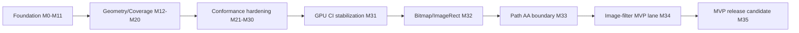

# kanvas

Kanvas is a Kotlin graphics stack that is converging toward a shared
high-performance rendering pipeline for CPU raster and WebGPU. The active
pipeline target is based on a typed Kanvas IR, WGSL parser/generator support,
CPU scalar/vector execution plans, and parser-validated generated WGSL for the
GPU backend.

## MVP Roadmap

Last updated: 2026-05-27

MVP readiness: approximately 94%.

The percentage is a readiness score, not an effort estimate. A block only moves
when its milestone Definition of Done has CI, Linear, report, or artifact
evidence. Archived migration plans are historical evidence only and must not be
used as active backlog.

Active execution source:

- Linear project: [Kanvas - WGSL Pipeline Target](https://linear.app/forge-yg/project/kanvas-wgsl-pipeline-target-ef9e97757caa)
- Architecture target: [.upstream/target/high-performance-wgsl-pipeline-target.md](.upstream/target/high-performance-wgsl-pipeline-target.md)
- Linear/agent methodology: [.upstream/target/linear-agent-methodology.md](.upstream/target/linear-agent-methodology.md)

| Block | Scope | Status | Weight | Progress | MVP evidence gate |
| --- | --- | --- | ---: | ---: | --- |
| Foundation pipeline | M0-M11: parser deps, PipelineIR, CPU scalar pilot, generated WGSL pilot, runtime effect pilot, Java 25 Vector pilot | Done | 15% | 100% | Parser/generator smoke, stable IR dumps, generated WGSL pilot evidence |
| Geometry/Coverage convergence | M12-M20: GeometryPlan/CoveragePlan contracts, shadow harness, CPU/GPU routing | Done | 20% | 100% | Descriptor-driven geometry coverage baseline and migration evidence |
| Conformance hardening | M21-M30: PipelineKey, parser validation, runtime matrix, CPU vector gate, evidence gates, residual scope | Done | 20% | 100% | Conformance report, release-readiness gates, residual work made explicit |
| GPU CI stabilization | M31: required GPU smoke gate separated from full non-blocking inventory | Done | 15% | 100% | Adapter-backed smoke gate and inventory classification policy |
| Bitmap/ImageRect remediation | M32: fix or evidence-classify `DrawBitmapRect3` and `DrawBitmapRectSkbug4734` GPU similarity deltas | Done | 10% | 100% | `GRA-93` through `GRA-100`; image-rect similarity regressions are zero and `DrawBitmapRectSkbug4734` is required smoke |
| Path AA inventory boundary | M33: classify edge-budget refusals and promote only stable AA coverage | Done | 10% | 100% | `GRA-105` through `GRA-108`; `coverage.edge-count-exceeded` remains inventory-only and `AnalyticAntialiasConvexWebGpuTest` is required smoke |
| Image-filter MVP lane | M34: gate `Crop(input = nonNull)` image-filter cases as an accepted MVP limitation | In Progress | 5% | 80% | `GRA-109` through `GRA-112`; `image-filter.crop-input-nonnull-prepass-required` remains inventory-only and `SimpleOffsetImageFilter*` fixtures are blocked from required smoke |
| MVP release candidate | M35 proposed: final smoke, inventory, PM demo, limitations, and release notes | Proposed | 5% | 0% | Required CI green, PM evidence linked, README status updated |



### MVP Definition

The MVP is reached when:

- the required CPU and GPU smoke gates are green on CI;
- remaining GPU inventory failures are classified as expected unsupported,
  dependency-gated, or tracked follow-up work;
- generated/validated WGSL is the accepted path for promoted pipeline slices;
- CPU reference behavior and GPU similarity policy are visible in tests or
  reports;
- PM-facing evidence links Linear milestones, PRs, CI runs, and known
  limitations.

Non-goals for the MVP:

- porting Ganesh or Graphite;
- rebuilding Skia's SkSL compiler, IR, or VM;
- hiding GPU inventory failures by lowering floors in bulk;
- adding short-lived font or codec substitutes for dependency-gated gaps.

## Development Commands

Use the Gradle wrapper from the repository root:

```bash
./gradlew build
./gradlew check
./gradlew clean
```

For project workflow commands, prefer the repository `rtk` wrapper when it is
available, for example:

```bash
rtk git diff --check
rtk ./gradlew --no-daemon check
```
