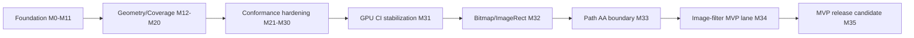

# kanvas

Kanvas is a Kotlin graphics stack that is converging toward a shared
high-performance rendering pipeline for CPU raster and WebGPU. The active
pipeline target is based on a typed Kanvas IR, WGSL parser/generator support,
CPU scalar/vector execution plans, and parser-validated generated WGSL for the
GPU backend.

Shader target wording for PM and agents: Kanvas targets WGSL on WebGPU. SkSL
appears only as Skia API compatibility context for `SkRuntimeEffect`; Kanvas is
not building a SkSL compiler, SkSL IR, or SkSL VM. Runtime effects that are
actually supported must be registered Kanvas descriptors with Kotlin CPU
behavior and parser-validated WGSL GPU implementations.

## Active Target: Skia-Like Breadth And Real-Time Renderer

Last updated: 2026-06-02

The MEP evidence target is complete at 100% and is now historical. The active
product target is broader: make Kanvas render more of the practical Skia CPU
surface while building a measured real-time WebGPU lane with live telemetry,
feature diagnostics, and PM-visible demos.

New target readiness is 67.75%, rounded for PM to approximately 70%, after the MEP-NEXT M89/M90 evidence package and the M91/M92 RC assembly evidence. This is intentionally lower
than the completed MEP score because the scope has expanded from evidence
infrastructure to feature breadth, fidelity, runtime behavior, and release
operability. The score is based on counted denominators in the target doc, not
manual sprint estimates. M89 and M90 improve post-RC-MEP PM evidence and
runtime operability; M91 and M92 assemble a release-candidate scene pack,
Kadre runtime script, and telemetry provenance report. They do not move
readiness because they do not add a new counted renderer denominator,
release-blocking timing gate, broad observed cache counter, or broad Skia
parity claim.

| Area | Weight | Current progress | PM interpretation |
|---|---:|---:|---|
| Rendering feature breadth | 30% | 60% | Path AA, bounded image-filter DAG, text/font, color/blend/color-filter, and registered runtime-effect evidence now have selected generated contracts; M87 adds selected SimpleRT live editing, but broad runtime-effect families, layers, and fallbacks remain incomplete. |
| Skia-like fidelity | 20% | 50% | M66 raises selected GM/reference evidence to 50/100 rows. M86 ranks and classifies the selected wave into a burn-down queue with root-cause buckets and remediation targets, but only 37/100 rows are Skia-comparable today; CPU-oracle rows are breadth/refusal evidence until comparable Skia references land. |
| Real-time runtime | 20% | 90% | M65 adds a reporting-only headless runtime smoke lane, M68 verifies the Kadre source-build bridge, M69 runs a bounded native Kadre/WebGPU present loop, M70-A adds a PM-visible Kadre demo task, M70-B/C confirm normalized native surface success plus a produced wgpu4k offscreen texture readback, M71 drives the selected route from Kadre/AppKit `ControlFlow.Poll`, M72 renders one selected `solid-rect` replay contract in Kadre, M73 adds a bounded typed replay-pack registry with selected scene-id routing, M74 extracts that replay model into closed typed commands, M75 emits deterministic multi-scene replay-pack evidence, M76 maps selected generated dashboard metadata into replay contracts with stable refusals, M77 makes bounded SrcOver partial-alpha replay explicit while refusing unsupported blend modes, M78 adds bounded ClipRect intersect replay evidence while preserving complex clip refusals, M79 adds bounded fixture-backed BitmapRect replay evidence while refusing unsupported bitmap samplers, M80 shares the replay CPU oracle result across native smoke, tests, and evidence, M81 packages native frame artifact capture evidence for PM review, M82 verifies deterministic Kadre input/resize runtime-loop semantics with telemetry, M83 proves one bounded Kanvas display-list scene through the native Kadre/WebGPU route with nonblank readback evidence, and M87 adds selected registered SimpleRT live parameter editing evidence with reflected uniforms. Real OS event injection, broad display-list replay, arbitrary op streams, arbitrary blend modes, broad clip-stack semantics, arbitrary texture/image support, dynamic multi-scene live switching, broad runtime-effect live controls, and window-surface screenshot/readback remain incomplete. |
| Performance and cache readiness | 15% | 45% | M67 promotes `frame.headless-webgpu` to a candidate gate from M65 telemetry and adds family budgets plus quarantine/rebaseline fixture. M84 packages `frame.kadre-windowed` warmup/measured native samples as candidate/reporting-only evidence. M85 adds a deterministic selected-scene resource/cache ledger with bounded key-space evidence and resize invalidation proof, but it is not observed WebGPU runtime cache telemetry and is not counted as a cache readiness gate. |
| PM/demo operability | 15% | 100% | PM bundle now includes M65 runtime smoke, M66 counters, M67 performance tiering, M68 Kadre bridge/demo evidence, M69 native Kadre present evidence, M70-A/B/C live-runtime/readback evidence, M71 autonomous frame-clock evidence, M72 single-scene replay evidence, M73 replay-pack registry evidence, M74 replay-command foundation evidence, M75 multi-scene replay-pack evidence, M76 generated-metadata replay evidence, M77 blend/alpha replay evidence, M78 clip replay evidence, M79 bitmap replay evidence, M80 shared replay oracle evidence, M81 native frame capture evidence, M82 input/resize runtime-loop evidence, M83 bounded display-list native replay evidence, M84 native frame timing candidate evidence, M85 resource/cache evidence, M86 fidelity burn-down evidence, M87 runtime-effect live-editing evidence, M88 RC2 package evidence, M89/M90 MEP-NEXT evidence, and M91/M92 RC assembly evidence when generated. |

Weighted PM readiness for the new target: **67.75%**, reported to PM as **approximately 70%**.

Active planning entry points:

- target: [.upstream/target/skia-like-realtime-renderer-target.md](.upstream/target/skia-like-realtime-renderer-target.md)
- specs: [.upstream/specs/skia-like-realtime/README.md](.upstream/specs/skia-like-realtime/README.md)
- parent architecture: [.upstream/target/high-performance-wgsl-pipeline-target.md](.upstream/target/high-performance-wgsl-pipeline-target.md)
- completed MEP archive: [archives/target-closeout-2026-05-31/README.md](archives/target-closeout-2026-05-31/README.md)

| Milestone | Focus | PM-visible outcome |
|---|---|---|
| M60 | Coverage & Path AA Expansion | More curves, strokes, joins/caps, and nested AA clips render or refuse with stable reasons. |
| M61 | Image Filter DAG V2 | Bounded multi-node filter graphs render with graph diagnostics and intermediate texture ownership. |
| M62 | Text & Glyph Rendering V1 | Simple text renders through real font loading with outline/path glyph routes; glyph atlas, fallback-family selection, emoji, and complex shaping remain explicit non-claims. |
| M63 | Color, Blend & ColorFilter Parity | Bounded SrcOver, linear-gradient color-filter kPlus, and sweep-gradient clamp rows render; wide-gamut color-space and advanced blend chains refuse with stable reasons. |
| M64 | Registered Runtime Effects | SimpleRT renders through a registered Kotlin/WGSL descriptor with parser-reflected uniforms; SpiralRT without a WGSL descriptor and arbitrary Skia/SkSL runtime shader input refuse with stable reasons because SkSL is compatibility context, not the implementation target. |
| M65 | Real-Time Scene Runtime | Headless/offscreen runtime smoke exposes 120-frame telemetry, nonblank frame artifacts, invalidation diagnostics, and explicit Kadre-host blocker. |
| M66 | Skia GM Promotion Wave | 19 cumulative GM/reference rows become generated support/refusal evidence, bringing selected fidelity evidence to 50/100 rows. |
| M67 | Performance Tiering | `frame.headless-webgpu` candidate gate, family budgets, and deterministic quarantine fixture are generated and bundled. |
| M68 | Native Real-Time Demo | Kadre source-build bridge and flagship scene inputs are generated; native windowed launch is blocked until the Kanvas/Kadre host adapter lands. |
| M69 | Kanvas/Kadre Host Adapter V1 | Host adapter contract, route smoke, first scene route, PM bundle counters, and a bounded standalone native Kadre/WebGPU present loop are generated. |
| M70-A | Kadre Live Runtime V1 | PM-visible Kadre demo command, one selected Kanvas-owned native scene contract, and reporting-only frame telemetry are generated. |
| M70-B | Kadre Surface Success | Native surface status semantics are audited and the PM route distinguishes raw wgpu4k API status from normalized presentation evidence. |
| M70-C | Kadre Native Readback | A real wgpu4k native offscreen texture readback PNG is generated for the selected scene contract and bundled for PM review. |
| M71 | Kadre Autonomous Frame Clock | The selected Kadre live demo route advances through a Kadre/AppKit `ControlFlow.Poll` frame clock instead of requiring mouse or input events to wake the loop. |
| M72 | Kadre Scene Replay V1 | The selected Kadre live route renders one `solid-rect` replay contract with command counters and CPU/GPU evidence; broad display-list replay remains a non-claim. |
| M73 | Kadre Replay Pack V1 | The selected Kadre live route can choose from a bounded typed replay-pack registry, render selected pack scenes, and keep unsupported scenes as explicit refusals; broad display-list replay remains a non-claim. |
| M74 | Replay Commands V2 | The replay registry/model is extracted into closed typed commands so M75-M88 can add feature scenes without turning the native smoke into a display-list replay implementation. Readiness stays at 67.75% because this is foundation work that preserves M73 behavior. |
| M75 | Multi-Scene Replay Evidence | The M73/M74 registry now emits deterministic pack evidence for 5 scenes, including CPU reference checksums, native/readback facts where available, explicit expected-unsupported accounting, and PM bundle links. Readiness stays at 67.75% because this is evidence aggregation, not new rendering breadth. |
| M76 | Replay From Generated Scene Metadata | Selected generated dashboard metadata now maps into 4 replay contracts with 2 stable refusal fixtures, preserving source route provenance and PM bundle links. Readiness stays at 67.75% because this is a bridge/evidence slice, not broad generated scene replay. |
| M77 | Blend & Alpha Replay | The Kadre replay command contract now records explicit `SrcOver` blend and partial-alpha facts for 2 bounded renderable scenes plus 1 unsupported blend-mode refusal fixture. Readiness stays at 67.75% because this is replay contract/evidence work, not broad blend-mode support. |
| M78 | Clip Replay V1 | The Kadre replay command contract now records bounded `ClipRect` intersect commands for 2 renderable clipped rect scenes plus 1 complex clip refusal fixture. Readiness stays at 67.75% because this is replay contract/evidence work, not broad clip-stack support. |
| M79 | Bitmap Replay V1 | The Kadre replay command contract now records bounded fixture-backed `BitmapRect` commands for 3 renderable bitmap scenes, including one clipped bitmap scene, plus 1 unsupported mipmap sampler refusal fixture. Readiness stays at 67.75% because this is replay contract/evidence work, not broad image/texture support. |
| M80 | Shared Replay CPU Oracle | Bounded replay CPU reference rendering now flows through `ReplayCpuOracle` typed result fields for native smoke, tests, M75-M79 evidence, and the M80 PM report. Readiness stays at 67.75% because this is reference hardening, not broad display-list replay or new rendering breadth. |
| M81 | Native Frame Artifact Capture | Current M69/M70 Kadre/WebGPU native/offscreen readback evidence is packaged under `reports/wgsl-pipeline/m81-native-frame-capture/` with explicit artifact paths, host/adapter/surface metadata, frame counts, and a stable window-surface readback refusal. Readiness stays at 67.75% because this is PM evidence packaging and does not add window-surface screenshot/readback support. |
| M82 | Kadre Input And Resize Runtime Loop | Deterministic Kadre-backed event fixtures now cover frame ticks, resize, scale-factor, pointer, keyboard, close, telemetry, resource-generation invalidation, and stable unsupported diagnostics under `reports/wgsl-pipeline/m82-kadre-input-resize-runtime-loop/`. Readiness stays at 67.75% because CI does not synthesize real desktop OS events and timing remains reporting-only. |
| M83 | Kanvas Display-List Replay Through Kadre | One bounded Kanvas display-list scene now routes through the native Kadre/WebGPU demo path with nonblank offscreen readback evidence under `reports/wgsl-pipeline/m83-display-list-replay/`; text, image-filter DAG, runtime-effect, broad SkCanvas op replay, and release-grade timing remain explicit non-claims. Readiness stays at 67.75% because this proves one selected display-list scene, not broad display-list replay. |
| M84 | Native Frame Timing Candidate Gate | Native Kadre timing now has a candidate/reporting-only payload under `reports/wgsl-pipeline/m84-native-frame-timing/` with warmup/measured samples, p50/p95/worst, host/adapter/JDK metadata, cache-counter schema placeholders, quarantine reasons, and a negative threshold fixture. Readiness stays at 67.75% because `frame.kadre-windowed` is not release-blocking and is not counted as a measured release gate. |
| M85 | Runtime Resource Lifetime And Cache Hardening | Selected realtime resource/cache ledger evidence now lives under `reports/wgsl-pipeline/m85-resource-lifetime-cache/` with deterministic per-frame counters, bounded cache key spaces, resize resource-generation invalidation, cache pressure before/after, and stable device-loss unsupported diagnostics. Readiness stays at 67.75% because the counters are not observed WebGPU runtime cache telemetry and are not counted as a cache readiness gate. |
| M86 | Fidelity Burn-Down Wave 2 | Selected GM/reference rows now have a ranked burn-down queue under `reports/wgsl-pipeline/m86-fidelity-burndown/`, including family/reference counters, root-cause classifications, and high-value remediation targets. Readiness stays at 67.75% because M86 does not add new support rows, Skia-comparable denominators, measured gates, or renderer before/after fixes. |
| M87 | Registered Runtime Effect Live Editing V2 | Selected `runtime.simple_rt` live editing evidence now lives under `reports/wgsl-pipeline/m87-runtime-effect-live-editing/`, including `gColor.b` metadata, reflected WGSL layout evidence, two edited-state CPU/GPU/diff PNG sets, telemetry states, and stable refusals for arbitrary Skia/SkSL runtime shader input and missing WGSL descriptors. Readiness stays at 67.75% because this is a selected runtime-effect operability slice, not broad runtime-effect support or dynamic SkSL compilation. |
| M88 | Realtime Renderer Release Candidate 2 | RC2 freeze evidence now lives under `reports/wgsl-pipeline/m88-realtime-rc2/`, including API surface, correctness/performance gate freeze, support/refusal matrix, PM demo script, and release notes. Readiness stays at 67.75% because M88 packages and freezes evidence rather than adding a new counted rendering/runtime/performance denominator. |
| M89 | MEP-NEXT Feature Breadth Evidence | Post-RC-MEP feature breadth evidence now lives under `reports/wgsl-pipeline/m89-feature-breadth/`, aggregating bounded image-filter, clip/Path AA, bitmap sampling, and registered WGSL runtime-effect rows with stable refusals. Readiness stays at 67.75% because this is PM evidence aggregation over existing bounded rows, not new renderer breadth implementation or broad parity. |
| M90 | MEP-NEXT Runtime Interactive Evidence | Bounded Kadre runtime evidence now lives under `reports/wgsl-pipeline/m90-runtime-interactive/`, including autonomous loop semantics, scene switching, input telemetry, and observed-partial/derived resource counters. Readiness stays at 67.75% because native demo/benchmark tasks remain opt-in, timing remains reporting-only, and broad cache/runtime/display-list claims remain out of scope. |
| M91 | MEP RC Scene Pack | Release-candidate scene selection now lives under `reports/wgsl-pipeline/m91-mep-rc-scene-pack/`, with 10 supported, partial, expected-unsupported, and blocked-dependency rows validated by a headless gate. Readiness stays at 67.75% because this is existing evidence assembly, not new renderer support. |
| M92 | Kadre Runtime RC Closeout | Kadre runtime RC evidence now lives under `reports/wgsl-pipeline/m92-kadre-runtime-rc/` with a single opt-in native command, PM demo script, and observed/derived/not-observable telemetry classification. Readiness stays at 67.75% because no release-blocking native timing gate or broad observed WebGPU cache counter is added. |
| M70 | Release Candidate Renderer | Renderer API, runtime, demos, CI gates, and known limitations are frozen for RC. |

## Completed MEP Evidence Target (Historical)

Last updated: 2026-05-31

Post-MVP Big Target readiness for MEP: 100%.

This percentage is a PM readiness score for the full Post-MVP target, not an
effort estimate and not the completion state of the last sprint. It moves only
when Kanvas gains release-relevant capability with visible report, artifact,
dashboard, CI, or demo evidence.

The MVP is complete. The big target is now the Kanvas Rendering Conformance &
Performance Platform: a generated evidence system that turns CPU/GPU rendering
tests into PM-readable progress and engineering-actionable proof.

Current PM interpretation: M41-M47 built the evidence foundation, M48 expanded
representative Skia integration breadth, M49 promoted the dashboard into a
release-oriented readiness gate candidate, M50 converted that candidate plus the
front/font specs into executable evidence, M51 made the full Skia GM/sample
surface release-visible as inventory, M52 promoted 10 selected inventory
candidates into generated dashboard evidence, M53 promoted a second 12-row GM
feature pack, M54 promoted a 10-row hard feature depth pack, M55 added a
non-blocking performance gate candidate for seven representative rows, M56
promoted one incorrectly classified sweep-gradient boundary row into a real
adapter-backed `pass` row, and M57 adds one bounded AA clip grid slice as
row-specific generated `pass` evidence. M58 turns the selected measured M55
performance rows into a narrow release-blocking gate while keeping estimated
and missing metrics visible as non-claims. M59 closes the remaining measurement
gap by adding measured CPU and GPU/cache payloads for `solid-rect`,
`linear-gradient-rect`, and `m54-simple-aa-clip`; the final selected performance
target has 0 not-measured rows and 0 blocking failures. Broad Skia parity is not
claimed, and dependency-gated text/font/codec gaps remain visible outside the
selected evidence rows.

M51 inventory coverage is complete: upstream GM files, Kotlin GM files,
classification status, mismatches, PM bundle links, and an M52 promotion backlog
are generated and validated. Inventory rows are not support claims.

M52 inventory promotion is complete for a 10-row selected pack: 7 generated
`pass` rows and 3 generated `expected-unsupported` rows now carry
`inventoryId`, reference/CPU/GPU or refusal evidence, diff/stat artifacts, tags,
and fallback semantics. This does not broaden Skia GM support beyond those
generated scene contracts.

M53 GM feature promotion is complete for a 12-row selected pack: 10 generated
`pass` rows and 2 generated `expected-unsupported` rows across gradient,
bitmap/image, blend/color-filter, clip/transform/saveLayer, and bounded
image-filter families after the M56 sweep-gradient correction.

M54 hard feature depth is complete for a 10-row generated pack: 8 generated
`pass` rows and 2 generated `expected-unsupported` rows across bounded
image-filter v2, Path AA / clip depth, and runtime / paint composition. The
final M54 dashboard has 60 rows, 45 pass, 15 expected-unsupported, 0
tracked-gap, 0 fail, 58 generated rows, 2 static policy rows, 41 adapter-backed
rows, and 32 inventory-derived generated rows. Two M54 rows carry measured
warning-only performance metadata; no performance gate became release-blocking.

M55 performance gate candidate evidence is complete for seven selected rows: 4
candidate `pass` rows with measured CPU and GPU/cache payloads, 3 candidate
`deferred` rows with stable reasons, 0 `warn`, and 0 `fail-candidate`. The
candidate is generated by `pipelinePerformanceTrendWarnings`, exposed through
`pipelinePmBundle`, and remains non-blocking.

M59 performance release gate evidence is complete for the same seven selected
rows: all 7 rows now have release-blocking measured CPU and GPU/cache
thresholds, 0 rows remain `not-measured`, and the generated gate reports
0 blocking failures. The gate is generated by `pipelinePerformanceReleaseGate`,
writes JSON/Markdown under `build/reports/wgsl-pipeline-performance-release-gate/`,
and is exposed through `pipelinePmBundle`. M59 raises readiness to 100%.

M56 unsupported-to-pass work is partially complete: `m53-sweep-gradient-clamp`
now maps to `skia-gm-sweepgradient` and renders as a real `pass` row with
adapter-backed artifacts. Image-filter and Path AA/clip candidates were
reviewed and intentionally kept unsupported because their current artifacts do
not prove row-specific GPU support. M56 moves readiness to 96%, not the 97%
stretch target.

The final M56 dashboard has 60 rows, 46 pass, 14 expected-unsupported, 0
tracked-gap, 0 fail, 58 generated rows, 2 static policy rows, 42 adapter-backed
rows, and 32 inventory-derived generated rows.

M57 Path AA / clip micro-promotion is complete: `m57-aaclip-bounded-grid`
adds a bounded `skia-gm-aaclip` AA clip grid slice as a generated `pass` row
with row-specific CPU/GPU/reference/diff/stats artifacts and route diagnostics. Existing
edge-budget, dash, stroke-outline, hairline, and complex-clip refusals remain
visible and unchanged.

The final M57 dashboard has 61 rows, 47 pass, 14 expected-unsupported, 0
tracked-gap, 0 fail, 59 generated rows, 2 static policy rows, 43 adapter-backed
rows, and 33 inventory-derived generated rows.

| PM area | Weight | Status | Progress | Evidence / remaining work |
|---|---:|---|---:|---|
| Evidence foundation | 25% | Done through M57 | 100% | Generated dashboard, 59 generated rows, 0 tracked-gap, 0 fail, release gate report |
| Skia integration coverage | 25% | Adapter-backed + bounded Path AA / clip micro-promotion | 100% | M57 adds one bounded AA clip support row while keeping image-filter and broad Path AA blockers explicit |
| CI and release gates | 20% | Release-blocking measured performance gate | 100% | `wgsl_scene_dashboard_release_gate` runs dashboard gate, performance warnings, PM bundle, M54 metadata checks, M55 candidate output, M56/M57 generated evidence, and M59 final selected performance release gate |
| Performance readiness | 15% | Blocking for final selected rows | 100% | Seven M59 rows have measured CPU and GPU/cache lanes: 7 pass rows, 14 blocking measured lanes, 0 not-measured rows, 0 blocking failures |
| PM demo and reporting workflow | 15% | PM bundle + front QA + M59 counters | 100% | `pipelinePmBundle` includes manifest, dashboard, artifacts, front QA, gate, performance warnings, inventory reports, M52/M53/M54 counters, M55 candidate counters, M56/M57 evidence, and M59 release-gate counters |

Weighted PM readiness: 100% after rounding.

| Track | Status | Progress | Evidence |
|---|---|---:|---|
| Generated scene dashboard | Done | 100% | M41 generated rows and dashboard exporter |
| Adapter-backed P0 GPU capture | Done | 100% | M42 P0 captures and status policy |
| Measured CPU/GPU benchmark payloads | Done | 100% | M43 reporting-only benchmark evidence |
| Narrow Path AA support promotion | Done | 100% | M44 selected Path AA family |
| Bounded image-filter DAG support | Done | 100% | M45 selected DAG subset |
| Static-to-generated evidence expansion | Done | 100% | M46 converted five additional rows |
| Remaining static evidence hardening | Done | 100% | M47 converted remaining static pass rows and validated Path AA policy rows |
| MEP scene coverage expansion | Done | 100% | M48 added 7 generated support rows and 3 expected-unsupported breadth rows |
| MEP readiness gate toward 60% | Done | 100% | M49 promoted dashboard evidence into a CI gate candidate, portable PM bundle, non-blocking performance trend contract, release checklist, and 7 adapter-backed rows |
| Front evidence experience specs | Draft spec complete | 100% | `front/` documents dashboard UX, PM workflow, accessibility, and quality gates without changing rendering claims |
| Font and text evidence specs | Draft spec complete | 100% | `font/` documents OpenType, shaping, glyph rendering, color fonts, emoji, and validation boundaries without clearing dependency-gated rows |
| MEP readiness acceleration toward 80% | Done | 100% | M50 adds required CI ownership, front QA gate, 17 adapter-backed rows, first generated font/text evidence pack, performance warning automation, and score closeout |
| Skia GM inventory coverage | Done | 100% | M51 inventories 437 upstream GM C++ files and 751 Kotlin GM sources into 802 rows, exposes inventory in the PM bundle, validates it, and selects 34 M52+ candidates without changing support claims |
| GM inventory promotion pack | Done | 100% | M52 promotes 10 selected candidates into generated dashboard evidence: 7 pass rows, 3 expected-unsupported rows, 0 tracked-gap, 0 fail |
| GM feature promotion pack v2 | Done | 100% | M53 promotes 12 selected candidates into generated dashboard evidence: 10 pass rows, 2 expected-unsupported rows after M56 correction, 0 tracked-gap, 0 fail |
| Hard feature depth pack | Done | 100% | M54 promotes 10 selected hard-feature rows into generated dashboard evidence: 8 pass rows, 2 expected-unsupported rows, 0 tracked-gap, 0 fail |
| Performance gate candidate | Done | 100% | M55 selects 7 representative rows, emits non-blocking pass/deferred/warn/fail-candidate output, exposes PM bundle counters, and keeps release-blocking performance disabled |
| Unsupported-to-pass feature scene pack | Partial | 50% | M56 promotes 1 row to pass, rejects unsafe image-filter and Path AA shortcuts, and moves readiness to 96% instead of the 97% stretch target |
| Path AA / clip micro-promotion | Done | 100% | M57 promotes one bounded `aaclip` grid slice to generated adapter-backed pass evidence while preserving all broad Path AA / clip refusals |
| Performance release gate | Done | 100% | M59 closes the final selected target with 7 measured rows, 14 release-blocking measured lanes, 0 not-measured rows, and 0 blocking failures without promoting estimated or missing metrics |

Evidence-hardening readiness is 100% through M47:
all static pass rows have generated evidence, and the only remaining static rows
are explicit Path AA expected-unsupported policy sentinels.

M48 coverage expansion is complete for the selected scene pack: the dashboard now
has 23 rows, 18 pass, 5 expected-unsupported, 0 tracked-gap, 0 fail, 21 generated
rows, 2 static rows, and 2 adapter-backed rows. This justifies moving Skia
integration coverage from 15% to 35%, but not higher, because CI gates,
performance thresholds, broad adapter-backed captures, text/font/codec coverage,
and a repeatable PM demo workflow remain outside this milestone.

M49 readiness gating is complete for the selected evidence set: the dashboard
still has 23 rows, 18 pass, 5 expected-unsupported, 0 tracked-gap, 0 fail, 21
generated rows, and 2 static policy rows, while adapter-backed proof increased
from 2 to 7 rows. The new `pipelineSceneDashboardGate` task, negative fixture,
portable PM bundle, release checklist, and non-blocking performance trend
contract justify moving the overall Post-MVP readiness score from 40% to 60%.

What moved into the new target:

- promote more selected GM candidates into generated scene evidence without
  treating inventory status as support;
- keep new support claims generated by default;
- broaden performance gates from selected rows to family and real-time budgets;
- publish live PM demo/report flows beyond the generated portable local bundle;
- extend dashboard/front QA only where it supports feature evidence and PM
  review;
- close broader dependency-gated text/font/glyph/emoji/codec gaps through real
  deliveries, not substitutes, then promote those scenes with generated
  CPU/GPU/refusal evidence.

M50 moved the PM score to 80% because these requirements landed together:

- CI/release ownership for `pipelineSceneDashboardGate` and non-blocking
  inventory evidence;
- front PM dashboard gates for image inspection, filters, route/reference
  notices, desktop/mobile screenshots, accessibility, and PM bundle inclusion;
- at least 14 adapter-backed rows across multiple Skia-relevant scene families;
- first generated font/text scene pack with pass rows and explicit
  expected-unsupported rows using stable fallback reasons;
- automated warning-only performance trend output with baselines, variance
  policy, owner, quarantine, and rollback notes;
- sprint review recalculating the score from artifacts.

Historical MEP evidence:

- target archive: [archives/target-closeout-2026-05-31/rendering-conformance-performance-target.md](archives/target-closeout-2026-05-31/rendering-conformance-performance-target.md)
- conformance backlog archive: [archives/target-closeout-2026-05-31/post-mvp-conformance-backlog.md](archives/target-closeout-2026-05-31/post-mvp-conformance-backlog.md)
- pipeline backlog archive: [archives/target-closeout-2026-05-31/post-mvp-pipeline-backlog.md](archives/target-closeout-2026-05-31/post-mvp-pipeline-backlog.md)
- front specs: [.upstream/specs/front/README.md](.upstream/specs/front/README.md)
- font specs: [.upstream/specs/font/README.md](.upstream/specs/font/README.md)
- dashboard source: [reports/wgsl-pipeline/scenes/](reports/wgsl-pipeline/scenes/)
- generated demo: `rtk ./gradlew --no-daemon pipelineSceneDashboard`
- M46 review: [reports/wgsl-pipeline/2026-05-31-m46-sprint-review.md](reports/wgsl-pipeline/2026-05-31-m46-sprint-review.md)
- M47 review: [reports/wgsl-pipeline/2026-05-31-m47-sprint-review.md](reports/wgsl-pipeline/2026-05-31-m47-sprint-review.md)
- M47 inventory: [reports/wgsl-pipeline/2026-05-31-m47-remaining-static-evidence-inventory.md](reports/wgsl-pipeline/2026-05-31-m47-remaining-static-evidence-inventory.md)
- M47 Path AA policy validation: [reports/wgsl-pipeline/2026-05-31-m47-path-aa-expected-unsupported-policy-validation.md](reports/wgsl-pipeline/2026-05-31-m47-path-aa-expected-unsupported-policy-validation.md)
- M48 taxonomy: [reports/wgsl-pipeline/2026-05-31-m48-mep-skia-scene-taxonomy.md](reports/wgsl-pipeline/2026-05-31-m48-mep-skia-scene-taxonomy.md)
- M48 scene pack: [reports/wgsl-pipeline/2026-05-31-m48-p0-p1-scene-pack-selection.md](reports/wgsl-pipeline/2026-05-31-m48-p0-p1-scene-pack-selection.md)
- M48 support evidence: [reports/wgsl-pipeline/2026-05-31-m48-paint-blend-transform-generated-evidence.md](reports/wgsl-pipeline/2026-05-31-m48-paint-blend-transform-generated-evidence.md), [reports/wgsl-pipeline/2026-05-31-m48-bitmap-gradient-generated-evidence.md](reports/wgsl-pipeline/2026-05-31-m48-bitmap-gradient-generated-evidence.md)
- M48 unsupported breadth: [reports/wgsl-pipeline/2026-05-31-m48-expected-unsupported-breadth-evidence.md](reports/wgsl-pipeline/2026-05-31-m48-expected-unsupported-breadth-evidence.md)
- M49 proposed sprint: [reports/wgsl-pipeline/2026-05-31-m49-60-readiness-sprint-plan.md](reports/wgsl-pipeline/2026-05-31-m49-60-readiness-sprint-plan.md)
- M49 gate invariants: [reports/wgsl-pipeline/2026-05-31-m49-dashboard-gate-invariants.md](reports/wgsl-pipeline/2026-05-31-m49-dashboard-gate-invariants.md)
- M49 CI validation task: [reports/wgsl-pipeline/2026-05-31-m49-ci-dashboard-validation-task.md](reports/wgsl-pipeline/2026-05-31-m49-ci-dashboard-validation-task.md)
- M49 portable PM bundle: [reports/wgsl-pipeline/2026-05-31-m49-portable-pm-bundle.md](reports/wgsl-pipeline/2026-05-31-m49-portable-pm-bundle.md)
- M49 adapter-backed expansion: [reports/wgsl-pipeline/2026-05-31-m49-adapter-backed-expansion.md](reports/wgsl-pipeline/2026-05-31-m49-adapter-backed-expansion.md)
- M49 performance trend gate contract: [reports/wgsl-pipeline/2026-05-31-m49-performance-trend-gate-contract.md](reports/wgsl-pipeline/2026-05-31-m49-performance-trend-gate-contract.md)
- M49 release readiness checklist: [reports/wgsl-pipeline/2026-05-31-m49-mep-release-readiness-checklist.md](reports/wgsl-pipeline/2026-05-31-m49-mep-release-readiness-checklist.md)
- M49 sprint review: [reports/wgsl-pipeline/2026-05-31-m49-sprint-review.md](reports/wgsl-pipeline/2026-05-31-m49-sprint-review.md)
- M50 sprint plan: [reports/wgsl-pipeline/2026-05-31-m50-80-readiness-sprint-plan.md](reports/wgsl-pipeline/2026-05-31-m50-80-readiness-sprint-plan.md)
- M50 sprint review: [reports/wgsl-pipeline/2026-05-31-m50-sprint-review.md](reports/wgsl-pipeline/2026-05-31-m50-sprint-review.md)
- M50 verification and Linear sync: [reports/wgsl-pipeline/2026-05-31-m50-verification-and-linear-sync.md](reports/wgsl-pipeline/2026-05-31-m50-verification-and-linear-sync.md)
- M51 proposed sprint: [reports/wgsl-pipeline/2026-05-31-m51-skia-gm-inventory-sprint-plan.md](reports/wgsl-pipeline/2026-05-31-m51-skia-gm-inventory-sprint-plan.md)
- M51 sprint review: [reports/wgsl-pipeline/2026-05-31-m51-sprint-review.md](reports/wgsl-pipeline/2026-05-31-m51-sprint-review.md)
- M51 PM report: [reports/wgsl-pipeline/2026-05-31-m51-pm-report.md](reports/wgsl-pipeline/2026-05-31-m51-pm-report.md)
- M52 PM report: [reports/wgsl-pipeline/2026-05-31-m52-pm-report.md](reports/wgsl-pipeline/2026-05-31-m52-pm-report.md)
- M53 sprint review: [reports/wgsl-pipeline/2026-05-31-m53-sprint-review.md](reports/wgsl-pipeline/2026-05-31-m53-sprint-review.md)
- M53 PM report: [reports/wgsl-pipeline/2026-05-31-m53-pm-report.md](reports/wgsl-pipeline/2026-05-31-m53-pm-report.md)
- M54 sprint review: [reports/wgsl-pipeline/2026-05-31-m54-sprint-review.md](reports/wgsl-pipeline/2026-05-31-m54-sprint-review.md)
- M54 PM report: [reports/wgsl-pipeline/2026-05-31-m54-pm-report.md](reports/wgsl-pipeline/2026-05-31-m54-pm-report.md)
- M55 performance gate candidate selection: [reports/wgsl-pipeline/2026-05-31-m55-performance-gate-candidate-selection.md](reports/wgsl-pipeline/2026-05-31-m55-performance-gate-candidate-selection.md)
- M55 baseline payloads: [reports/wgsl-pipeline/2026-05-31-m55-official-performance-baseline-payloads.md](reports/wgsl-pipeline/2026-05-31-m55-official-performance-baseline-payloads.md)
- M55 quarantine/rebaseline/rollback policy: [reports/wgsl-pipeline/2026-05-31-m55-quarantine-rebaseline-rollback-policy.md](reports/wgsl-pipeline/2026-05-31-m55-quarantine-rebaseline-rollback-policy.md)
- M55 sprint review: [reports/wgsl-pipeline/2026-05-31-m55-sprint-review.md](reports/wgsl-pipeline/2026-05-31-m55-sprint-review.md)
- M55 PM report: [reports/wgsl-pipeline/2026-05-31-m55-pm-report.md](reports/wgsl-pipeline/2026-05-31-m55-pm-report.md)
- M56 selection: [reports/wgsl-pipeline/2026-05-31-m56-unsupported-to-pass-selection.md](reports/wgsl-pipeline/2026-05-31-m56-unsupported-to-pass-selection.md)
- M56 image-filter decision: [reports/wgsl-pipeline/2026-05-31-m56-gra334-image-filter-promotion-decision.md](reports/wgsl-pipeline/2026-05-31-m56-gra334-image-filter-promotion-decision.md)
- M56 Path AA / clip review: [reports/wgsl-pipeline/2026-05-31-gra-336-path-aa-clip-budget-review.md](reports/wgsl-pipeline/2026-05-31-gra-336-path-aa-clip-budget-review.md)
- M56 sprint review: [reports/wgsl-pipeline/2026-05-31-m56-sprint-review.md](reports/wgsl-pipeline/2026-05-31-m56-sprint-review.md)
- M56 PM report: [reports/wgsl-pipeline/2026-05-31-m56-pm-report.md](reports/wgsl-pipeline/2026-05-31-m56-pm-report.md)
- M58 performance release gate selection: [reports/wgsl-pipeline/2026-05-31-m58-performance-release-gate-selection.md](reports/wgsl-pipeline/2026-05-31-m58-performance-release-gate-selection.md)
- M58 threshold policy: [reports/wgsl-pipeline/2026-05-31-m58-performance-threshold-policy.md](reports/wgsl-pipeline/2026-05-31-m58-performance-threshold-policy.md)
- M58 sprint review: [reports/wgsl-pipeline/2026-05-31-m58-sprint-review.md](reports/wgsl-pipeline/2026-05-31-m58-sprint-review.md)
- M58 PM report: [reports/wgsl-pipeline/2026-05-31-m58-pm-report.md](reports/wgsl-pipeline/2026-05-31-m58-pm-report.md)
- M58 non-claims: [reports/wgsl-pipeline/2026-05-31-m58-non-claims.md](reports/wgsl-pipeline/2026-05-31-m58-non-claims.md)
- M59 performance gap decision: [reports/wgsl-pipeline/2026-05-31-m59-performance-gap-decision.md](reports/wgsl-pipeline/2026-05-31-m59-performance-gap-decision.md)
- M59 performance release gate selection: [reports/wgsl-pipeline/2026-05-31-m59-performance-release-gate-selection.md](reports/wgsl-pipeline/2026-05-31-m59-performance-release-gate-selection.md)
- M59 sprint review: [reports/wgsl-pipeline/2026-05-31-m59-sprint-review.md](reports/wgsl-pipeline/2026-05-31-m59-sprint-review.md)
- M59 PM report: [reports/wgsl-pipeline/2026-05-31-m59-pm-report.md](reports/wgsl-pipeline/2026-05-31-m59-pm-report.md)
- M59 non-claims: [reports/wgsl-pipeline/2026-05-31-m59-non-claims.md](reports/wgsl-pipeline/2026-05-31-m59-non-claims.md)

## MVP Roadmap

Last updated: 2026-05-28

MVP readiness: 100%.

The percentage is a readiness score, not an effort estimate. A block only moves
when its milestone Definition of Done has CI, Linear, report, or artifact
evidence. Archived migration plans are historical evidence only and must not be
used as active backlog.

Active execution source:

- Linear project: [Kanvas - WGSL Pipeline Target](https://linear.app/forge-yg/project/kanvas-wgsl-pipeline-target-ef9e97757caa)
- Sprint closeout: [reports/wgsl-pipeline/2026-05-28-m33-m35-sprint-report.md](reports/wgsl-pipeline/2026-05-28-m33-m35-sprint-report.md)
- Architecture target: [.upstream/target/high-performance-wgsl-pipeline-target.md](.upstream/target/high-performance-wgsl-pipeline-target.md)
- Active post-MEP target: [.upstream/target/skia-like-realtime-renderer-target.md](.upstream/target/skia-like-realtime-renderer-target.md)
- Completed MEP target archive: [archives/target-closeout-2026-05-31/rendering-conformance-performance-target.md](archives/target-closeout-2026-05-31/rendering-conformance-performance-target.md)
- Completed MEP backlog archive: [archives/target-closeout-2026-05-31/post-mvp-conformance-backlog.md](archives/target-closeout-2026-05-31/post-mvp-conformance-backlog.md)
- Front evidence specs: [.upstream/specs/front/README.md](.upstream/specs/front/README.md)
- Font and text specs: [.upstream/specs/font/README.md](.upstream/specs/font/README.md)
- Linear/agent methodology: [.upstream/target/linear-agent-methodology.md](.upstream/target/linear-agent-methodology.md)

| Block | Scope | Status | Weight | Progress | MVP evidence gate |
| --- | --- | --- | ---: | ---: | --- |
| Foundation pipeline | M0-M11: parser deps, PipelineIR, CPU scalar pilot, generated WGSL pilot, runtime effect pilot, Java 25 Vector pilot | Done | 15% | 100% | Parser/generator smoke, stable IR dumps, generated WGSL pilot evidence |
| Geometry/Coverage convergence | M12-M20: GeometryPlan/CoveragePlan contracts, shadow harness, CPU/GPU routing | Done | 20% | 100% | Descriptor-driven geometry coverage baseline and migration evidence |
| Conformance hardening | M21-M30: PipelineKey, parser validation, runtime matrix, CPU vector gate, evidence gates, residual scope | Done | 20% | 100% | Conformance report, release-readiness gates, residual work made explicit |
| GPU CI stabilization | M31: required GPU smoke gate separated from full non-blocking inventory | Done | 15% | 100% | Adapter-backed smoke gate and inventory classification policy |
| Bitmap/ImageRect remediation | M32: fix or evidence-classify `DrawBitmapRect3` and `DrawBitmapRectSkbug4734` GPU similarity deltas | Done | 10% | 100% | `GRA-93` through `GRA-100`; image-rect similarity regressions are zero and `DrawBitmapRectSkbug4734` is required smoke |
| Path AA inventory boundary | M33: classify edge-budget refusals and promote only stable AA coverage | Done | 10% | 100% | `GRA-105` through `GRA-108`; `coverage.edge-count-exceeded` remains inventory-only and `AnalyticAntialiasConvexWebGpuTest` is required smoke |
| Image-filter MVP lane | M34/M38: gate unsupported `Crop(input = nonNull)` graphs and promote the selected SimpleOffset child pre-pass | Done | 5% | 100% | `GRA-109` through `GRA-113` and `GRA-174` through `GRA-184`; selected `SimpleOffsetImageFilterWebGpuTest` is required smoke with dashboard evidence, while `image-filter.crop-input-nonnull-prepass-required` is retained only for out-of-scope Crop(input nonNull) graph shapes |
| MVP release candidate | M35: final smoke, inventory, PM demo, limitations, and release notes | Done | 5% | 100% | Required CI, conformance, smoke, full inventory, PM evidence package, and closeout evidence are complete |

Sprint verification on 2026-05-28 confirmed that Linear epics `GRA-101`,
`GRA-102`, and `GRA-103`, their M33-M35 child tasks, and the M33-M35
milestones are all `Done` / 100%.



### MVP Definition

The MVP is reached when:

- the required CPU and GPU smoke gates are green on CI;
- remaining GPU inventory failures are classified as expected unsupported,
  dependency-gated, or tracked follow-up work;
- generated/validated WGSL is the accepted path for promoted pipeline slices;
- CPU reference behavior and GPU similarity policy are visible in tests or
  reports;
- PM-facing evidence links Linear milestones, PRs, CI runs, and known
  limitations.

Non-goals for the MVP:

- porting Ganesh or Graphite;
- rebuilding Skia's SkSL compiler, IR, or VM;
- hiding GPU inventory failures by lowering floors in bulk;
- adding short-lived font or codec substitutes for dependency-gated gaps.

## Historical MEP Evidence Details

The completed MEP target was tracked through the generated scene dashboard and
the reports below. These links remain useful as evidence, but the active target
is now the Skia-like real-time renderer plan above.

Current scene dashboard:

- source: [reports/wgsl-pipeline/scenes/](reports/wgsl-pipeline/scenes/)
- export task: `rtk ./gradlew --no-daemon pipelineSceneDashboard`
- generated output: `build/reports/wgsl-pipeline-scenes/index.html`
- target archive: [archives/target-closeout-2026-05-31/rendering-conformance-performance-target.md](archives/target-closeout-2026-05-31/rendering-conformance-performance-target.md)

Current dashboard evidence after M50 readiness acceleration:

| Signal | Count | Meaning |
|---|---:|---|
| Scene rows | 28 | Static and generated rows merged by `pipelineSceneDashboard`. |
| `pass` | 21 | Reference, CPU, GPU, diff, stats, and route evidence exist for the selected support scene. |
| `tracked-gap` | 0 | P0 adapter-backed capture gaps were closed by M42 and GRA-222. |
| `expected-unsupported` | 7 | GPU intentionally refuses the scene with a stable fallback reason. |
| `fail` | 0 | No dashboard row is currently a failing support claim. |
| `maturity.generated-evidence` | 26 | M41, M46, M47, M48, and M50 generated rows, including first font/text evidence. |
| `maturity.static-evidence` | 2 | Remaining rows are explicit Path AA expected-unsupported policy evidence. |
| `maturity.adapter-backed` | 17 | M50 adapter-backed expansion across paint, blend, bitmap, gradient, clip, transform, Path AA, image-filter, runtime-effect, and selected text rows. |
| CPU/GPU perf `measured` | 2 each | M43 benchmark payloads, reporting-only until CI gate policy is approved. |

Closed post-MVP milestones:

- M41: generated dashboard rows from test outputs;
- M42: closed adapter-backed P0 GPU capture gaps;
- M43: replaced selected estimated metrics with measured CPU/GPU benchmarks;
- M44: promoted one narrow Path AA family to rendered GPU support;
- M45: extended image-filter support to a bounded DAG subset;
- M46: converted five additional static rows to generated evidence;
- M47/GRA-273: locked the remaining static evidence inventory and selected the
  three rows eligible for generated conversion;
- M47/GRA-274: converted `runtime-effect-simple` to generated evidence while
  preserving the registered Kotlin/WGSL descriptor boundary;
- M47/GRA-275: converted `clip-rect-difference` to generated evidence;
- M47/GRA-276: converted `bitmap-shader-local-matrix` to generated evidence;
- M47/GRA-277: kept the two Path AA expected-unsupported rows as static policy
  evidence with stable fallback reasons;
- M47/GRA-278: closed the sprint with 11 generated rows and 2 static policy rows;
- GRA-221: added scene tags, exact-tag filtering, tag search, and
  feature/maturity/risk aggregates.
- M48/GRA-280: defined the MEP scene taxonomy and readiness rule for moving
  Skia integration coverage beyond 15%;
- M48/GRA-281: selected 10 P0/P1 rows for the M48 scene pack;
- M48/GRA-282: added four generated paint, blend, clip, and transform support
  rows;
- M48/GRA-283: added three generated bitmap and gradient support rows;
- M48/GRA-284: added three explicit expected-unsupported Path AA/image-filter
  breadth rows;
- M48/GRA-285: synced PM dashboard counters and readiness after the M48 scene
  pack landed.
- M48/GRA-286: closed the sprint with 23 rows, 21 generated rows, 0 tracked-gap,
  0 fail, and an M49 recommendation for CI/release gates.
- M49/GRA-287: closed the readiness gate sprint with a CI gate candidate,
  portable PM bundle, non-blocking performance trend contract, release
  checklist, 7 adapter-backed rows, and a 60% PM readiness score.
- M50: closed readiness acceleration with release-visible dashboard gate,
  front QA bundle evidence, 17 adapter-backed rows, first generated font/text
  evidence pack, warning-only performance automation, and an 80% PM readiness
  score.
- M51: closed Skia GM inventory coverage with 802 inventory rows from 437
  upstream GM files and 751 Kotlin GM sources, 34 M52+ candidates, PM bundle
  inventory exposure, inventory validation, and an 82% PM readiness score.
- M52: closed the GM inventory promotion pack with 10 inventory-derived
  generated rows, 38 dashboard rows total, 28 pass, 10 expected-unsupported, 0
  tracked-gap, 0 fail, 36 generated rows, 24 adapter-backed rows, and an 85% PM
  readiness score.
- M53: closed the GM feature promotion pack v2 with 12 additional
  inventory-derived generated rows. After the M56 sweep-gradient correction,
  M53 contributes 10 pass rows and 2 expected-unsupported rows; the historical
  M53 closeout score remains 90%.
- M54: closed the hard feature depth pack with 10 additional inventory-derived
  generated rows, 60 dashboard rows total, 45 pass, 15 expected-unsupported, 0
  tracked-gap, 0 fail, 58 generated rows, 41 adapter-backed rows, 2 measured
  warning-only M54 performance rows, and a 93% PM readiness score.
- M55: closed the performance gate candidate with 7 selected representative
  rows, 4 candidate pass rows, 3 deferred rows, 0 warn, 0 fail-candidate, PM
  bundle exposure, quarantine/rebaseline/rollback policy, unchanged dashboard
  support counters, and a 95% PM readiness score.
- M56: partially closed the unsupported-to-pass feature sprint with 1 corrected
  sweep-gradient promotion, 60 dashboard rows total, 46 pass, 14
  expected-unsupported, 0 tracked-gap, 0 fail, 42 adapter-backed rows, explicit
  image-filter and Path AA rejection reports, and a 96% PM readiness score.
- M57: closed a bounded Path AA / clip micro-promotion with 1 generated
  `aaclip` grid pass row, 61 dashboard rows total, 47 pass, 14
  expected-unsupported, 0 tracked-gap, 0 fail, 43 adapter-backed rows, preserved
  broad Path AA / clip refusals, and a 98% PM readiness score.
- M58: closed the measured-lane performance release gate with 7 selected rows, 4 measured
  rows, 8 release-blocking measured lanes, 3 not-measured rows, 0 blocking
  failures, PM bundle exposure, and a 99% PM readiness score without promoting
  estimated or missing metrics.
- M59: closed the final performance measurement gap with 7 selected measured
  rows, 14 release-blocking measured lanes, 0 not-measured rows, 0 blocking
  failures, PM bundle exposure, and a 100% PM readiness score without promoting
  estimated or missing metrics.
- Front specs: split the evidence dashboard, PM reporting, accessibility, and
  front quality-gate target under `.upstream/specs/front/`; this documents
  current M49 behavior and future gates, but does not change rendering support.
- Font specs: split font/text/glyph/emoji validation under
  `.upstream/specs/font/`; this documents the current pure Kotlin OpenType and
  simple text baseline, plus dependency-gated rows, but does not clear those
  gaps without implementation evidence.

Sprint reviews:
[reports/wgsl-pipeline/2026-05-28-m41-m45-sprint-review.md](reports/wgsl-pipeline/2026-05-28-m41-m45-sprint-review.md)
[reports/wgsl-pipeline/2026-05-31-m46-sprint-review.md](reports/wgsl-pipeline/2026-05-31-m46-sprint-review.md)
[reports/wgsl-pipeline/2026-05-31-m47-sprint-review.md](reports/wgsl-pipeline/2026-05-31-m47-sprint-review.md)
[reports/wgsl-pipeline/2026-05-31-m48-sprint-review.md](reports/wgsl-pipeline/2026-05-31-m48-sprint-review.md)
[reports/wgsl-pipeline/2026-05-31-m49-sprint-review.md](reports/wgsl-pipeline/2026-05-31-m49-sprint-review.md)
[reports/wgsl-pipeline/2026-05-31-m50-sprint-review.md](reports/wgsl-pipeline/2026-05-31-m50-sprint-review.md)
[reports/wgsl-pipeline/2026-05-31-m51-sprint-review.md](reports/wgsl-pipeline/2026-05-31-m51-sprint-review.md)
[reports/wgsl-pipeline/2026-05-31-m52-sprint-review.md](reports/wgsl-pipeline/2026-05-31-m52-sprint-review.md)

M46 closeout:
[reports/wgsl-pipeline/2026-05-30-m46-generated-evidence-expansion-closeout.md](reports/wgsl-pipeline/2026-05-30-m46-generated-evidence-expansion-closeout.md)

Support claims after the MVP require visible evidence: reference, CPU/GPU
render or explicit refusal, diffs, stats, route diagnostics, and stable fallback
policy. Static or estimated evidence must be labelled as such.

## M30 — Skia Kanvas Bridge

| Ticket | Scope | Status |
| --- | --- | --- |
| M30-001 | KanvasSkiaBridge — type conversion functions (SkRect→Rect, SkPaint→Paint, SkPath→Path, SkShader→Shader, SkImage→Image, SkBlendMode→BlendMode) | Done |
| M30-002 | SkiaKanvasSurface — wrap SkSurface → Kanvas Surface, bridge draw calls through Kanvas Canvas, flush via Surface.flush() | Done |
| M30-003 | Regression tests — 14 unit tests covering bridge conversion and SkiaKanvasSurface integration | Done |
| M30-004 | gpu-raster deprecation — @Deprecated on SkWebGpuDevice, log warning, frozen at M30 (device removed in M32-005) | Done |

Module: `:kanvas-skia-bridge` depends on `:kanvas-skia` and `:kanvas` without circular dependency.
The `:gpu-raster` module is kept for shared WGSL-validation / pipeline-conformance / gate / generated-WGSL / inventory infra (no render device).

Activation: Kanvas-native is the sole renderer (no legacy fallback). No activation flag needed.

## Development Commands

Use the Gradle wrapper from the repository root:

```bash
./gradlew build
./gradlew check
./gradlew clean
```

For project workflow commands, prefer the repository `rtk` wrapper when it is
available, for example:

```bash
rtk git diff --check
rtk ./gradlew --no-daemon check
```
