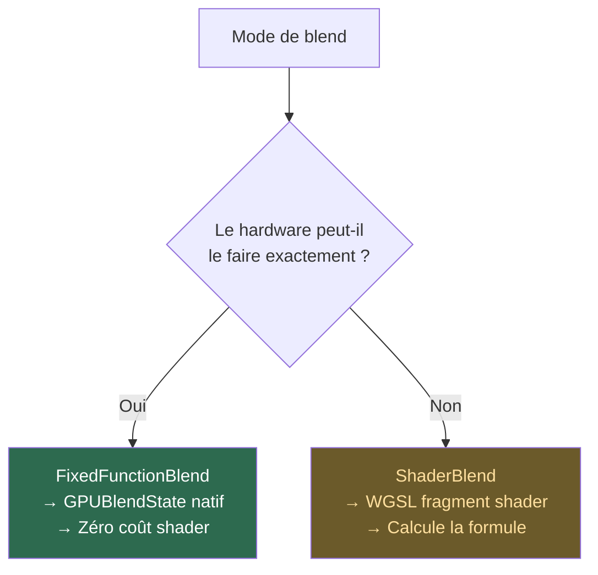
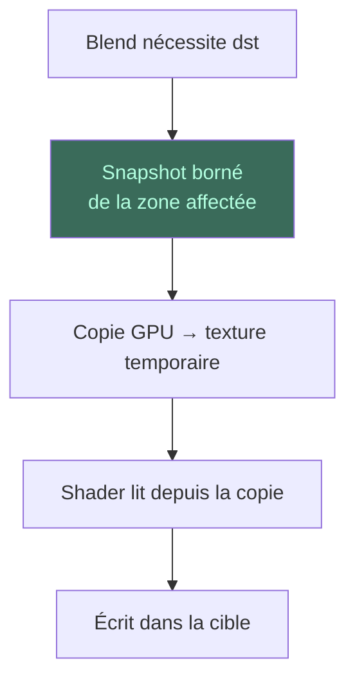

# Concept : Blend

Le **blend** (mélange) combine la couleur d'un nouveau pixel (la **source**)
avec la couleur déjà présente (la **destination**). C'est ce qui permet la
transparence, les ombres, et les effets de calque.

## Les 29 modes

Kanvas supporte les 29 modes de blend Skia. Voici les principaux :

| Mode | Formule | Fixed-function ? |
|------|---------|-----------------|
| `SrcOver` | src + dst × (1 − src.a) | ✅ Oui |
| `SrcIn` | src × dst.a | ✅ Oui |
| `SrcOut` | src × (1 − dst.a) | ✅ Oui |
| `DstOver` | dst + src × (1 − dst.a) | ✅ Oui |
| `DstIn` | dst × src.a | ✅ Oui |
| `SrcATop` | src × dst.a + dst × (1 − src.a) | ✅ Oui |
| `DstATop` | dst × src.a + src × (1 − dst.a) | ✅ Oui |
| `Xor` | src × (1 − dst.a) + dst × (1 − src.a) | ✅ Oui |
| `Plus` | src + dst | ✅ Oui (sauf coverage partielle) |
| `Multiply` | src × dst | ❌ Shader |
| `Screen` | src + dst − src × dst | ❌ Shader |
| `Overlay` | hard-light(dst, src) | ❌ Shader |

## Fixed-function vs Shader

## Lecture de la destination

Certains modes (comme `Plus`) ont besoin de la couleur destination pour
calculer le résultat. WebGPU interdit de lire et écrire la même texture
dans une render pass. Solution : **snapshot destination** (copie bornée).

## Le cas Plus + couverture partielle

`Plus` avec couverture partielle est le cas le plus exigeant :
- Ne peut jamais utiliser le fixed-function
- Nécessite toujours un shader exact (`plus_exact@v1`)
- Requiert la destination quand la couverture est < 1
