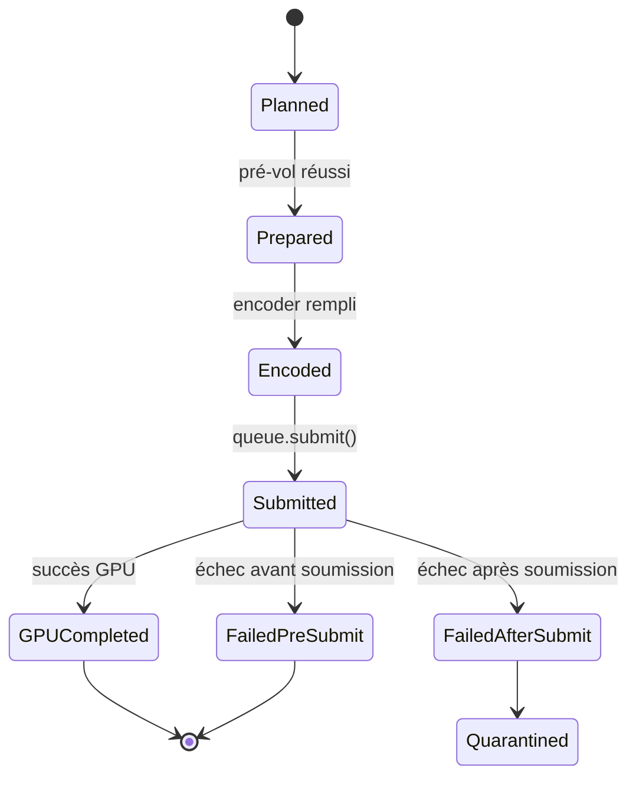
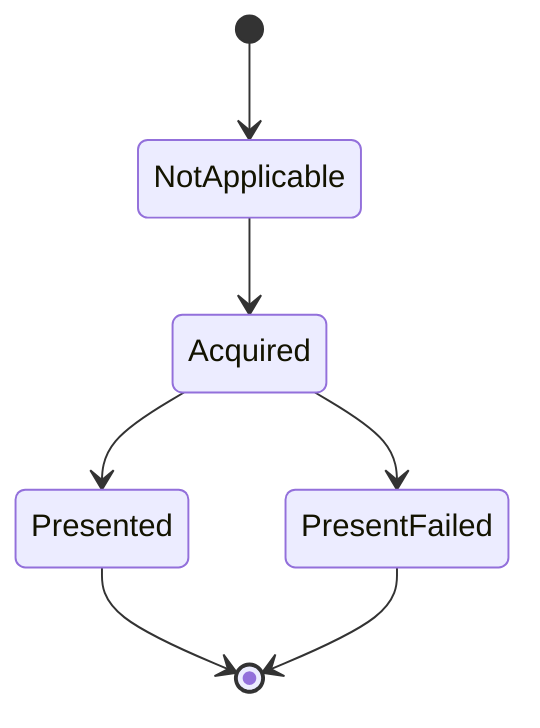

# Concept : Complétion & Cycle de vie

La soumission GPU est asynchrone.

## États d'exécution

## États de sortie

## Règles

- **Présent ≠ Complétion.** Ressources libérées seulement après
  `GPUCompleted`.
- **Complétion armée avant présent.** Échec d'armement → quarantaine, mais
  ne bloque pas le présent.
- **Readback après complétion.** Attend `GPUCompleted`, mappe le staging
  buffer, dé-padde, unmappe.
