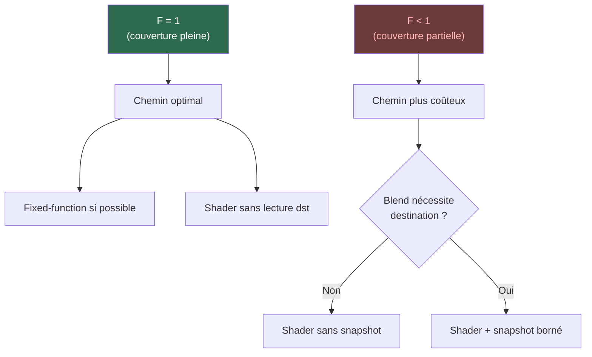

# Concept : Coverage (Couverture)

La **couverture** représente la proportion d'un pixel recouverte par
la forme dessinée. 1.0 = pixel entièrement couvert, 0.5 = à moitié
couvert (bord anti-aliasé).

## La formule fondamentale

```
result = dst + F × (Blend(src, dst) − dst)
```

où `F = geometryCoverage × clipCoverage`.

## Impact sur le blend



## Formes de couverture

| Forme | Usage |
|-------|-------|
| `FullOrScissor` | Shapes pleines, clipping rectangulaire |
| `ScalarCoverage` | Anti-aliasing par shader |
| `StencilCoverage1x` | Stencil buffer, clipping complexe |
| `MultisampleAttachmentCoverage` | MSAA natif |
| `LCDCoverage` | Vectoriel RGB par sous-pixel (LCD) |
