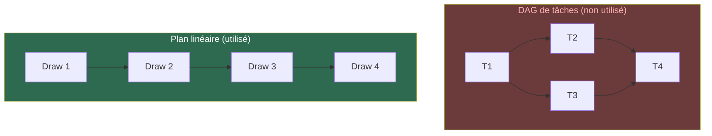
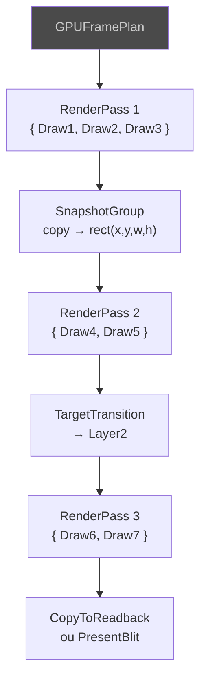

# Concept : Frame Plan (Planification linéaire)

Le Frame Plan est l'ordonnancement d'exécution d'une frame.

## Linéaire vs DAG

Un DAG permettrait le parallélisme, mais pour le rendu 2D, **l'ordre du
peintre est fondamental** — ce qui est dessiné après recouvre ce qui est
avant. Le Frame Plan est donc **linéaire** : il préserve strictement
l'ordre. Seule optimisation : le **groupement par passe** (draws
compatibles regroupés, jamais réordonnés).

## Structure d'un plan

## GPUFrameCoordinator

Point d'entrée unique. Enchaîne planification → pré-vol → exécution.
Préserve les refus comme résultats terminaux — un draw refusé n'est
jamais silencieusement ignoré.
