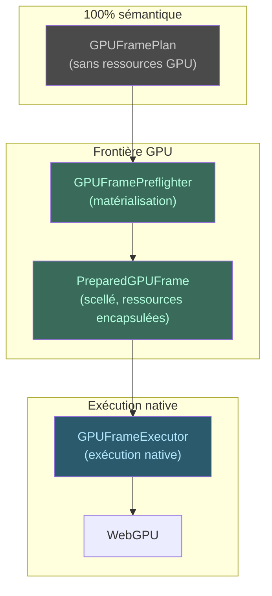

# Concept : Pré-vol & Exécution

La séparation planification/exécution est un choix architectural
fondamental.

## Pourquoi deux phases ?

1. **Correction :** plan figé et validé avant allocation GPU.
2. **Diagnostic :** plan inspectable sans GPU.
3. **Sécurité :** handles GPU natifs jamais exposés.
4. **Testabilité :** plan (sans GPU) et exécution (avec GPU) testés
   indépendamment.

## Gestion des erreurs

| Échec | Comportement |
|-------|-------------|
| Pré-vol | Rollback atomique de toutes les ressources |
| Pré-soumission (`FailedPreSubmit`) | Libération normale |
| Post-soumission (`FailedAfterSubmit`) | Quarantaine jusqu'au teardown |
