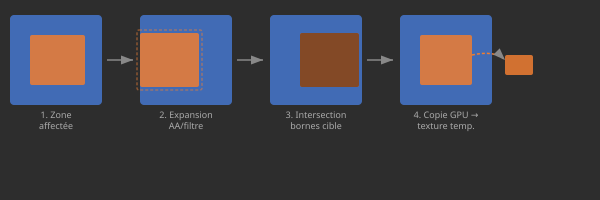
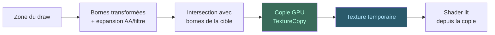

# Concept : Snapshots & Copies Destination

Quand un shader de blend doit lire la destination, on copie une portion
bornée de la cible dans une texture temporaire.

## Pourquoi c'est nécessaire

WebGPU interdit de lire et écrire la même texture dans une render pass
(pas de framebuffer-fetch). Le snapshot est la seule solution 100% GPU.

## Snapshots bornés

## Budget et partage

- **Politique initiale :** une copie par draw qui lit la destination.
- **Partage :** modélisé mais désactivé sans calibration du modèle de coût.
- **Budget :** chaque snapshot est comptabilisé dans le
  `GPUFrameMemoryBudgetPlan`.

## Cycle de vie

1. **Réservé** — bornes calculées, texture allouée
2. **Encodé** — copie enregistrée dans le command encoder
3. **Soumis** — exécuté sur le GPU
4. **Complété** — libéré ou réutilisé après `GPUCompleted`
