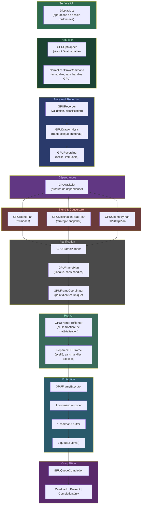

# Architecture du Frame Plan WebGPU

Inspiré de Graphite/Dawn — pipeline de rendu GPU pour Kanvas.

## Le pipeline en un schéma

## Pourquoi cette architecture ?

Kanvas remplace le rendu GPU immédiat (une opération = un appel GPU)
par un **chemin de rendu mesuré et planifié**. L'idée centrale : au lieu
d'envoyer chaque opération de dessin au GPU une par une, on **prépare
toute la frame à l'avance** — on classe les opérations, on planifie les
passes, on alloue les ressources, puis on exécute en une seule soumission.

## Inspirations et limites

Ce design s'inspire de **Graphite** (le successeur de Ganesh dans Skia)
et de **Dawn** (l'implémentation native de WebGPU), mais ne les porte pas.
Kanvas a un seul backend GPU — WebGPU via wgpu4k — et adopte uniquement
les invariants de performance utiles sans la complexité multi-backend.

## État de la migration

| Opérations | Statut |
|-----------|--------|
| Images | ✅ Migré (FP-04) |
| Texte & glyphes | ⏳ En attente (FP-05) |
| Vertices & meshes | ⏳ En attente (FP-06) |
| Composites (calques, filtres, masques) | ⏳ En attente (FP-07) |
