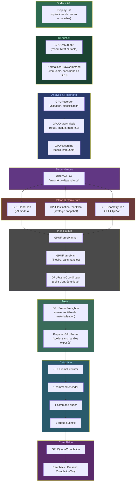

# Architecture du Frame Plan WebGPU

Pipeline de rendu GPU pour Kanvas.

## Le pipeline en un schéma

## Principes

Le pipeline est conçu autour de quelques principes simples :

- **Toute la frame est préparée avant la première allocation GPU.**
  L'analyse, le recording et le plan sont purement sémantiques — aucun
  handle natif ne circule avant le pré-vol.

- **Une frame = une soumission.** Un command encoder, un command buffer,
  un `queue.submit()`. Pas de soumissions intermédiaires.

- **Le blend est décidé une fois pour toutes.** Le `GPUBlendPlan` couvre
  les 29 modes et choisit la stratégie optimale : fixed-function quand
  c'est possible, shader WGSL sinon, snapshot borné de la destination si
  le shader doit la lire.

- **Tout passe par le GPU.** Pas de fallback CPU pour les lectures de
  destination. Pas de snapshots uploadés.

- **L'ordre du peintre est préservé.** Le plan est linéaire, pas un DAG
  de tâches. Seule optimisation : le groupement par render pass.

- **Une seule autorité par décision.** Chaque composant a un propriétaire
  unique. Pas de double énumération, pas de chemin parallèle.

## Backend

Kanvas a un seul backend — WebGPU via wgpu4k.
