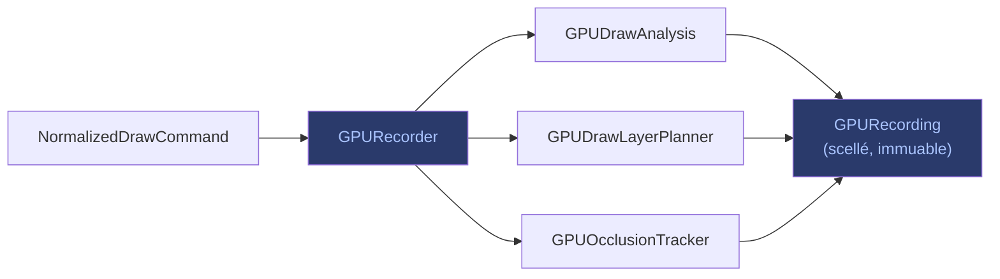

# Analyse & Recording — GPURecorder

Le **GPURecorder** consomme la séquence de `NormalizedDrawCommand` et
la configuration de cible. Il ne touche pas au GPU.

## Responsabilités

1. **Valider** les invariants (commandes bien formées, pas de dépendances
   circulaires).
2. **Construire** une **GPUDrawAnalysis** par commande.
3. **Sélectionner** les groupes de draws compatibles via le
   `GPUDrawLayerPlanner`.
4. **Produire** un **GPURecording** — l'enregistrement complet de la frame,
   immuable et scellé.

## GPUDrawAnalysis

La **GPUDrawAnalysis** est explicite et ne référence aucune ressource GPU
native. Chaque commande reçoit
sa propre analyse, qui capture :

- La **route** empruntée (quel chemin de rendu).
- Le **calque** destination.
- Le **matériau** et le render step.
- Les **ressources** requises (textures, samplers).
- L'**occlusion** (via `GPUOcclusionTracker`).

## Flux

> Le `GPURecording` est l'entrée du [GPUTaskList](dependances.md), qui
> alimente le [Frame Plan](../concepts/frame-plan.md).
