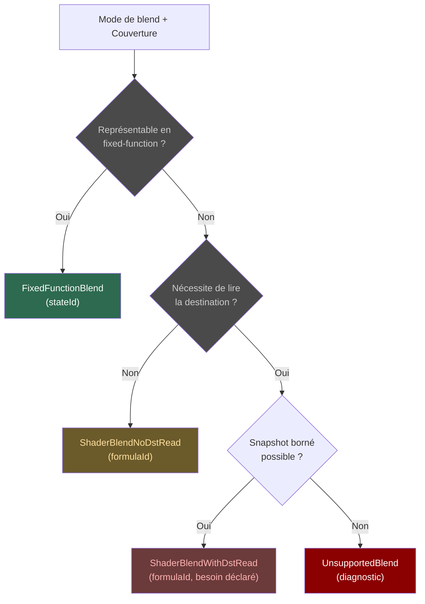

# Blend & Couleur — GPUBlendPlan

Le **GPUBlendPlan** est l'autorité canonique de blend. Il couvre les **29
modes de blend** et produit une décision par mode.

## La matrice de décision

## Séparation des responsabilités

Quand le blend exige de lire la destination, le GPUBlendPlan émet un
`GPUBlendDestinationReadRequirement` — purement sémantique. C'est le
**GPUDestinationReadPlan** qui décide *comment* : snapshot borné, copie
native, ou refus.

> Voir [Concepts — Blend](../concepts/blend.md) pour le détail des 29 modes.

## GPUColorPlan et GPUTargetState

- **GPUColorPlan** : classification alpha source, compatibilité format cible,
  preuves d'opacité.
- **GPUTargetState** : format des attachments, load/store, sample count.
