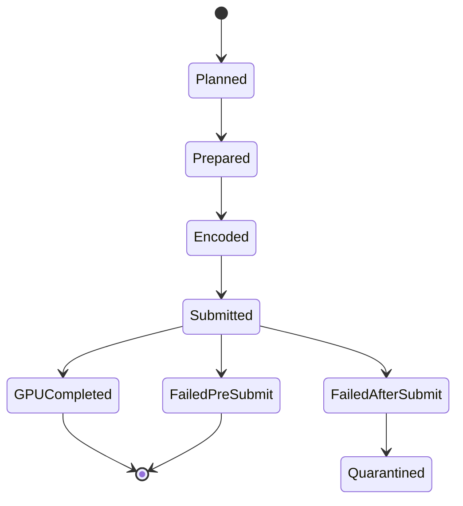

# Complétion & Cycle de vie

Le `queue.submit()` est asynchrone. Le **GPUQueueCompletionAdapter**
gère la complétion GPU et les transitions d'état.

## États d'exécution

## Règles

- **Présent ≠ Complétion.** L'affichage fenêtre et la complétion GPU sont
  deux événements indépendants.
- **Complétion avant présent.** Le ticket de complétion est armé avant la
  soumission.
- **Readback après complétion.** La lecture des pixels attend `GPUCompleted`.
- **Échec après soumission → quarantaine.** Ressources conservées jusqu'au
  teardown explicite du device.

> Voir [Concepts — Complétion](../concepts/completion-cycle-vie.md) pour
> le détail des états et transitions.
