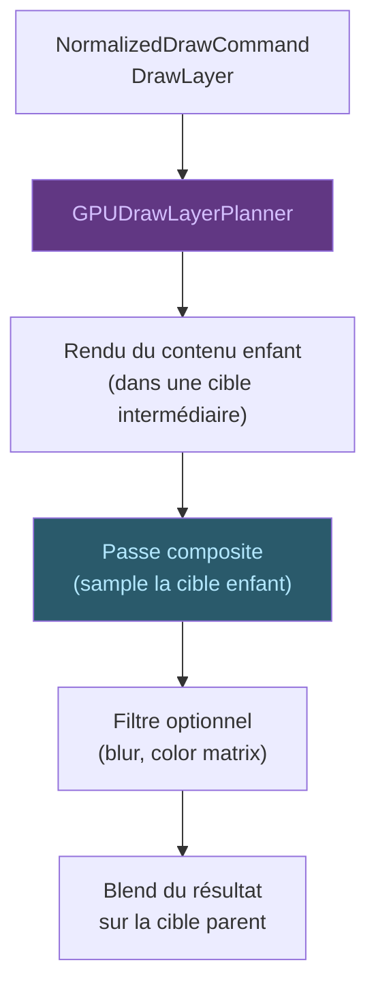

# Opérations Composites

Les opérations composites regroupent les **calques** (`saveLayer`),
les **filtres d'image** (flou, matrice de couleur), les **masques de
flou**, les **pictures**, et les **backdrops**.

## Flux

## Types de composites

| Type | Description |
|------|-------------|
| `saveLayer` | Groupe de dessin isolé dans une cible intermédiaire |
| `ImageFilter` | Filtre appliqué au contenu du calque (flou, matrice) |
| `MaskFilter` | Masque de flou appliqué aux bords |
| `Picture` | Sous-arbre de dessin pré-enregistré |
| `Backdrop` | Accès au contenu sous le calque avant dessin |

## Cibles intermédiaires

Chaque composite utilise une cible intermédiaire (`GPUIntermediateTarget`).
Le contenu enfant est d'abord rendu dans cette cible, puis la passe
composite la sample pour l'appliquer sur la cible parent. Les transitions
de cible sont planifiées par le `GPUFramePlanner`.
