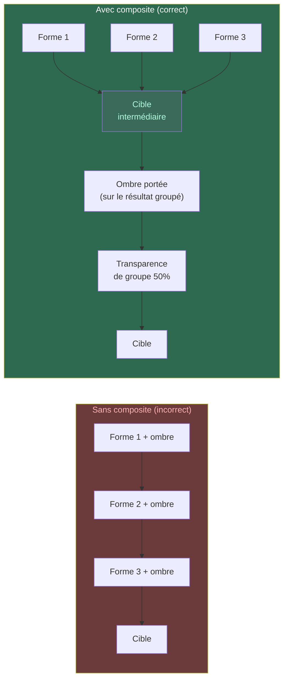
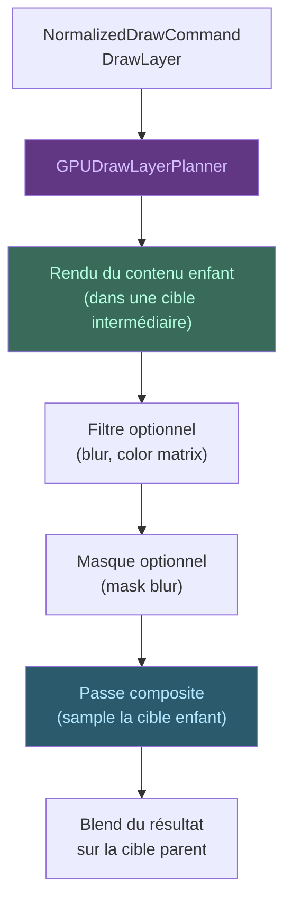

# Opérations Composites

Les opérations composites gèrent tout ce qui nécessite de **dessiner
dans une surface temporaire** puis de **réincorporer le résultat** dans
la cible principale. C'est le mécanisme qui permet les ombres, les flous,
la transparence de groupe, et les effets de calque.

## Pourquoi on en a besoin

Imaginons qu'on veuille dessiner un groupe de formes avec une ombre
portée et une transparence de groupe à 50%. Si on dessine chaque forme
directement sur la cible, l'ombre d'une forme va interférer avec la
forme voisine, et la transparence de groupe ne peut pas être appliquée
forme par forme. La solution : dessiner tout le groupe dans une **cible
intermédiaire**, puis appliquer l'effet (ombre, transparence) en une
seule fois sur le résultat complet.

## Flux

## Types de composites

| Type | Quand on l'utilise | Exemple concret |
|------|-------------------|-----------------|
| `saveLayer` | Isoler un groupe de dessins pour appliquer une transparence ou un effet global | Un groupe de formes avec `alpha=0.5` : on les dessine dans une cible intermédiaire, puis on blend le résultat à 50% |
| `ImageFilter` | Appliquer un filtre au contenu d'un calque | Flou gaussien sur une photo, matrice de couleur (noir & blanc, sépia) |
| `MaskFilter` | Adoucir les bords d'un dessin | Ombre portée floue, glow effect |
| `Picture` | Réutiliser un sous-arbre de dessin pré-enregistré | Un logo complexe dessiné une fois, réutilisé à plusieurs endroits |
| `Backdrop` | Accéder au contenu déjà présent sous le calque | Effet de verre dépoli : on lit ce qui est derrière, on le floute, on dessine par-dessus |

## Cibles intermédiaires

Chaque composite utilise une **cible intermédiaire** (`GPUIntermediateTarget`)
— une texture temporaire allouée par le `GPUFramePlanner`. Le contenu
enfant est d'abord rendu dans cette cible. Ensuite, une **passe composite**
lit cette cible comme une texture, applique les filtres et masques, et
blend le résultat sur la cible parent.

Les cibles intermédiaires sont en espace linéaire (`rgba8unorm`, pas de
sRGB) pour que les calculs de filtre et de blend restent corrects.

> Voir [Images](images.md) pour les textures et [Ressources](ressources.md)
> pour l'allocation des cibles temporaires.
