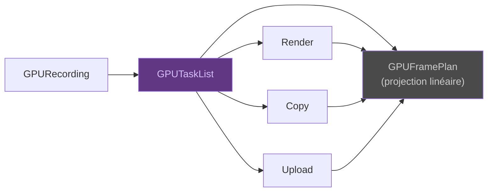

# Dépendances — GPUTaskList

Le **GPUTaskList** est l'autorité de dépendance du pipeline. Il transforme
le `GPURecording` en une liste ordonnée de tâches GPU.

## Variantes de tâches

| Tâche | Rôle |
|-------|------|
| `Render` | Dessiner une géométrie avec un matériau |
| `PrepareResources` | Préparer des ressources (textures, buffers) |
| `DrawPass` | Grouper des draws dans une render pass |
| `Compute` | Exécuter un shader de calcul |
| `Copy` | Copier (texture → texture, buffer → texture) |
| `Upload` | Transférer CPU → GPU |
| `Barrier` | Barrière de synchronisation |
| `Refused` | Tâche refusée avec diagnostic |

## Relation avec le Frame Plan

Le **GPUFramePlan** est la projection d'exécution du GPUTaskList — il
linéarise et ordonnance, mais n'invente jamais de dépendance ni n'efface
de refus.

> Voir [Concepts — Frame Plan](../concepts/frame-plan.md) pour la
> comparaison entre plan linéaire et DAG de tâches.
