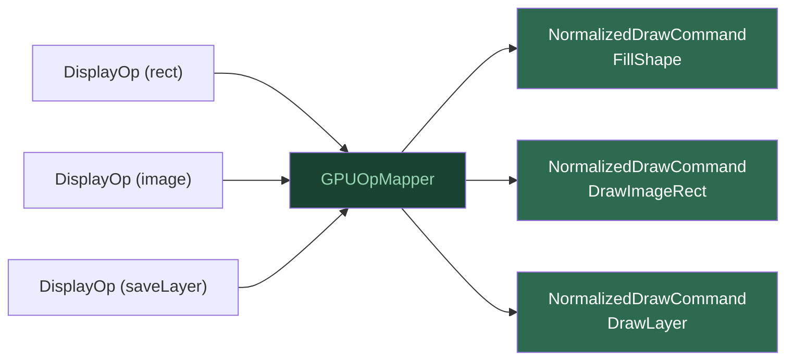

# Entrée — DisplayList et GPUOpMapper

La **Surface** est l'API publique de Kanvas. Elle reçoit des opérations de
dessin (rectangle, image, texte, calques...) et les accumule dans une
**DisplayList** — une séquence ordonnée de `DisplayOp`. La DisplayList est
indépendante du backend : elle ne sait rien du GPU.

## GPUOpMapper

Le **GPUOpMapper** fait la traduction. Il prend chaque `DisplayOp` et produit
un **NormalizedDrawCommand**. Pour cela, il consomme l'état mutable de la
Surface — transformations, clips, sauvegardes/restaurations, groupes de
calques — et le résout en faits explicites par commande.

## Flux

## NormalizedDrawCommand

Un `NormalizedDrawCommand` est :

- **immuable** — une fois produit, il ne change plus ;
- **sans handles GPU** — il ne référence aucune ressource native ;
- **auto-suffisant** — il capture tout ce dont le pipeline a besoin.

Types de commandes :

| Type | Usage |
|------|-------|
| `FillShape` | Dessiner une forme (rect, rrect, path) |
| `StrokeShape` | Dessiner le contour d'une forme |
| `DrawImageRect` | Dessiner une image |
| `DrawTextRun` | Dessiner du texte |
| `DrawVertices` | Dessiner des vertices/meshes |
| `DrawLayer` | Composite de calque |
| `Clear` | Effacer la cible |
| `Discard` | Ignorer le contenu précédent |

**Pourquoi cette couche ?** C'est le point de séparation entre l'API
compatible Skia (en amont) et le pipeline GPU Kanvas (en aval).
