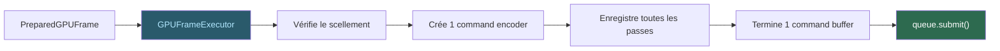

# Exécution — GPUFrameExecutor

Le **GPUFrameExecutor** consomme un `PreparedGPUFrame`, vérifie son
scellement, et le traduit en appels WebGPU natifs.

## Une soumission par frame

C'est un invariant de performance fondamental : **un frame = une
soumission**. Aucune soumission intermédiaire, aucun flush partiel.

Le GPUFrameExecutor arme également le ticket de complétion avant la
soumission, et invoque l'action de présent post-soumission si la frame
est destinée à une fenêtre.
