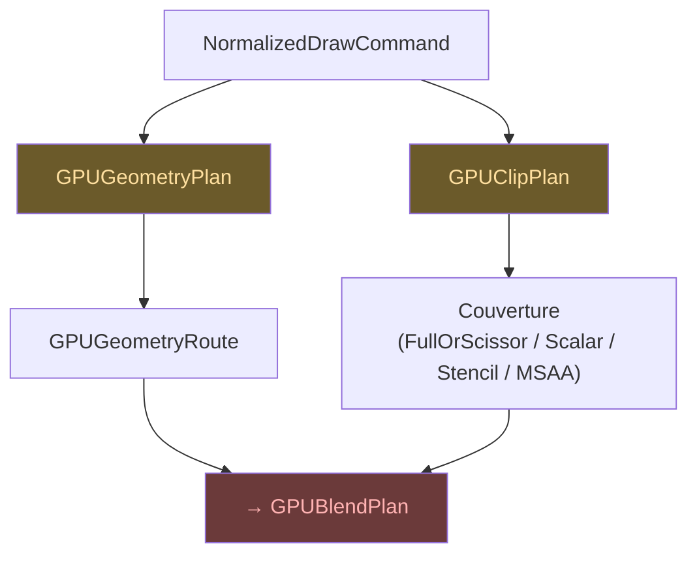

# Géométrie & Couverture

## GPUGeometryPlan

Décide comment une forme sera dessinée sur le GPU. Il produit un
`GPUGeometryRoute` — le chemin de rendu pour cette géométrie.

## GPUClipPlan

Gère le clipping et produit un plan de couverture. Formes possibles :

| Forme | Description |
|-------|-------------|
| `FullOrScissor` | Tout ou rien via scissor rect natif |
| `ScalarCoverage` | Anti-aliasing par shader |
| `StencilCoverage1x` | Stencil buffer single-sample |
| `MultisampleAttachmentCoverage` | Couverture via MSAA |
| `LCDCoverage` | Couverture vectorielle RGB par canal |

## Lien avec le blend

La couverture est une entrée critique pour le plan de blend — la formule
fondamentale `result = dst + F * (Blend(src,dst) - dst)` dépend du facteur
de couverture **F**.

## Contexte de migration

`GPUGeometryPlan` et `GPUClipPlan` remplacent les anciens
`GeometryPlan`/`CoveragePlan` hérités de KanvasPipelineIR. Les anciens
existent encore comme entrée de migration et oracle CPU, mais sont
traduits une fois à la frontière.
