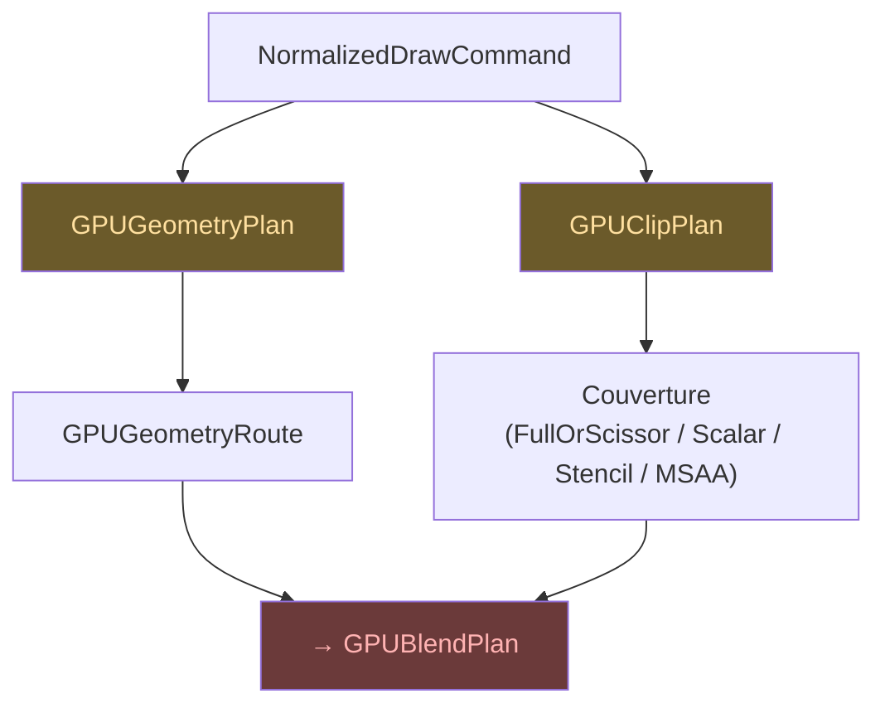

# Géométrie & Couverture

## GPUGeometryPlan

Décide comment une forme sera dessinée sur le GPU. Il produit un
`GPUGeometryRoute` — le chemin de rendu pour cette géométrie.

## GPUClipPlan

Gère le clipping et produit un plan de couverture. Formes possibles :

| Forme | Description |
|-------|-------------|
| `FullOrScissor` | Tout ou rien via scissor rect natif |
| `ScalarCoverage` | Anti-aliasing par shader |
| `StencilCoverage1x` | Stencil buffer single-sample |
| `MultisampleAttachmentCoverage` | Couverture via MSAA |
| `LCDCoverage` | Couverture vectorielle RGB par canal |

## Lien avec le blend

La couverture est une entrée critique pour le plan de blend — la formule
fondamentale `result = dst + F * (Blend(src,dst) - dst)` dépend du facteur
de couverture **F**.

## Autorité

`GPUGeometryPlan` et `GPUClipPlan` sont les autorités uniques de géométrie
et de couverture dans le pipeline GPU. Ils consomment les
`NormalizedDrawCommand` et produisent les plans consommés par le
`GPUBlendPlan` et le `GPUFramePlanner`.

> Voir [Concepts — Coverage](../concepts/coverage.md) pour le détail
> de la formule de couverture et son impact sur le blend.
