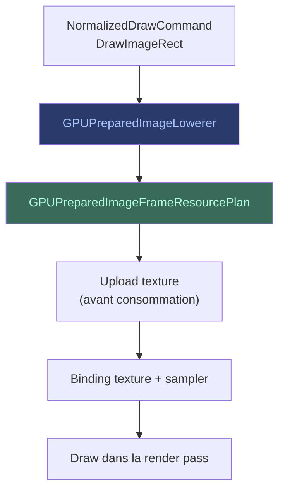

# Opérations Image

Les opérations image (`DrawImageRect`, `DrawImageNine`, `DrawImageLattice`)
permettent de dessiner des images dans le pipeline GPU.

## Flux

## Étapes clés

1. **Normalisation** — le `NormalizedDrawCommand` capture l'image source,
   les bornes, et le filtre d'échantillonnage.
2. **Abaissement** (`GPUPreparedImageLowerer`) — traduit la commande en
   plan de ressources image.
3. **Planification** — le `GPUPreparedImageFrameResourcePlan` réserve les
   slots de texture et sampler.
4. **Upload** — les pixels sont transférés CPU → GPU avant le draw
   consommateur (ordre strict : upload avant sample).
5. **Binding** — la texture et le sampler sont liés au pipeline via le
   layout de binding.
6. **Exécution** — le draw est émis dans la render pass.

## Formats et sRGB

Le pipeline gère la conversion sRGB au stockage. Les textures source sont
uploadées en linéaire ou sRGB selon leur format, et la cible de scène
canonique gère le stockage sRGB sans conversion CPU.

> Voir [Concepts — Snapshots](../concepts/snapshots.md) pour la gestion
> des textures temporaires.
